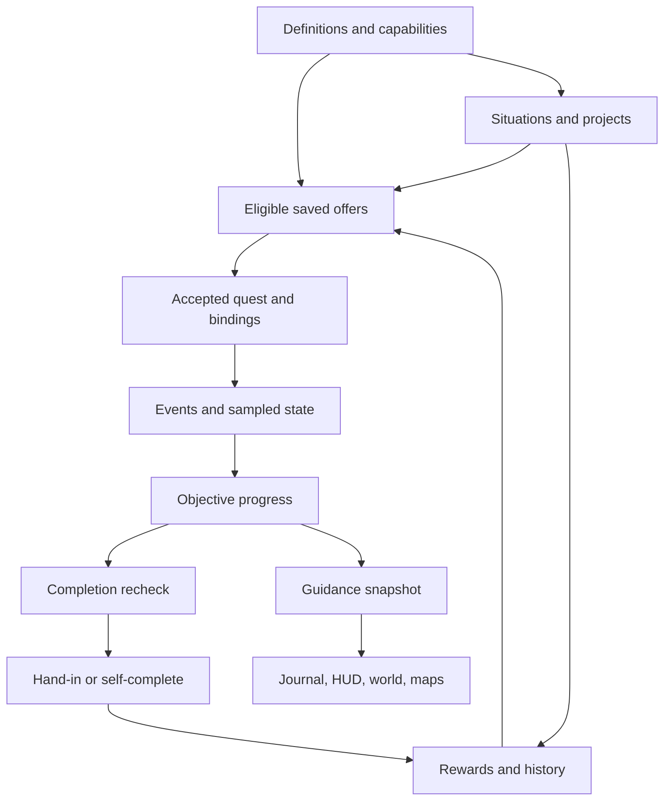
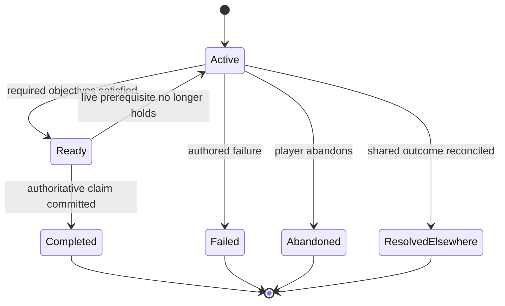
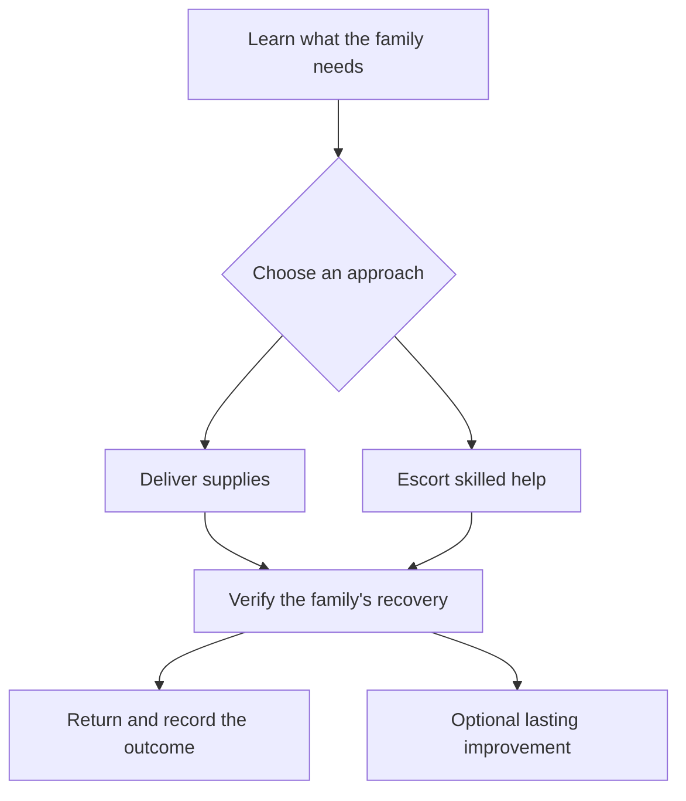

# MCA: Quests — Quest System Research and Execution Plan

**Research date:** 7 September 2026  
**Primary baseline:** `otectus/MCAQuests`, `main`, commit `724b07f0565c91d6e3adc2e42f58adff40573e19`  
**Intended reader:** a coding agent implementing and validating a sequence of reviewable changes.

MCA: Quests should develop into a dependable, character-driven quest system in which villagers remember the player's help, objectives credit the intended accomplishment, and guidance clearly communicates what the player knows and what to do next. Its existing implementation already provides much of the infrastructure. The most valuable next work is to strengthen identity, evidence, recovery, and presentation before substantially expanding the catalogue.

This document contains research, a source review, proposed contracts, and an execution backlog. **It does not report implemented fixes or successful Minecraft runtime tests.** Findings marked **confirmed** describe inspected source behavior; their player-facing reproductions remain acceptance tests. Recommendations are explicitly distinguished from existing capabilities.

## Contents

1. [Decisions and scope](#1-decisions-and-scope)
2. [The complete quest-system model](#2-the-complete-quest-system-model)
3. [Lessons from commercial games and Minecraft mods](#3-lessons-from-commercial-games-and-minecraft-mods)
4. [MCA: Quests as implemented](#4-mca-quests-as-implemented)
5. [Prioritized findings](#5-prioritized-findings)
6. [State, identity, and reward contracts](#6-state-identity-and-reward-contracts)
7. [Objective detection and composition](#7-objective-detection-and-composition)
8. [Target resolution, navigation, and marking](#8-target-resolution-navigation-and-marking)
9. [Player experience and accessibility](#9-player-experience-and-accessibility)
10. [Living villages, cooperation, and content quality](#10-living-villages-cooperation-and-content-quality)
11. [Authoring, validation, and integrations](#11-authoring-validation-and-integrations)
12. [Execution work packages](#12-execution-work-packages)
13. [Verification and release gates](#13-verification-and-release-gates)
14. [Migration and coding-agent runbook](#14-migration-and-coding-agent-runbook)
15. [Research sources and interpretation limits](#15-research-sources-and-interpretation-limits)

## 1. Decisions and scope

### 1.1 Recommended decisions

Adopt these defaults unless a maintainer deliberately changes the product policy during review:

| Decision | Reason | First implementation |
|---|---|---|
| Preserve existing player progress and promised rewards through definition changes | A datapack update must not reinterpret a completed task or replace an owed payout | W02–W03 |
| Treat progress, current availability, navigation knowledge, and payout status as separate dimensions | A temporarily unloaded villager is not dead; an unknown route is not an impossible objective; an unpaid reward is not a paid one | W02–W07 |
| Require evidence appropriate to the verb | “Use,” “heal,” “build,” “deliver,” and “find” make different promises | W06, W09 |
| Keep explicit tracking under player control | A followed quest must remain visible; explicit untracking should persist; automatic selection must be an identifiable mode | W07–W08 |
| Share world outcomes and participation records across online and offline players | Connection timing should not accidentally determine outcomes or earned credit | W04 |
| Keep personal relationship stories tied to the actual villager | Replacing a spouse or parent with the nearest matching NPC destroys the meaning of the quest | W05, W10 |
| Expand composition with a small declarative model | Sequence, alternatives, optional objectives, and explicit evidence windows enable richer stories without an arbitrary scripting engine | W09, W11 |
| Preserve optional integrations and graceful degradation | A quest should explain a missing capability and retain recoverable state | W12 |
| Make each release demonstrably better on a small set of complete stories | More definitions alone do not establish better pacing, reliability, or navigation | W13–W15 |

**Priority meanings:** P1 = correctness, earned-state integrity, stuck progression, or materially misleading guidance; P2 = major usability, authoring, or content improvement; P3 = bounded polish or a later expansion. No P0 emergency is asserted by this static review. Work-package dependencies take precedence over priority when an enhancement requires a new persistence or protocol contract.

### 1.2 Exact repository scope

The reviewed `main` snapshot declares **MCA: Quests 1.6.2, Minecraft 1.20.1, Forge 47.4.10, and Java 17**. The pinned commit adds Map Atlases integration and describes 1.6.2 as not yet published. Therefore, neither a published-release guarantee nor absence of Map Atlases support should be inferred from an older release page. [Pinned commit][repo-commit] · [Build properties][src-gradle.properties] · [Map Atlases documentation][src-MAPATLASES.md]

The repository also has a `1.21.1` branch, inspected at `3588aa4defdb3e50b8f390fdd2518e0b489f205b`. Its build metadata declares NeoForge 21.1.248 and Java 21. **This report audits the 1.20.1 implementation; it does not establish behavior parity with the 1.21.1 branch.** Port the design contracts through the appropriate platform adapters and repeat the tests on that branch. [1.21.1 properties][repo-port]

A static census at the primary snapshot found 600 main Java files and 183 test Java files; 262 base quest JSON files and 19 quest files in conditional compatibility packs; 21 base village-project definitions; 25 base situation definitions plus two compatibility definitions; and nine title definitions. Seven base quest files are templates, so file counts are not a count of every possible instantiated quest. Both bundled locales, `en_us` and `pt_br`, contain 3,253 keys. These counts describe breadth, not quality or test coverage. [Source tree][repo-tree] · [Base quest resources][dir-quests] · [Compatibility packs][dir-compatpacks]

The review traced the central lifecycle, registered objective families, persistence, events, guidance, client presentation, shared outcomes, and compatibility boundaries. It did not execute a full Java build, launch Minecraft, profile a server, or play through every authored quest. Existing audit documents describe earlier verification; those results are historical evidence and are not substituted for validation of the pinned commit or proposed changes. [Repository build instructions][src-CLAUDE.md] · [Previous stabilization report][src-STABILIZATION.md]

### 1.3 Research boundaries

The comparison covers eight representative commercial games and eight Minecraft mod/tool comparisons, including Heracles together with its Argonauts integration. They were selected for distinct strengths: branching stories, spatial guidance, accessibility, shared events, graph authoring, cooperative progress, village simulation, and resource requests. This is a design benchmark, **not a measured popularity ranking or a claim to have reverse-engineered proprietary engines**.

First-party documentation, developer publications, official patch notes, and public source code are used. Patch notes establish concrete failure classes and fixes, not the hidden architecture of an entire game. Historical Minecraft documentation is labeled as historical. Proposed MCA architecture is the report's synthesis; borrowing a principle does not require installing the comparison mod or copying its code.

## 2. The complete quest-system model

Questing is a collection of connected contracts. A journal and a counter expose only a small part of it. The following map is the coverage checklist for this implementation plan.

| Layer | Questions the system must answer | Required output or invariant |
|---|---|---|
| Content and narrative | Who needs help, why now, and what changes afterward? | Authored premise, relationships, outcomes, follow-ups, localized dialogue |
| Eligibility and discovery | Is the quest appropriate, available, and discoverable without spoiling it? | Explained eligibility; rumors, conversations, boards, or notices; manageable offer density |
| Acceptance | What exactly did this player agree to? | Authoritative offer validation; frozen bindings, terms, deadline policy, and reward roll |
| Identity and scope | Which quest run, objective, villager, village, and participant does this state belong to? | Stable identities independent of list order or display name |
| Objective logic | Must objectives be parallel, ordered, alternative, optional, sustained, or repeated? | Deterministic progression with explicit activation and completion rules |
| Evidence collection | What event or state proves the requested accomplishment? | Server-owned observations, provenance, attribution, deduplication, and capability checks |
| World binding | Which actual NPC, block, structure, biome, or dimension is intended? | Stable commitments where identity matters; honest unresolved or last-known states |
| Navigation knowledge | What has the player learned and how precise is it? | Separate exact targets, search areas, clues, historical observations, and route availability |
| Presentation | What belongs in the journal, HUD, world, map, dialogue, sound, and narration? | One coherent progress snapshot, consistent labels, independent accessibility controls |
| Completion and hand-in | Is the work done, who may accept it, and must goods still be present? | Revalidated completion and delivery at the authoritative target |
| Rewards and consequences | What is owed, who receives it, and which effects succeeded? | Persisted entitlements, visible delivery status, bounded retry, world and relationship consequences |
| Cooperation and competition | Whose action counts, and who gets credit if another player resolves the need? | Authored scope and participation policy; online/offline consistency |
| Failure and recovery | What happens on death, abandonment, unavailable mods, missing targets, or obsolete needs? | Explained terminal outcomes, reversible suspension, cleanup, and recovery records |
| Persistence and updates | What happens on save, restart, death clone, reload, or changed definitions? | Versioned migrations, preserved unreadable data, explicit handling of incompatible changes |
| Authoring and operations | Can authors understand, simulate, validate, balance, and diagnose the system? | Schema, actionable diagnostics, graph checks, scenario fixtures, and read-only traces |
| Performance and integration | How much world work, networking, and third-party coupling is permitted? | Bounded shared scheduling, correct thread affinity, isolated adapters, and measurable budgets |

Several apparently similar statements require different objective contracts:

| Player-facing promise | Appropriate evidence | Common wrong substitute |
|---|---|---|
| Have eight apples | Current matching inventory, if possession is required at completion | Eight apples seen once in the past |
| Gather eight new apples | Explicitly attributed acquisition after activation, with a documented source policy | Dropping and picking up the same stack repeatedly |
| Make eight planks | Successful supported crafting output attributed to the player | Possessing planks made by somebody else |
| Bring food to this villager | Committed inventory transfer to the bound recipient | A right-click with food somewhere in the inventory |
| Heal this villager | An attributable successful healing result, or an explicitly named treatment action | Any click with the expected item |
| Find the missing relative | Discovering the actual bound person under the authored proximity or interaction rule | Merely selecting or spawning that entity |
| Repair the shelter | A validated site or building state, possibly held for a duration | A cumulative count of placements that no longer exist |
| Protect the village | Authored survival, threat, participation, and location conditions | Unrelated kills anywhere in the world |
| Enter the ruin | Membership in the intended structure area or authored entrance region | Reaching an approximate structure locator coordinate |

This is the main design principle behind the recommendations: **name and implement the evidence contract before choosing the counter or marker.**

## 3. Lessons from commercial games and Minecraft mods

### 3.1 Commercial games

The “apply” column contains recommendations for MCA, not claims about the other game's internals.

| Example and primary evidence | Documented pattern | Apply to MCA: Quests | Boundary |
|---|---|---|---|
| **The Witcher 3 / REDkit** — [quest nodes][game-redkit-nodes], [quest debugger][game-redkit-debug] (2024) | Explicit quest-flow nodes distinguish waiting, conditions, branching, journal updates, tracking, and map pins. The debugger exposes active quest flow and facts | Separate objective evaluation from journal and marker presentation; add small compositional operators and an inspectable state trace | Public authoring tools establish supported operations, not every shipped quest's design |
| **Baldur's Gate 3** — [Patch 1][game-bg3-p1] (2023), [Patch 7][game-bg3-p7] (2024) | Fixes address alternative action order, journal knowledge, hidden information, and multiplayer markers. Some hidden-cache pinpoints became area markers | Test noncanonical order and knowledge leaks; give hidden objectives search areas; test late joining and per-player marker state | Patch fixes are specific examples, not a guarantee that every similar case is solved |
| **Ghost of Tsushima** — [world design][game-ghost-world], [official beginner guide][game-ghost-guide] | Guiding Wind, landmarks, environmental activity, and people help connect discovery to the world | Add optional rumors, visible village cues, and restrained directional assistance; keep the explicit tracker available | Borrow environmental coherence; a voxel world does not automatically have curated sightlines or paths |
| **Assassin's Creed Shadows** — [Ubisoft exploration overview][game-shadows] (January 2025) | The design describes clues, scouts, progressive map information, guidance choices, and pathfinding toward revealed destinations | Model knowledge stages and assistance settings; distinguish finding a target from routing to one already known | A prelaunch developer description, not a current patch-by-patch behavior audit |
| **Horizon Forbidden West** — [accessibility feature overview][game-horizon] (2022) | Guidance and waypoint assistance coexist with configurable HUD reminders, text presentation, motion settings, and story recap | Provide layered guidance and a short quest recap; independently control motion, density, text, and reminders | The source does not establish universal screen-reader support; test Minecraft's narrator directly |
| **Final Fantasy XIV** — [HUD guide][game-ffxiv-hud], [NPC icons][game-ffxiv-icons] | Quest title and objective links connect journal and map; icon vocabulary distinguishes quest categories and availability states | Make objective rows actionable; distinguish available, active, hand-in-ready, and blocked states using shape and text as well as color | Readable vocabulary is transferable; reproduce MCA's own visual language |
| **Guild Wars 2** — [dynamic events][game-gw2] | Shared events support contribution without formal parties, participation rewards, scaling, and world consequences | Strengthen village situations and projects with durable participation, shared outcomes, and useful follow-ups after failure | No specific scoring formula or scaling algorithm is inferred |
| **Cyberpunk 2077** — [Update 2.0][game-cyberpunk] (2023) | Journal changes include categories, distance information, and untracking; HUD safe zones address widescreen layouts | Make untracking explicit, add useful journal organization, and bound HUD content to configurable safe areas | These are documented UI changes, not evidence for a particular backend design |

The common lesson is consistency between story, evidence, and guidance. More objective arrows cannot repair incorrect evidence, and sophisticated branching cannot repair lost progress. Conversely, truthful uncertainty and good recovery often improve a quest without adding a new mechanic.

### 3.2 Minecraft comparisons

| Example and evidence scope | Observed capability or contract | Apply to MCA: Quests |
|---|---|---|
| **FTB Quests** — pinned 1.20.1 source: [ItemTask][mod-ftb-item], [TeamData][mod-ftb-team]; separate [1.21.1 questbook guide][mod-ftb-guide] | Item-task behavior distinguishes consumption, crafting detection, and accumulated maximum inventory progress. Team data persists task state and reward claims. The guide explains dependency navigation and warns about overcrowded automatic pins | Make item semantics explicit; keep delivery separate from possession; add dependency navigation and bounded tracking. Do not silently change MCA's live `obtain_item` into FTB's maximum-observed behavior |
| **Heracles / Argonauts** — pinned Heracles 1.20.1 source: [GatherItemTask][mod-heracles-gather], [CompositeTask][mod-heracles-composite]; [guild integration][mod-argonauts] | Gather tasks expose collection and consumption modes with stable task IDs. Composite progress combines child progress. Argonauts documents guild contributions | Use stable IDs and explicit submission modes; provide cooperative scope through adapters. A fractional composite is not equivalent to “complete any K whole objectives”; specify both separately |
| **Better Questing** — [embedded 1.12 guide and UI definitions][mod-bq], historical | The shipped guide describes keybound access, party reward choices, submission behavior that avoids voiding excess goods, editor controls, resync, and localization | Keep access independent of a losable item; preserve delivery safety; add structured author diagnostics and explicit resync. This historical example is not a 1.20.1 installation recommendation |
| **Bountiful** — [boards][mod-bountiful-boards], [generation][mod-bountiful-generation] | Boards rotate themed offers while each player takes an independent copy. Generation matches objective worth to selected reward worth with controlled variation | Extend existing offer diversity with contextual categories and understandable reward budgets; distinguish shared discovery from individually consumable offers |
| **Custom NPCs** — [quest setup][mod-customnpcs-quest], [dialog setup][mod-customnpcs-dialog], historical developer documentation | Quests can start through dialogue; documented objective types distinguish prior-read dialogue from locations that require a revisit. Area kills and scripted/manual completion demonstrate explicit alternative credit paths | Define whether evidence before acceptance counts; support authenticated dialogue outcomes and deliberately scoped group credit. Treat the old documentation as a design reference, not a current API contract |
| **MineColonies** — official [quests][mod-minecolonies-quests] and [requests][mod-minecolonies-requests], live documentation without a fixed release selector | Citizens offer stories and sequential objectives; the log can locate the giver. Its separate request system routes real needs through inventories, production, and couriers and can filter persistent routine demands | Tie quests to unmet village needs; distinguish narrative commitments from routine logistics; prioritize bottlenecks and offer a route back to the actual giver |
| **Patchouli** — [multiblock definitions and visualization][mod-patchouli] | Patterns can describe block, tag, and block-state constraints and be visualized. The documented API also permits server validation with the appropriate dependency | Add an optional build preview and a server-owned site validator. A preview must not itself award completion; adopting the concept does not require making Patchouli mandatory |
| **Waystones** — [official FAQ][mod-waystones], mixed version-specific sections | The documentation exposes stale destinations, ownership differences between destination classes, interaction restrictions, and identity duplication when initialized waystones are copied into structures | Keep target identity separate from coordinates; distinguish stale and inaccessible routes; respect discovery, ownership, and cost if a travel adapter is later added |

The two closest product lessons are complementary. FTB Quests and Heracles offer clear progression and authoring primitives; NPC-centered systems and colony requests connect those primitives to people and a changing world. MCA can combine these strengths while keeping its existing personal, family, and village focus.

## 4. MCA: Quests as implemented

### 4.1 Existing architecture and strengths to preserve

| Area | Existing implementation | Main entry points |
|---|---|---|
| Offers and acceptance | Remembered offer slots, eligibility rechecks, frozen offers and template values, caps, refresh rules, diversity, and relationship-aware gating | [QuestManager][src-QuestManager], [OfferSessionService][src-OfferSessionService], [OfferFilters][src-OfferFilters] |
| Personal quest state | Active quests, objective progress, bound targets, frozen reward amounts, completion/decline/failure/abandon history, repeat and cooldown state | [ActiveQuest][src-ActiveQuest], [PlayerQuestData][src-PlayerQuestData], [ObjectiveProgress][src-ObjectiveProgress] |
| Detection | Forge events plus throttled polling; a public polling extension; sticky event counters and live inventory objectives | [QuestProgressEvents][src-QuestProgressEvents], [QuestObjective][src-QuestObjective], [PollingObjective][src-PollingObjective] |
| Delivery | Aggregate inventory reservation across delivery rows; capacity checking, snapshot validation, and rollback attempts; direct recipient transfers | [InventoryTransfer][src-InventoryTransfer], [ItemDeliveryObjective][src-ItemDeliveryObjective], [DeliverToVillagerObjective][src-DeliverToVillagerObjective] |
| Guidance | Shared server guidance snapshots, authored item-source hints, target resolution, dimension-aware target records, cached searches, and a bounded asynchronous structure-search queue | [GuidanceService][src-GuidanceService], [GuidanceSnapshot][src-GuidanceSnapshot], [SourceHint][src-SourceHint], [StructureSearches][src-StructureSearches] |
| World and map markers | In-world glyphs, edge indicators, smoothing, occlusion handling, motion/contrast settings, reconciled owned map markers, and explicit saved pins | [QuestMarkerRenderer][src-QuestMarkerRenderer], [QuestMarkerHud][src-QuestMarkerHud], [QuestWaypointSync][src-QuestWaypointSync], [WaypointReconciler][src-WaypointReconciler] |
| Journal and interactions | Villager quest menus, log, HUD, journal, toasts, keyboard focus, narration support in controls, map actions, and progression presentation | [QuestMenuScreen][src-QuestMenuScreen], [QuestLogScreen][src-QuestLogScreen], [QuestHudOverlay][src-QuestHudOverlay], [JournalScreen][src-JournalScreen] |
| Shared village work | Scoped projects, contribution validation, phases, unlocks, recipient policies, frozen payouts, offline queues, and stale-scope quarantine | [ProjectManager][src-ProjectManager], [ProjectRewardDistributor][src-ProjectRewardDistributor], [ProjectState][src-ProjectState] |
| World-driven stories | Situation detection, shared instances, personal quest copies, deadlines, resolution, cooldowns, and shared unavailable-content clock accounting | [SituationManager][src-SituationManager], [SituationSavedData][src-SituationSavedData] |
| Rewards and social consequences | Items, currency, XP, hearts, reputation, titles, effects, loot, commands, unlocks, and optional-provider effects; bounded pending item delivery | [RewardTypes][src-RewardTypes], [ItemRewardDelivery][src-ItemRewardDelivery], [PendingItemRewards][src-PendingItemRewards] |
| Data and compatibility | Codecs, validators, recoverable unreadable records, capability status, conditional packs, isolated optional adapters, and diagnostics | [QuestRegistry][src-QuestRegistry], [StrictCodecs][src-StrictCodecs], [ObjectiveValidator][src-ObjectiveValidator], [CompatStatus][src-CompatStatus], [CLAUDE.md][src-CLAUDE.md] |

Do not open a large rewrite whose first deliverables recreate those capabilities. In particular, asynchronous structure locating, shared projects, branching quest chains through history conditions, map integration, failure isolation, target UUID binding, and basic accessibility are already present. Improve the remaining contracts and extend the existing tests.

The current conceptual flow is:



### 4.2 Personal objectives: all 36 registered types

All IDs below use the `mcaquests:` namespace. “Latched” means earned completion persists; “live” means current state is evaluated again. This table describes the central current contract and the most important refinement, not every codec parameter. The [objective registry][src-ObjectiveTypes] is the inventory authority; individual source links describe each implementation. Events are dispatched through [QuestProgressEvents][src-QuestProgressEvents].

| Type | Current detection/completion | Guidance and required refinement |
|---|---|---|
| [`item_delivery`][src-ItemDeliveryObjective] | Matching current inventory; aggregate reservation and consumption or transfer at hand-in | Item source may guide acquisition. Show remaining total across overlapping delivery rows and the actual eligible hand-in target |
| [`obtain_item`][src-ObtainItemObjective] | Live matching inventory, never consumed | Optional authored source. Explain that progress can fall when items leave inventory; distinguish this from new acquisition |
| [`kill_entity`][src-KillEntityObjective] | Attributed death events matching entity predicate, accumulated count | Authored source where provided. Preserve existing pet-owner and kill-credit attribution; add explicit spawn/assist policies only where authored |
| [`use_item`][src-UseItemObjective] | Right-click attempts, or fully finished item use when `require_success` is true | Optional source. Split attempt, completed use, duration, and actual successful result; bow release is not a Finish event |
| [`interact_block`][src-InteractBlockObjective] | Accepted right-click interaction, with cancellation/use-denial and duplicate-hand protection | Block/source destination. Distinguish an interaction attempt from a successful block action |
| [`bountiful_bounties`][src-BountifulBountiesObjective] | Successful supported bounty cash-in through the compatibility bridge | Relevant source/board context where available. Retain provider receipt deduplication and unavailable capability handling |
| [`break_block`][src-BreakBlockObjective] | Noncanceled player block-break event matching block predicate | Authored block/source hint. Explicitly document placed-block, tool, dimension, and region policies if added |
| [`visit_biome`][src-VisitBiomeObjective] | Sampled current biome, then latched | Located biome candidate. A sampled search position is approximate and need not be a safe surface destination |
| [`visit_dimension`][src-VisitDimensionObjective] | Sampled current dimension, then latched | Portal or dimension guidance. Preserve destination dimension even when no route is known |
| [`craft_item`][src-CraftItemObjective] | Player crafting event and matching output count | Source/recipe instruction where authored. Validate shift crafting and supported nonvanilla workstations rather than assuming coverage |
| [`place_block`][src-PlaceBlockObjective] | Noncanceled player placement events | Authored source/context. This is an action count; it does not certify a completed building |
| [`fish_item`][src-FishItemObjective] | Matching drops from successful fishing events | Source hint where authored. Define quantities, alternative fishing implementations, and attribution |
| [`talk_to_profession`][src-TalkToProfessionObjective] | Accepted conversation credit; distinct villager UUIDs, including a shared bridge entry point | Matching villagers. Repeated clicks on one villager do not count as several people; add a separate specific-dialogue objective for story decisions |
| [`escort_entity`][src-EscortEntityObjective] | Bound target, staged or unstaged escort, follow/lead modes, arrival latch | Target then destination. Add dimension to frozen destination, durable movement ownership, safe recovery, and readable wait/stuck states |
| [`protect_entity`][src-ProtectEntityObjective] | Accumulated sampled time while target is loaded/alive and optionally near; death fails or resets | Bound villager. Explain whether time is accumulated or consecutive and why it is paused |
| [`defend_villager`][src-DefendVillagerObjective] | Attributed matching threat deaths near a bound villager, including a short last-seen grace window | Villager and relevant area. Preserve the existing grace behavior; define participation and vertical/region semantics |
| [`trade_with_villager`][src-TradeWithVillagerObjective] | Trade-completion events matching the configured villager/profession filter; capital-role targets use a bound identity | Merchant guidance. Distinguish number of trades from number of items; provider-specific trading requires explicit support |
| [`heal_entity`][src-HealEntityObjective] | Matching held-item interaction and health threshold; optional consumption; counter increases | Bound target. This currently proves a tending interaction, not a verified health increase; see F12 |
| [`cure_villager`][src-CureVillagerObjective] | Observed infected state followed by observed cured state on the bound living target | Bound target. Current state transition does not establish who caused the cure; declare personal versus shared credit |
| [`breed_animals`][src-BreedAnimalsObjective] | Player-attributed child spawn matching the objective and location constraints | Optional `near` location anchor; no animal-source marker is inferred. Check canceled births and alternative breeding providers |
| [`tame_animal`][src-TameAnimalObjective] | Player-attributed tame event with target/location matching | Optional `near` location anchor. Distinguish newly tamed animals from already owned animals |
| [`sleep_or_rest`][src-SleepOrRestObjective] | Morning sleep-finish event credits sleeping players; `require_morning` is parsed but not consulted there | Respawn position is used as a bed hint without validating that it is a bed; see F13 |
| [`build_near_location`][src-BuildNearLocationObjective] | Unique placed positions within the configured three-dimensional radius; count is latched | Location anchor; only some anchor types freeze their selection. Replacing the same position is deduplicated, but dismantling the site does not subtract credit |
| [`enter_structure`][src-EnterStructureObjective] | Sampled structure-piece membership, latched | Structure locator candidate. Arrival at its approximate marker is not proof of entering a piece |
| [`deliver_to_villager`][src-DeliverToVillagerObjective] | Bound-recipient interaction with required inventory; committed consumption/transfer latches completion | Actual recipient. Show capacity failure and consumption clearly; preserve existing all-or-nothing transfer behavior |
| [`find_missing_relative`][src-FindMissingRelativeObjective] | Bound family member; existing-entity checks and a conditional materialization path; discovery completion | Search location/person. Materialization must not itself satisfy discovery outside the authored discovery radius; use safe spawn candidates |
| [`reach_location`][src-ReachLocationObjective] | Location anchor with journey-arming protection; village-specific arrival or horizontal radius for nonvillage locations, latched | Destination; some anchor selections are frozen. Add explicit arrival volume for vertically separated targets without silently changing legacy radius semantics |
| [`defend_location`][src-DefendLocationObjective] | Attributed matching kills inside the authored location constraint | Defended place/area. Make threat area, player participation area, and navigation area separate concepts |
| [`ftbq_complete_quest`][src-FtbqCompleteQuestObjective] | Polls the player's FTB team; latched completion; `already_complete` can satisfy or block the offer | Named external quest, with display-name support. Add an optional questbook action and clarify team scope; preserve current latch after external reset |
| [`townstead_state`][src-TownsteadStateObjective] | Supported state predicate held for an authored duration | Subject/building/village context. Preserve explicit observation and unavailable state; avoid using long holds to imitate multi-day work |
| [`townstead_change`][src-TownsteadChangeObjective] | Change from a bound acceptance baseline with direction and target constraints | Bound subject context. Explain baseline and required change; retain protection against unreadable baselines |
| [`townstead_profession_progress`][src-TownsteadProfessionProgressObjective] | Profession XP delta, target XP, or target tier under supported capabilities | Subject/workplace. Retain exactly-one-goal validation and profession reachability gates |
| [`townstead_building_registered`][src-TownsteadBuildingRegisteredObjective] | Qualifying village buildings, levels, and optional new/upgraded requirement | Existing qualifying building or village fallback already implemented. Add site-state explanation and validity feedback |
| [`townstead_spirit_progress`][src-TownsteadSpiritProgressObjective] | Spirit points delta or target tier | Village context. Distinguish player contribution from collective state improvement |
| [`townstead_healthy_residents`][src-TownsteadHealthyResidentsObjective] | Configured resident-wellbeing state over an authored hold | Village/subject context. Explain population denominator, observed residents, and pause reasons |
| [`townstead_schedule_streak`][src-TownsteadScheduleStreakObjective] | Distinct whole shifts with persisted calendar/shift identity and observation coverage; credited/missed/unknown outcomes | Worker/workplace context. Preserve unknown as distinct from failure; validate configured polling cadence against the coverage calculation |

### 4.3 Projects, eligibility, and consequences

Projects use a separate shared-state objective model; their semantics should not be accidentally replaced by personal counters. The eight registered project types are `donate_item`, `project_kill_entity`, `project_place_block`, `project_talk_to_profession`, `townstead_building_project`, `townstead_spirit_project`, `townstead_workforce_project`, and `townstead_resident_wellbeing_project`. They cover submitted resources, participant actions, and collective village state. Retain their scoped instances and phased progression while adding stable phase/objective identities and terminal participant receipts. [Project objective registry][src-ProjectObjectiveTypes] · [ProjectManager][src-ProjectManager]

Eligibility already combines `all_of`, `any_of`, and `not` conditions with profession, hearts, family/relationship state, age, personality, mood, health, home/village membership, time/weather/location, advancement and level, quest history, reputation/titles-related progression, and optional provider capabilities. Existing chain branching through completed/failed/declined/abandoned history is distinct from ordered or alternative objectives inside one active quest. [ConditionTypes][src-ConditionTypes] · [QuestDefinition][src-QuestDefinition]

The reward registry includes items, XP and levels, currency, hearts, effects, loot tables, commands, unlocks, village reputation, titles, sponsor/participant hearts, MCA: Reputation incidents, Townstead effects, Capitals titles/chronicles, and FTB progress. The principal next reward feature should be reliable entitlement handling and visible delivery state. More reward types can follow once failures and unavailable providers cannot silently erase a promised result. [RewardTypes][src-RewardTypes] · [ProjectRewardDistributor][src-ProjectRewardDistributor]

## 5. Prioritized findings

Each reproduction below is a **test to implement**, not a claim that it was executed during this research. “Confirmed” refers to inspected control flow or data representation. Some current behaviors are deliberate design choices; they are labeled accordingly.

### F01 — Definition edits can reinterpret progress and deferred rewards

**P1 · Confirmed representation and reload behavior · W02–W03.** `ActiveQuest.resolve` adopts the current definition, while `reconcile` only pads positional objective progress. Frozen reward amounts remain indexed by position. Project phases/objectives and pending reward references also depend on indices. Append-only changes are already partially supported and documented; insertion, reordering, or type changes are the problem. [ActiveQuest][src-ActiveQuest] · [ProjectState][src-ProjectState] · [PendingReward][src-PendingReward] · [DATAPACK.md][src-DATAPACK.md]

**Reproduce:** accept `[kill zombies, visit location]`, earn kills, insert a different objective at index zero, then reload. Separately, queue an offline project payout and reorder the phase's rewards before the recipient returns. Verify whether progress, bound UUIDs, or owed reward identity move to the wrong definition row.

**Required result:** stable objective, phase, and reward IDs; definition revisions; explicit migrations; immutable deferred reward payloads. An incompatible edit must preserve and pause the old record with a reason, never guess that two similarly named objectives are equivalent.

### F02 — The village-project switch also blocks unrelated banked FTB rewards

**P1 · Confirmed control flow · W01.** `ProjectManager.deliverPending` returns when village projects are disabled, although the same queue contains banked FTB hearts, village-reputation, and title rewards created outside the project feature. [ProjectManager][src-ProjectManager] · [McaHeartsReward][src-McaHeartsReward] · [McaVillageReputationReward][src-McaVillageReputationReward] · [McaGrantTitleReward][src-McaGrantTitleReward]

**Reproduce:** enable FTB integration, disable village projects, claim each of those rewards while its target cannot be resolved, then reach a valid target and relog.

**Required result:** entitlement delivery is independent of permission to create or advance projects. Apply provider-specific delivery policy to each queued entry. Disabling new content must not erase or indefinitely suppress previously earned rewards.

### F03 — Contained reward exceptions can silently discard unpaid entitlements

**P1 · Confirmed control flow; requires a throwing provider to reproduce · W03.** Pending project delivery drains the queue and retains entries when the outer loop sees a failure. However, `ProjectRewardDistributor.grantPlayerReward` catches reward exceptions and returns normally, so the outer loop can discard an unpaid entry. Ordinary `QuestManager.grantSafely` also contains reward failures without retaining a corresponding owed reward after quest completion. [ProjectRewardDistributor][src-ProjectRewardDistributor] · [ProjectManager][src-ProjectManager] · [QuestManager][src-QuestManager]

**Reproduce:** an add-on reward throws before making any change; accrue it as an offline project payout and log in. Repeat with a callback that mutates something and then throws.

**Required result:** return structured delivery outcomes, retain known-unapplied rewards, and expose unknown partial effects for recovery. **Do not fix this by retrying every exception:** commands and arbitrary external callbacks can already have paid part or all of a reward before throwing. Preserve sibling reward isolation.

### F04 — Shared situations need durable terminal participant reconciliation

**P1 · Confirmed state model; partly a product-policy decision · W04.** Situation success, failure, or clearing removes the shared instance. Failure processes online personal copies; successful or naturally cleared situations deliberately leave some other copies to their own deadlines. Saved state retains open situations and cooldowns rather than a terminal outcome ledger. Login reconciliation handles open instances. An offline ready participant can consequently retain different options from an online participant when the shared situation fails. Project and situation success counters also currently increment for online participants at resolution. [SituationManager][src-SituationManager] · [SituationSavedData][src-SituationSavedData] · [QuestProgressEvents][src-QuestProgressEvents] · [ProjectManager][src-ProjectManager]

**Reproduce:** A and B accept the same situation. B becomes ready and logs off. Let the world situation expire while A is online, then return as B and try hand-in. Also complete a project while a contributor is offline and compare its success statistic with its queued reward.

**Required result:** save terminal outcome, resolution time, participation eligibility, and per-player disposition. Reconcile before login sync and turn-in. Define personal credit separately from the shared world result. Recommended default: another player's success or disappearance of the underlying need closes obsolete assistance neutrally, with an authored follow-up or contribution reward where appropriate. Do not invent offline penalties that the current design deliberately omits.

### F05 — Ordinary missing-content pauses do not cover offline outages

**P1 · Confirmed accounting gap · W04.** Ordinary suspended timed quests accrue pause offsets only during the online player's polling pass. They do not retain enough information to reconstruct an unavailable-provider interval that occurred entirely while the player was offline. Shared situations already have stronger outage accounting; preserve it. [QuestProgressEvents][src-QuestProgressEvents] · [ActiveQuest][src-ActiveQuest]

**Reproduce:** A accepts a timed unfinished Townstead-dependent ordinary quest. Remove Townstead, keep the server's game time advancing with B online, restore it after A's original deadline, then let A return.

**Required result:** specify offline timer policy independently of unavailable-content policy and record provider availability epochs or equivalent persisted intervals. A player returning after a provider is restored must receive the intended pause compensation. Do not measure world-time deadlines with wall-clock time unless the author explicitly selected that clock.

### F06 — Escort movement cleanup needs ownership and deferred release

**P1 · Confirmed cleanup limitations; stuck-NPC consequence requires runtime validation · W05.** Staged escort holds set persistent `NoAI` and invulnerability flags. Release sets both flags to false rather than restoring a saved prior state. Terminal cleanup visits currently loaded targets resolvable in the player's level. It does not queue a later release for an unloaded target. Moreover, `resolveEscortee` can fall back to an unbound selector when the locked UUID is unloaded, potentially clearing another matching NPC's state. Abandonment also skips this cleanup when the definition is missing. [McaCompat][src-McaCompat] · [EscortEntityObjective][src-EscortEntityObjective] · [QuestManager][src-QuestManager]

**Reproduce:** hold a staged escortee, leave its dimension or unload its chunk, abandon or fail the quest, then reload the entity. Separately start with an NPC deliberately made invulnerable or AI-disabled by another system and complete the escort.

**Required result:** a persisted quest movement lease keyed by quest instance and target UUID, with prior state and ownership-aware cleanup. An existing locked UUID remains authoritative while unloaded; never substitute another NPC during cleanup. Queue release for entity load when immediate cleanup is impossible, independently of the current definition's presence. A different quest or mod's newer ownership must not be overwritten. Keep existing lead/follow behavior and its movement hysteresis while adding an explicit stuck/wait state. Legacy holds without recorded prior flags need an explicit recovery policy; the new implementation cannot infer those flags' historical values.

### F07 — Missing routes can produce wrong-dimension destinations

**P1 · Confirmed source paths · W01, W07.** `SourceHint.guidance` first tries `dimensionRoute`; an empty result can mean either “already in that dimension” or “different dimension but no route found.” It then falls through to searches in the current level. Escort `FrozenDest` stores a position and village ID without a dimension, and guidance wraps that position in the current level. The general `FrozenLocation` already carries dimension and should inform the repair. [SourceHint][src-SourceHint] · [EscortEntityObjective][src-EscortEntityObjective] · [FrozenLocation][src-FrozenLocation] · [Portals][src-Portals]

**Reproduce:** use a Nether-authored source hint containing a commonly available block or anchor, stand in the Overworld with no nearby portal, and resolve guidance. Freeze an escort destination, change dimension, and request guidance while the quest remains active.

**Required result:** preserve the final dimension even when routing fails; distinguish no route from same dimension. Do not search the current world for an explicitly other-world source. Persist escort destination dimension and define migration for old dimensionless destinations; infer only from reliable saved context, otherwise pause destination guidance and resolve deliberately.

### F08 — Hand-in eligibility and hand-in guidance can disagree

**P1 for missing guidance; P2 for policy mismatch · Confirmed · W01, W07.** Ready guidance mainly resolves the loaded original giver in the player's current level. It returns no target for any-villager hand-in and does not generally find an alternative matching profession or provide the unloaded giver's whereabouts. Separately, `allowTurnInToSameProfessionIfOriginalMissing` is documented as conditional on the original being gone, while `canTurnInAt` checks the setting and matching profession without establishing that condition. [GuidanceService][src-GuidanceService] · [QuestManager][src-QuestManager] · [CONFIG.md][src-CONFIG.md]

**Reproduce:** finish away from the giver; use any-villager or a different eligible profession mode. With the fallback setting enabled, keep the original giver alive beside another villager of the same profession and turn in to the latter.

**Required result:** one server-side hand-in eligibility resolver shared by interaction, menu, and guidance. Return an exact eligible NPC, a justified last-known location, a relevant search area, or a clear instruction. Define `known_dead`, `unloaded`, `elsewhere`, and `unknown` separately; absence from loaded entities is insufficient proof that the original is gone.

### F09 — Last-known whereabouts depend on the giver remaining loaded

**P2 · Confirmed resolver restriction · W07.** `ObjectiveSupport.lastKnownWhereabouts` requires a bound target absent from the current level, a loaded giver, and a same-dimension relative home lookup. The useful clue can disappear as the player travels away from the giver. [ObjectiveSupport][src-ObjectiveSupport]

**Reproduce:** accept a quest for a distant relative, record the visible clue, travel until the giver unloads, and compare guidance.

**Required result:** persist the permitted name, dimension, observation location, observation time, and provenance when known. Render that evidence independently of the giver's current load state. Do not turn a historical home into a live tracking claim or force-load remote chunks just to keep the marker exact.

### F10 — Marker arrival can hide a target on another floor

**P1 · Confirmed rendering calculation · W01, W07.** World-marker alpha is derived from horizontal distance before the vertical offset is considered. It can fade when the player shares the target's X/Z but remains far above or below. Approximate structure and search destinations also use arrival radii that are not completion regions. `GuidanceTarget` has approximate/last-known flags but lacks a durable entity UUID and objective identity for validating the client entity reference and aligning presentation. [QuestMarkerRenderer][src-QuestMarkerRenderer] · [GuidanceTarget][src-GuidanceTarget] · [GuidanceText][src-GuidanceText]

**Reproduce:** stand above a villager in a deep cave, or enter the radius around a structure locator without entering a structure piece. Inspect world glyph, HUD wording, and completion state.

**Required result:** use an authored arrival volume with vertical tolerance, or retain an above/below cue. Entering a search area should transition to a search instruction. It must not silently hide the only useful cue. Adding UUID and snapshot identity is a resilience enhancement; this review does not claim to have observed a network-ID reuse incident.

### F11 — Automatic fallback, explicit tracking, and objective text are conflated

**P2 · Confirmed behavior; partly deliberate policy · W07–W08.** `GuidanceSnapshot.select` intentionally falls back to another guidance target when the tracked quest has none. The followed-only waypoint mode uses the selected primary rather than necessarily the explicit tracked quest. HUD rows use the first configured number of active entries; a later tracked quest need not be visible. The HUD's first incomplete objective can differ from the objective selected by guidance. [GuidanceSnapshot][src-GuidanceSnapshot] · [QuestWaypointSync][src-QuestWaypointSync] · [QuestHudOverlay][src-QuestHudOverlay] · [GuidanceService][src-GuidanceService]

**Reproduce:** hold more quests than the HUD limit and follow the last one. Follow an unmappable first objective while a later objective or another quest has a target. Explicitly untrack and observe fallback.

**Required result:** distinguish `AUTO`, `PINNED`, and `NONE`. Guarantee the pinned quest a HUD row. Carry the selected objective's stable ID so marker, journal selection, and text agree. If the pinned quest has no destination, keep its instruction visible and explain why rather than silently replacing it.

### F12 — Healing and successful item use need stronger evidence contracts

**P1/P2 · Confirmed semantic mismatch · W06.** `HealEntityObjective.onInteract` checks the item, bound villager, and health threshold, optionally consumes an item, then increments progress. It does not verify a health increase. With the default threshold of 1.0, full health is not rejected by the `>` comparison. Bundled golden-carrot tending quests can omit consumption. This does not establish that MCA itself never heals during the same interaction; it establishes that this objective does not verify that outcome. [HealEntityObjective][src-HealEntityObjective] · [QuestProgressEvents][src-QuestProgressEvents]

`use_item.require_success` listens to `LivingEntityUseItemEvent.Finish`. Forge documents bow release under `Stop`, while `Finish` concerns fully completed item use. A released bow therefore needs a successful projectile/result hook, not simply the existing Finish mapping or indiscriminate credit for every Stop. [UseItemObjective][src-UseItemObjective] · [Forge 1.20.x item-use events][platform-forge-use]

**Reproduce:** repeat a qualifying interaction while no healing occurs; test at full health; test actual successful and canceled healing. Test food completion, interrupted use, an empty bow, a successful shot, and an item that acts immediately on right-click.

**Required result:** preserve legacy tending semantics under explicit wording or a versioned compatibility mode; add verified-result semantics for actual healing. Distinguish item-use attempt, completed use, successful effect, and duration. Each adapter must state which evidence it can supply. Never apply a second heal merely because MCA already handled the first one.

### F13 — Sleep configuration and bed guidance make unsupported promises

**P2 · Confirmed · W06.** `require_morning` is decoded but not used in sleep crediting. The objective credits the morning sleep-finish event and describes sleeping until morning. Guidance uses the respawn position as “your bed,” although it can identify a respawn anchor, forced spawn, or a removed bed. [SleepOrRestObjective][src-SleepOrRestObjective] · [QuestProgressEvents][src-QuestProgressEvents]

**Required result:** implement distinct valid rest/sleep/morning policies or reject/deprecate unsupported combinations with a clear migration. Only label a loaded, validated supported bed as a bed; otherwise show qualified last-known information or a general instruction. Test multiplayer night skipping and supported sleep mods.

### F14 — Materializing a missing relative is not the same as finding them

**P1 for unsafe placement risk; P2 for discovery semantics · Confirmed branch behavior, runtime consequences unverified · W05–W06.** The materialization branch can set discovery progress when the relative is spawned, even though author-selected spawn distance can exceed discovery radius. Candidate placement also needs a stronger collision/hazard validation contract. Existing identity, residence, and already-existing-entity safeguards are valuable and must remain. [FindMissingRelativeObjective][src-FindMissingRelativeObjective] · [McaCompat][src-McaCompat]

**Required result:** validate a bounded set of loaded safe positions, materialize only the intended eligible family identity, and award discovery through the same proximity/interaction rule as an already-existing target. If no safe candidate exists, retain a recoverable search state. Never duplicate a living relative or use spawning to hide an unresolved identity problem.

### F15 — Flat objective completion limits sequencing and alternatives

**P2 · Confirmed current model; enhancement · W09.** A personal quest's completion requires its objective list to be satisfied. Condition composition and branching across quest-history gates already exist, but they do not express a reusable within-quest sequence, mutually exclusive approach, optional bonus, or explicit activation window. Offer filtering can reject a quest when any objective is already trivially satisfied, even if other objectives require substantial work. [QuestDefinition][src-QuestDefinition] · [QuestManager][src-QuestManager] · [OfferFilters][src-OfferFilters]

**Required result:** introduce stable node IDs and a small compositional evaluation layer. Preserve legacy parallel-AND semantics. Specify whether each objective accepts pre-existing state; avoid a universal “any existing progress blocks the quest” rule while retaining protection against free repeatable rewards.

### F16 — Placement counts and sampled arrival should remain explicit semantics

**P2 · Confirmed behavior; enhancement, not an automatic bug · W06, W09.** `build_near_location` counts unique placements, not a standing structure; `reach_location` uses horizontal distance for nonvillage locations; location polling occurs roughly once a second and may miss very short visits. These can all be legitimate contracts when the text says so. [BuildNearLocationObjective][src-BuildNearLocationObjective] · [ReachLocationObjective][src-ReachLocationObjective] · [QuestProgressEvents][src-QuestProgressEvents]

**Required result:** add a distinct site-validation objective for “build/repair this,” explicit arrival volumes, and movement-triggered or swept-volume checks where small regions require them. Do not retroactively make completed placement quests fail because their blocks were removed.

### F17 — Global guidance cost needs a budget beyond the existing structure queue

**P1 as a scalability gate; measured severity unknown · Source-derived risk · W14.** Objective dispatch repeatedly walks active quests; per-second highlighting and log refresh can both request guidance work. Locate budgets are primarily per-player. A worst-case loaded block search at radius 48 and vertical range ±12 can inspect up to `97 × 97 × 25 = 235,225` positions before finding nothing. This is an upper-bound work count, not a measured duration. Biome locating is synchronous. [QuestProgressEvents][src-QuestProgressEvents] · [GuidanceService][src-GuidanceService] · [BlockTarget][src-BlockTarget] · [LocateCache][src-LocateCache] · [BiomeTarget][src-BiomeTarget]

Structure searching already has a bounded asynchronous queue, cache, tick steps, and a soft time budget. It can request structure-start chunks with generation permitted, and a soft budget cannot interrupt a single slow operation. Extend this infrastructure; do not replace it with an unsafe general background thread accessing world state. [StructureSearches][src-StructureSearches]

**Required result:** server-wide fair admission and budgets for all expensive resolution, event-type indexing, shared inventory/state snapshots, a single dirty-settle pass, clear pending versus exhausted search status, and measured load tests before choosing numeric limits.

### F18 — Unchanged log sync can rebuild screens; HUD text is insufficiently bounded

**P2 · Confirmed source behavior; visual impact requires client tests · W08.** Active players receive regular log snapshots. `QuestLogScreen.tick` rebuilds when the list identity changes, even if values did not materially change; focus restoration already exists and should be preserved. HUD width and row layout can grow with translated or long text and configured row counts. [QuestManager][src-QuestManager] · [QuestLogScreen][src-QuestLogScreen] · [QuestHudOverlay][src-QuestHudOverlay]

**Required result:** stable row identity, structural or revision-based diffing, bounded wrapping/truncation with accessible full text, a safe-area layout, and a compact overflow indicator. Do not reannounce unchanged content every polling interval.

### F19 — Authored format versions need an enforced migration contract

**P2, prerequisite for new syntax · Confirmed schema gap · W02, W11.** Bundled definitions include `format_version`, but the inspected `QuestDefinition` codec does not use it to select a versioned interpretation. Existing strict codecs and validators catch many malformed values; they do not by themselves define a versioned language or an active-save migration. [QuestDefinition][src-QuestDefinition] · [StrictCodecs][src-StrictCodecs] · [DATAPACK.md][src-DATAPACK.md]

**Required result:** an explicit versioned loader, validation before publication, a generated machine-readable schema, deterministic v1 compatibility, and rejection/quarantine of unsupported future versions. Unknown-field diagnostics should allow registered extension namespaces and distinguish typos from intentional extensions.

### F20 — A project throttle cache lacks an expiry lifecycle

**P3 · Confirmed · W14.** `ProjectManager.lastContributeTick` retains player/project keys; the inspected code has no removal or reset path for that map. [ProjectManager][src-ProjectManager]

**Required result:** expire entries after the throttle window and clear server-session state on shutdown. Validate many transient players/projects and successive integrated-server worlds. Avoid creating a broad caching framework solely for this small repair.

## 6. State, identity, and reward contracts

This section is a **proposed implementation design**, not a description of current classes.

### 6.1 Keep six concepts separate

| Concept | Stable identity and minimum state | Lifetime |
|---|---|---|
| Definition | Resource ID, schema version, author revision, semantic fingerprint, source pack | Published catalogue generation |
| Quest instance | Instance UUID, definition ID/revision, player or scope owner, accepted terms, bindings, timer policy | One accepted run, including repeatable runs |
| Objective instance | Stable objective ID, state version, activation tick, progress, evidence policy, bound target, reason/status | One node within that quest run |
| Target reference | Entity UUID or stable place identity, dimension, permitted knowledge, observation provenance | May outlive a loaded entity or chunk |
| World outcome | Situation/project instance identity, terminal result, participant dispositions, resolution tick | Retained long enough to reconcile all affected saves |
| Reward entitlement | Receipt ID, frozen reward payload, recipient and target identity, provider, amount, delivery status | Until delivered or explicitly resolved |

Do not use display text, list position, client entity number, or current proximity as a substitute for these identities. Reuse existing stable project-instance information rather than generating a conflicting parallel identity system.

### 6.2 Separate progress from availability and payment

Use orthogonal fields rather than one large enum that conflates every possible combination:

| Dimension | Proposed values | Meaning |
|---|---|---|
| Quest lifecycle | `ACTIVE`, `READY`, `COMPLETED`, `FAILED`, `ABANDONED`, `RESOLVED_ELSEWHERE` | Personal commitment and outcome |
| Availability | `AVAILABLE`, `PAUSED_CAPABILITY`, `PAUSED_DEFINITION`, `PAUSED_TARGET`, `NEEDS_REVIEW` | Whether the next authoritative transition is currently evaluable |
| Objective state | `LOCKED`, `ACTIVE`, `SATISFIED`, `SKIPPED`, `FAILED` | Node progression; live objectives may become unsatisfied according to explicit policy |
| Guidance result | `EXACT`, `AREA`, `LAST_KNOWN`, `CLUE`, `SEARCHING`, `UNAVAILABLE`, `NONE` | What can truthfully be presented |
| Payout state | `PENDING`, `DELIVERING`, `DELIVERED`, `RETRYABLE`, `REVIEW_REQUIRED`, `WAIVED` | Status of each individual promised reward |

A quest can be completed with a pending reward. A ready quest can be waiting for its eligible recipient. A completed objective may retain its earned latch while another objective pauses for a missing mod. The journal should explain these combinations without exposing internal enum names.

The key transition relationships are:



Availability overlays those states. It must not erase progress or manufacture failure. Each terminal transition releases owned movement, unregisters event subscriptions, invalidates owned markers, records history once, and creates the appropriate reward/consequence records.

### 6.3 Definition migration rules

1. Associate IDs through definition envelopes so objective implementations and existing public constructors can remain compatible. A node's payload continues to dispatch through the existing objective registry.
2. Give every new objective, project phase, and reward a stable authored ID. Renaming an ID is a migration, not a harmless text change.
3. Store a semantic fingerprint that covers target selectors, evidence/credit rules, completion thresholds, and relevant payload fields. Exclude localized wording and harmless display changes.
4. For v1 definitions, construct deterministic positional aliases such as `legacy/objective/0`, together with the known legacy definition fingerprint. These aliases preserve old order; they do **not** make a later reordered list safe.
5. On compatible changes, migrate by ID and state version. On incompatible changes, use an explicit author migration or retain the previous execution snapshot and pause for review. Never copy a kill count into a delivery node just because both use integers.
6. Persist generated instance IDs once during migration. Do not derive a new identity on every login. Preserve corrupt/unreadable legacy NBT as the existing loader already does.
7. Store deferred reward payloads independently of the mutable catalogue. Legacy queues with ambiguous identity remain queued for resolution; do not guess which reward the author intended.
8. Bound retained definition snapshots and history through compaction that preserves unresolved instances, entitlements, and migrations. Test definition removal and later restoration.

**First-upgrade limitation:** baseline saves do not contain a full historical accepted definition fingerprint or frozen deferred reward payload. Hashing the currently installed pack cannot prove that it matches the terms accepted months earlier, especially if the pack was already edited before the migrator was installed. Use a known matching baseline manifest or an explicit migration when available; otherwise preserve the original NBT and mark its provenance unknown for review. Do not fabricate a previous execution snapshot from the current catalogue. Test this case separately from edits made after the new snapshot mechanism is installed.

A reload should prepare and validate a complete candidate catalogue, calculate the migration diff, then publish a new generation atomically on the server thread. Active instances bind to a known generation/revision until a permitted migration succeeds. A bad definition should produce an actionable diagnostic and retain recoverable state, rather than partially rewriting active progress.

### 6.4 Reward settlement and delivery

The immediate repair is a typed result from every reward adapter:

```text
DeliveryResult =
  Delivered(receipt)
  RetryableUnapplied(reason)
  TemporarilyUnavailable(capability)
  UnknownPartial(recoveryRecord)
  ExplicitlyWaived(policy, reason)
```

The end-to-end sequence is:

1. Revalidate the accepted instance, objective completion, eligible recipient, inventory, and current revision.
2. Prepare the existing aggregate item-transfer plan. Freeze reward identity, payload, random result where applicable, target, and recipient into entitlements. For randomized loot, define whether the accepted terms freeze the table identity, the completion-time roll, or the generated stacks; retries must never reroll for advantage.
3. Commit the in-process claim guard and owned delivery operations in a documented order. Do not send success until the authoritative transition succeeds.
4. Record one quest outcome and one entitlement per promised reward. Deliver independently so one failed provider cannot cancel successful siblings.
5. Retry only a known-unapplied operation or a provider that accepts a stable idempotency key. Keep failed or unavailable entitlements visible.
6. Reconcile receipts on login, restart, and provider restoration. Administrative retry/waive/resolve operations require normal server permissions and append an audit record.

**Crash boundary:** a `setDirty()` call, a Java boolean, and a successful callback are not a disk transaction. Inventory, player data, world saved data, and another mod's storage may be saved separately. Do not claim arbitrary-crash exactly-once delivery from a receipt list alone. For native player inventory rewards, co-locate the receipt with the corresponding persisted player inventory state where feasible and avoid dropping unclaimed overflow into the world. For external effects, require provider idempotency or retain uncertain operations for review. If strong cross-file crash guarantees are a release requirement, implement and test a write-ahead persistence boundary before granting; otherwise explicitly document the remaining unsaved-crash window. Never silently replay a command whose prior outcome is unknown.

The minimum acceptable improvement is that normal failure, save/restart, unavailable-provider, and known retry paths cannot discard promised rewards, and every uncertain case remains inspectable. The hard-crash fixture must establish the actual guarantee rather than assuming one.

### 6.5 Shared outcomes and timers

Retain a compact terminal ledger keyed by shared instance ID. Record world outcome separately from each participant's `earned`, `eligible`, `already_settled`, and `closure_reason` fields. Offline login reconciliation must use this ledger before presenting a quest or accepting a hand-in. Repeatable situations receive new instance IDs; an old receipt cannot settle a new instance.

For timers, define `WORLD_GAME_TIME`, `PLAYER_ACTIVE_TIME`, and, only if truly needed, `REAL_TIME`. Define pause reasons independently: missing capability, unresolved definition, inaccessible target, or authored waiting state. Provider availability epochs allow an offline holder to reconstruct an outage without pretending it began at login. Unknown target load state normally pauses target-dependent observation, not the entire world clock, unless the quest says otherwise.

Retain the current distinction between sampled protection time, consecutive state holds, and Townstead whole-shift evidence. They are different mechanics. Show which clock is running and why it paused; never punish the player for an unobservable provider outage.

## 7. Objective detection and composition

### 7.1 A normalized evidence pipeline

Keep world observations on the appropriate server thread and adapt platform/provider events into a small internal representation. Do not expose an API that accepts a client-supplied “objective completed” boolean.

| Evidence field | Purpose |
|---|---|
| Event kind and provider | Identify the actual supported observation, such as completed trade or successful bounty cash-in |
| Actor and credited owner | Distinguish direct player action, pet owner, assist, automation owner, and world observation |
| Target identity | Entity UUID, dimension and block position, structure/site identity, or external quest/team ID |
| Time and sequence | Server game tick plus provider sequence/receipt where available; tick alone is not a universally unique event ID |
| Payload | Matching item/block/entity properties, quantity, before/after state, result, or provider receipt |
| Action phase | Attempted, accepted, committed, canceled, or observed state change |
| Provenance and capability | What the source can prove; unsupported evidence remains unknown |

Dispatch only to active objectives interested in that event kind, actor/scope, and relevant selector. An evaluator should be pure when possible: it returns a progress transition, not a world mutation. An explicit command/action adapter owns intentional side effects, such as a committed delivery or a scripted treatment. Apply transitions in a deterministic order and settle completion, history, and guidance once after the batch.

Use existing event handlers as adapters during migration; replace broad repeated `instanceof` walks incrementally. Keep `PollingObjective` as a compatibility path. Capability-gated provider events should mark relevant state dirty, with bounded polling retained as a recovery path where events are incomplete.

### 7.2 Required objective policies

| Policy | Supported meanings | Recommended default |
|---|---|---|
| Activation window | Since acceptance; since node activation; pre-existing persistent fact allowed | v1 retains current semantics; new sequential action nodes count after activation |
| Satisfaction | Live state; latch once satisfied; explicit committed transfer; continuous hold; accumulated duration | Chosen by objective type and visibly documented |
| Quantity | Action count; output count; distinct entities; distinct positions; current amount | Never infer from the noun alone |
| Attribution | Self; pet owner; authenticated assist; participant group; world state | Self for action tasks, authored shared/world mode for communal outcomes |
| Scope | Player; current party/team; frozen participant set; village; world instance | Personal by default; projects retain explicit shared scope |
| Pre-existing completion | Accept as satisfied; block offer; require a new transition | Per objective, with an overall anti-farming eligibility check |
| Repetition | New quest instance, new evidence window, retained long-term facts as configured | No reuse of last run's event counters or receipts |
| Unknown/unavailable | Pause observation; explain missing capability; defer lookup | Unknown must not mean false success or punitive failure |

Examples of edge handling:

- **Inventory:** keep live possession as live possession. A new “acquire” objective needs an explicit source contract, because arbitrary item movement between modded inventories is not universally attributable. Decide whether loot pickup, crafting, trades, container withdrawal, and automation count; do not claim complete provenance for every item in a modded world.
- **Consumption:** aggregate reservations prevent one stack paying several required delivery rows. For simultaneous active quests, one nonconsuming observation may count for several quests; the same consumed unit may not be spent twice.
- **Crafting:** count committed output, including valid shift crafting, only through supported workstations. Use a provider adapter or authored manual submission when the ordinary crafting event does not cover a machine.
- **Combat:** preserve current kill-credit and pet-owner support. Add assists only with a documented contribution window and target identity. Exclude friendly or quest-protected entities where the story requires it. Do not globally prohibit spawner mobs unless a quest or pack policy calls for that restriction.
- **Care and cures:** distinguish causing recovery from witnessing recovery. A communal quest may legitimately count another player's cure; a personal treatment quest should require the relevant action receipt.
- **Location:** use boundary crossings or a swept movement segment for narrow trigger volumes where one-second polling can miss a visit. Teleport entry may count for travel but must not imply that an escortee arrived.
- **Timing:** calculate observation intervals from actual valid samples, with a bounded maximum gap. Avoid inflating coverage when a configurable polling interval changes.

For event deduplication, use natural identities where possible: villager UUIDs for distinct conversations, provider receipts for cash-ins, placement identities for unique-site work, and objective-run identity for latches. Do not persist an unbounded log of every combat or tick event. Use saturating counters and validate quantities before multiplication or serialization.

### 7.3 Small compositional model

Implement these operators first:

| Operator | Contract | Critical edge case |
|---|---|---|
| `all_of` | Every required child must satisfy its contract | A live child can become false before hand-in unless explicitly latched |
| `sequence` | Activate the next child after the preceding child settles | One event must not accidentally satisfy multiple newly activated action steps in the same batch |
| `any_of` | Any complete child satisfies the group | Losing alternatives cease consuming resources and receiving side effects |
| `choice` | A server-validated explicit selection activates one branch | Persist selection before branch actions; explain irreversible choices |
| `optional` | Does not block main completion; can create its own bonus entitlement | Claiming the main quest closes or retains the optional branch according to explicit policy |
| `at_least` | K whole children must complete | Fractional child progress is not completion of a child |

Retain legacy flat objectives as `all_of` with their existing event windows. Validate acyclic references, reachability, duplicate IDs, valid K values, and impossible dependency combinations. Initially disallow recursive repeat loops within a quest; repeat the whole instance or use an existing chain. Keep persistent facts separate from transient events so already-known information and skipped introductory steps can be handled intentionally.

The following proposed story shape uses a committed choice rather than silently treating partial work on both alternatives as two earned rewards:



The family member remains the same bound identity throughout. Reaching the search area, delivering a remedy, observing recovery, and receiving thanks are separate transitions with separate evidence.

### 7.4 Additional objective families worth adding

These are staged opportunities. Implement a type only when a complete authored story and its tests need it.

| Proposed capability | Value | Evidence and scope requirement | Stage |
|---|---|---|---|
| Specific dialogue/decision | Negotiation, testimony, teaching, family choices | Server-authorized conversation outcome ID; no matching arbitrary chat text | W09–W10 |
| Verified treatment/healing | Honest care objectives | Supported successful action or before/after effect attribution | W06 |
| Validated site/building | Repairs, shelters, roads, lighting, civic work | Block/tag/state or Townstead building predicate; optional sustained validity | W09 |
| Advancement or external milestone | Integrate progression already tracked elsewhere | Stable advancement/provider ID and explicit pre-existing-completion rule | W12 |
| Smelting, brewing, cooking, workstation work | Broaden profession stories | Supported committed output; count and ownership rule | Later capability adapter |
| Inspect/investigate | Discover clues without pinpointing the answer | Authenticated interaction or observation of a bound clue, then knowledge update | W10 |
| Patrol/route | Watchkeeping and travel with ordered stops | Dimension-aware checkpoints, order, arrival volumes, optional return | W09–W10 |
| Cooperative contribution/assist | Reward help without competing for the last hit | Authored group membership, participation receipt, scope, and credit window | W10 |
| Fluid/energy/machine delivery | Modpack-specific civic infrastructure | Transactional capability adapter and explicit unit conversion; server permission checks | Optional later pack integration |
| Author-controlled manual task | Support an unusual mod mechanic without unreliable heuristics | Trusted server API or permissioned command with instance/objective/receipt identity | W11–W12 |

Avoid making every free-form condition a new objective class. Prefer a typed state predicate or provider adapter where it can retain clear evidence, validation, and guidance behavior. Avoid a general embedded scripting runtime until a concrete use case justifies its maintenance and security cost.

## 8. Target resolution, navigation, and marking

### 8.1 A destination is more than a coordinate

Extend the guidance envelope so all presentation surfaces consume the same permitted answer:

| Field | Contract |
|---|---|
| Snapshot identity | Server/session epoch, player view revision, quest-instance ID, objective ID |
| Purpose | Acquire, investigate, interact, escort target, escort destination, defend, build, or hand-in |
| Final target | Stable identity and true dimension; may remain server-only if hidden |
| Display geometry | Exact point/entity, bounded area/volume, route entrance, or no geometry |
| Knowledge | Exact observed, approximate authored, last-known, rumor/clue, or undisclosed |
| Observation | Source and timestamp where meaningful; unknown age is allowed |
| Arrival | Separate shape and tolerance for the presentation transition |
| Completion region | Owned by the objective; not derived from marker fade distance |
| Route | Current next hop, final dimension, route status, and known restrictions |
| Availability | Searching, target unloaded, missing capability, outside search budget, no known route, or invalidated |
| Presentation | Translatable label, concise instruction, permitted actions, priority, and accessibility semantics |

Continue using existing `GuidanceTarget` factories through a compatibility adapter until callers migrate. Add entity UUID checks alongside network IDs so the client follows a loaded entity only when identity agrees. On mismatch, render the last permitted position or withhold, never attach to an unrelated entity.

### 8.2 Resolution order and target stability

Use this policy at the resolver boundary:

1. If identity matters, prefer the accepted bound target; do not silently replace it with a nearer candidate.
2. If the exact target is loaded and authorized to be revealed, use its live position.
3. If another loaded dimension contains the known target, preserve that dimension and resolve a route separately.
4. If the target is not loaded, use stored permitted whereabouts, a known home/workplace, or an authored search area with its provenance.
5. If the objective intentionally permits any equivalent service provider, score eligible candidates within a bounded search; retain the selected candidate with hysteresis unless it becomes invalid or the player requests another.
6. If no useful candidate is known, return a reason and next action. `Optional.empty()` alone should not have to mean both “not needed” and “lookup failed.”

Use deterministic tie-breaking. Distinguish *nearest coordinate candidate* from *known reachable destination*. A ring search does not establish path reachability. Prefer a known entrance when an adapter or authored anchor provides one; do not advertise a structure locator's center as a verified doorway.

Target invalidation should be event-aware: observed death, moved/destroyed bed, removed workstation, village reorganization, changed dimension availability, changed registry/tag generation, provider reload, and expired observation. Unloaded chunks should not automatically invalidate durable identities.

### 8.3 Search areas and knowledge progression

Recommended knowledge flow:

| Stage | Player sees | Server sends |
|---|---|---|
| Rumor | A person to ask, landmark description, or broad region | Only disclosed clue text and permitted coarse geometry |
| Search area | Shaded region with “Search here” and optional above/below uncertainty | Area bounds and authorized contextual cues |
| Confirmed target | Exact entity/site marker after authored discovery | Stable identity, live or last-confirmed position, objective purpose |
| Arrival | Interaction/build/defend instruction appropriate to the place | In-area action state; objective remains authoritative |
| Target unavailable | Last-known label, reason, and recovery action | Qualified observation or no geometry |

Do not transmit a hidden target's exact coordinates and merely conceal its glyph client-side. Otherwise maps, packet inspection, or other client features can reveal it. Apply knowledge policy before composing packets and map actions. A saved pin for a search area should store the disclosed area/center with a search label, not the hidden answer.

Support area shapes useful in Minecraft: a horizontal region with vertical range, a three-dimensional sphere or box, a structure-piece set, a village boundary, and an ordered route. Start with box/cylinder geometry and provider-defined regions before introducing arbitrary polygons. Exploration assistance may narrow a disclosed area after explicit clues or a player-requested hint; it should not secretly change objective evidence or rewards.

### 8.4 Dimension routing

Represent final destination and next hop separately. A route result should distinguish `SAME_DIMENSION`, `KNOWN_NEXT_HOP`, `NO_KNOWN_ROUTE`, `REQUIRES_UNLOCK`, `TARGET_DIMENSION_UNAVAILABLE`, and `SEARCHING`.

For vanilla travel, a nearby Nether portal is a possible entrance, not proof of its final link or a complete route to the target. End travel may require an Overworld stronghold or another known gateway, so an End objective while standing in the Nether needs a multi-step route rather than a stronghold search in the wrong dimension. Coordinate scaling alone is not a travel route. The existing [Portals implementation][src-Portals] is a starting adapter, not a general route graph.

A future travel graph should contain only known, usable connections with dimension, ownership/discovery, cost, availability, and optional directionality. A Waystones integration is a later optional adapter: check its exact target-version API, activation rules, permissions, and costs; do not create, activate, consume, or teleport through a waystone merely to display guidance. A useful initial no-route instruction is sufficient: “This destination is in the Nether. Find or build a Nether portal.”

### 8.5 Marker and HUD behavior

Preserve existing smoothing, occlusion, edge projection, reduced motion, contrast controls, and map ownership. Add these presentation rules:

- One primary world destination by default, with a small configurable budget for relevant local subtargets. Dense candidate sets become an area or a grouped marker rather than hundreds of glyphs.
- Marker purpose determines shape/text: available quest, active objective, hand-in, search area, route entrance, last-known target, and blocked guidance must be distinguishable without color alone.
- Vertical cues survive horizontal arrival. Show “above,” “below,” or “height uncertain”; use actual vertical distance only when knowledge permits it.
- A search-area marker transitions to an in-area instruction; an interaction marker transitions to the required action. Completion alone removes the objective's need for guidance.
- The selected objective's text and target travel together. If the player selected an unmappable objective, retain its instruction and offer “Choose another objective” rather than changing the followed quest silently.
- Edge indicators remain inside configurable safe areas and avoid native HUD elements. Preserve existing handling of behind-camera projection, camera changes, occlusion, and interpolation.
- Motion, scale, opacity, pulse, world glyph, edge indicator, labels, distance, and through-wall assistance should be independently configurable through a small set of presets plus advanced controls.

### 8.6 Map integration contracts

JourneyMap, Xaero, and Map Atlases integrations already exist. Preserve owned-marker reconciliation, retries, cleanup, and the distinction between automatic temporary guidance and explicitly saved personal pins. Map Atlases already has coverage policies, layer/height hints, surface budgets, map actions, and disabled-action reasons. Extend that work consistently rather than reimplementing it in a new generic map screen. [QuestWaypointSync][src-QuestWaypointSync] · [WaypointReconciler][src-WaypointReconciler] · [MAPATLASES.md][src-MAPATLASES.md]

Backend capability records should distinguish: temporary marker, moving entity, area geometry, dimension tab, focus/open action, persistent pin, vertical layer, label budget, and deletion acknowledgement. If a backend cannot draw an area, use a clearly labeled search-area center and the journal's region description. Do not falsely upgrade it to an exact target.

World/session identity must prevent markers leaking across servers or integrated worlds. Reconcile the owned namespace only; never remove a player's unrelated pins. Completion, abandonment, untracking, capability loss, logout, and server switching each need a tested cleanup or withholding path. Map Atlases' own server request to open an atlas remains its capability; MCA should not fabricate map data or reveal unexplored terrain to satisfy a focus action.

## 9. Player experience and accessibility

### 9.1 A consistent quest journey

| Moment | Required player experience | Implementation implications |
|---|---|---|
| Discovery | Understand who needs help and whether the opportunity is personal, repeatable, urgent, or shared | Small icon vocabulary; restrained nearby notices; optional rumors; no unsolicited full map reveal |
| Offer | Understand the need, concrete objectives, consumed items, reward terms, deadline, and hand-in destination | Server-generated terms and stable offer revision; preview unavailable conditions clearly |
| Acceptance | Know what to do first and why | Immediate selected-objective instruction; show bound names and shared scope |
| Progress | Receive concise meaningful changes | Batch progress notifications; do not toast every count during rapid crafting/combat |
| Arrival | Understand the required next action | “Speak to…,” “Hand over…,” “Search this floor,” or “Keep the area safe” instead of a disappearing arrow |
| Blocked progress | Know what is unknown and what can be done | Recoverable pause, target whereabouts, recipe help, or a provider-specific explanation |
| Hand-in | Find an eligible recipient and know what will be consumed | Shared eligibility resolver and aggregate missing-item explanation |
| Reward | See delivered, pending, and review-required portions | Reward receipt presentation; never announce delivery when only a retry was queued |
| Return after absence | Recall the story and next step | Short recap using accepted context and recorded outcomes, not freshly inferred dialogue |

### 9.2 Journal and tracking

Provide categories for active, ready, paused, completed, failed/abandoned, and shared work, with search and filters by village, giver, activity, and quest type. Distinguish a village's routine requests from personal story commitments. Offer optional distance sorting only when a comparable destination is known; never rank another dimension using misleading straight-line distance.

Within a quest, show the bound giver/subject, short reason for the work, objective statuses, chosen branch, consumption rule, reward status, and relevant history. Dependency navigation should show what is blocking progress and link to the related quest without revealing hidden future branches. Keep a brief accepted-story recap and the latest meaningful update for returning players.

Use three tracking modes:

| Mode | Behavior |
|---|---|
| `AUTO` | Select the next suitable actionable quest using stable priority rules; label the mode clearly |
| `PINNED` | Follow the chosen quest and optional objective; never silently substitute another quest |
| `NONE` | Retain the journal but suppress automatic primary quest guidance until the player chooses otherwise |

Automatically promote the pinned quest into the visible HUD budget while preserving the persisted active-list order. Use compact overflow text and an “open log” action. Track user interaction state separately from refreshed server data so scrolling, focus, expanded rows, and selected tabs survive unchanged snapshots.

### 9.3 Accessibility acceptance criteria

Basic keyboard/narrator and marker options already exist. Extend and verify them, rather than claiming they are absent:

- Every actionable quest, objective, map action, reward status, branch choice, and failure explanation is reachable by keyboard with visible focus and a meaningful narration label.
- Narration reports meaningful transitions once. Repeated unchanged syncs must not steal focus or restart reading.
- Symbols, text, and shape distinguish states independently of color. Include high-contrast palettes and adjustable background opacity.
- HUD text wraps or truncates within a safe area; full text remains available in a focusable detail view. Test long names, long translations, non-Latin text, font changes, and narrow/high-GUI-scale layouts.
- Reduced motion disables pulsing/bobbing and reduces distracting smoothing effects without hiding the information itself. Audio cues have separate volume/enable controls and a textual equivalent.
- Provide compact, standard, and guidance-rich presets. A minimal presentation mode must still explain impossible or paused progress.
- Controller compatibility should use existing Minecraft/input-mod focus conventions through optional adapters. Do not promise native controller support without testing a chosen provider.

Do not expose implementation words such as “resolver miss” to players. Suitable messages include “Clara was last seen near her home,” “Search the riverbank,” “Return to a farmer in this village,” and “This quest is paused because Townstead is unavailable.” Exact diagnostics belong in operator tools.

## 10. Living villages, cooperation, and content quality

### 10.1 Build on MCA's identity

MCA's advantage is continuity with a particular villager, family, household, profession, and settlement. Existing conditions, targets, chains, projects, and optional Townstead/Capitals/Reputation integrations support that direction. [ConditionTypes][src-ConditionTypes] · [VillagerTarget][src-VillagerTarget] · [TOWNSTEAD.md][src-TOWNSTEAD.md] · [CAPITALS.md][src-CAPITALS.md]

Use those systems to make requests contextually true. A hungry household should stop asking for food when the need is already resolved; a recovered worker should acknowledge help; a repaired dock should improve a later story; a deceased giver should produce a coherent closure or inheritance follow-up. Distinguish changing offer eligibility from invalidating an already accepted promise. If an accepted need disappears, use an authored resolution policy rather than silently deleting progress.

### 10.2 Offer quality and pacing

Extend the existing stable offers and diversity shaping with an author-visible eligibility explanation and a bounded scoring model:

| Factor | Use | Guardrail |
|---|---|---|
| Actual need | Prefer a currently relevant shortage, threat, relationship event, or opportunity | Recheck the world fact; do not repeatedly generate rewards for a need the player can trivially manufacture |
| Variety | Balance care, craft, exploration, social, defense, and civic work | Use recent history and existing diversity groups; avoid random rerolls on every conversation |
| Effort | Consider quantity, rarity, travel, risk, prerequisites, and expected waits | Missing estimates should be unknown, not a precise invented duration |
| Continuity | Prefer a relevant follow-up to an existing relationship or project | Avoid forcing every minor errand into a long compulsory chain |
| Capacity | Respect personal quest and shared-work attention budgets | Urgency does not justify overwhelming the HUD or flooding every villager |
| Accessibility and choice | Offer alternative supported approaches | Keep rewards and consequences understandable; assistance settings should not penalize players by default |

For rewards, use an authoring budget informed by opportunity cost and travel/risk, with small controlled variation. Currency amount freezing already exists; preserve it. Run a simulation over representative pack recipes and resource availability where available, but label missing economic data. Cap repeatable reputation/currency loops and distinguish cosmetic acknowledgment from scarce progression unlocks. Test deliberate damage-then-heal, break-then-repair, abandon/reaccept, and cross-mod reward loops without globally banning legitimate automation or creative building.

### 10.3 Cooperation policy

Personal, party, village, and world quests require different rules:

| Scope | Recommended policy |
|---|---|
| Personal relationship | Bound player and person; assistance may count only when the objective explicitly permits it |
| Party expedition | Explicit join/leave policy; freeze membership for scarce rewards or record contribution eligibility; explain late joins |
| Village project | Shared progress under the existing scope; personal contribution receipts; transparent threshold and reward target |
| Shared situation | One world outcome, individually reconciled dispositions; no race that destroys another player's completed work by accident |

Define whether a single kill counts for all eligible nearby participants, only its owner, or qualified assists. Define whether one submitted item benefits shared progress once while several participants receive eligible rewards. A team-member change must not copy personal rewards or transfer a spouse-bound quest. Record contribution independently of online presence, and show why an observer did or did not qualify.

FTB Quests already evaluates team state in its bridge; this must remain explicit to players. A future Argonauts or other party adapter should supply membership and events to MCA's scope policy rather than secretly changing every personal objective into a guild objective.

### 10.4 NPC behavior and failure that respects the story

For escort and protection quests, expose `waiting for you`, `following`, `leading`, `path blocked`, `target elsewhere`, and `arrived` states. Use a bounded path watchdog and legitimate replan behavior. A stuck NPC can pause and offer a recovery action; silent teleporting is inappropriate by default, particularly for a persistent family member. If an authored rescue permits relocation, use safe placement, explicit player-facing context, and the same UUID.

Capture movement ownership and restore only the state MCA: Quests owns. Do not permanently freeze a target because the player logged off. Do not release another system's hold when one quest ends. Define whether two players can escort the same person simultaneously; the recommended default is one active movement owner with visible assistance participation.

Failure should be legible and proportionate. Distinguish deliberate abandonment, a preventable authored failure, another player's resolution, a missing mod, unavailable evidence, and a changed world need. Use follow-ups such as rebuilding after an unsuccessful defense or finding another route after a blocked expedition. Avoid punitive relationship loss for provider outages or unobservable state.

### 10.5 Complete story slices for validation

Create these as small fixture packs first, then adapt selected production quests:

| Story slice | Mechanics exercised | Required end-to-end result |
|---|---|---|
| **A worker's recovery** | Bound villager, verified treatment or delivery, observed recovery, return, relationship consequence | Repeated ineffective clicks do not advance; another player's help follows authored credit policy; owed reward survives provider loss |
| **The missing relative** | Rumor, search area, safe identity resolution, proximity discovery, escort, family acknowledgment | No hidden exact-coordinate leak; no duplicate relative; arrival and cleanup survive unload/restart |
| **Repair the village crossing** | Alternative supply delivery or validated construction, shared contributions, durable completion | Placing and removing blocks does not satisfy the structural branch; offline contributors receive eligible credit once |
| **A route through another dimension** | Known destination, no-route explanation, portal next hop, destination dimension, return | No current-world substitute coordinates; vertical/search arrival is truthful |
| **An apprentice's week** | Townstead profession progression, distinct schedule evidence, interruptions, recap | Unobserved shifts are unknown rather than failures; polling changes do not inflate coverage |
| **Defense and aftermath** | Shared threat, assists, outcome ledger, alternate recovery follow-up | Success/failure and personal dispositions agree for online/offline participants |

Measure these through observed task success, incorrect-credit incidents, stuck objectives, missing/incorrect markers, comprehension of consumption and shared credit, and frame/server cost. Define targets after a baseline playtest rather than inventing evidence of improvement.

## 11. Authoring, validation, and integrations

### 11.1 Extend the current author workflow

The repository already exposes validation, reload, quest/offer/guidance debugging, compatibility diagnostics, and `export-schema`. The latter currently writes an annotated example quest, not a complete generated JSON Schema. Extend these commands with consistent machine-readable output and accurate naming/documentation. [McaQuestsCommand][src-McaQuestsCommand]

The recommended pipeline is:

1. Parse a declared format version and preserve the source pack/file identity.
2. Validate field types, ranges, IDs, tags, selectors, and required capabilities.
3. Validate graph references, objective/reward identities, reward scope, and reachable terminal outcomes.
4. Analyze objective semantics: pre-existing completion, unsupported success evidence, consumptive alternatives, live-state regression, and impossible hand-in dependencies.
5. Validate guidance: correct dimensions, resolvable anchors, supported geometry, knowledge policy, and a text fallback.
6. Produce a reload/migration diff before publishing the candidate catalogue.
7. Run representative fixture scenarios; publish only the validated generation.

Diagnostics should include a stable error code, file, quest ID, JSON pointer, severity, explanation, and suggested correction. For example: an error can name `/objectives/2/id` and the duplicate ID; a warning can identify a healing objective whose adapter only proves an interaction. Do not silently discard an unknown field that looks like a misspelled critical setting. Preserve registered add-on fields and documented extension namespaces.

### 11.2 Proposed v2 envelope

The following is a **valid JSON design fragment, not a currently loadable quest**. It illustrates the required separation between stable node identity, unchanged objective payloads, activation rules, and flow. W02/W09/W11 must implement and document the schema before production packs use it; a full generated quest must also supply normal giver, dialogue, reward, and hand-in fields.

```json
{
  "format_version": 2,
  "id": "mcaquests:examples/lantern_work",
  "definition_revision": 1,
  "objectives": [
    {
      "id": "make_lanterns",
      "evidence_window": "since_activation",
      "definition": {
        "type": "mcaquests:craft_item",
        "item": "minecraft:lantern",
        "count": 4
      }
    },
    {
      "id": "place_lanterns",
      "evidence_window": "since_activation",
      "definition": {
        "type": "mcaquests:build_near_location",
        "block": "minecraft:lantern",
        "location": { "anchor": "home_village" },
        "radius": 16,
        "count": 4
      }
    }
  ],
  "flow": {
    "operator": "sequence",
    "children": ["make_lanterns", "place_lanterns"]
  }
}
```

The wording for this example must ask for crafting and placing lanterns. It must not promise a certified safe or permanently repaired village: the second payload is still the legacy placement-count mechanic. A later structural-lighting objective would require a different payload and semantic fingerprint. Decide and publish whether v2 uses this envelope or an equivalent wrapper before implementing multiple consumers; do not let the renderer, codec, and save format invent separate schemas.

### 11.3 Author tools with high return

| Tool | Required output | Scope control |
|---|---|---|
| Generated schema and reference | Versioned field definitions, registry-backed types, examples, migration rules | Reuse codecs/metadata; avoid a second manually maintained language |
| Eligibility explanation | Which gate blocked an offer, target availability, caps, cooldown, diversity exclusion | Read-only; reroll remains a separate explicitly mutating action |
| Objective trace | Last relevant evidence, why it matched or was rejected, current state and activation window | Bounded, opt-in, redacted to operator permissions |
| Guidance trace | Bound target, knowledge, dimension, candidate status, search cost/cache reason, selected objective | Never reveal undisclosed targets to ordinary players |
| Graph export | Dependencies, active nodes, choices, unreachable paths, terminal outcomes | Start with JSON/Mermaid or a simple debug view; a full visual editor is later |
| Migration preview | Which instances migrate, pause, retain old payloads, or need manual resolution | No automatic guessing based on titles |
| Reward recovery view | Entitlement identity, frozen terms, attempts, known/unknown effect status | Retry only safe operations; explicit operator resolution |
| Content simulation | Offer distribution, repeat exposure, rough resource/reward budgets, missing capabilities | Label model assumptions; no invented playtime accuracy |

Keep production logging quiet and actionable. Aggregate repeated provider failures rather than flooding logs. Do not add remote telemetry by default; local counters and optional exported profiling snapshots are sufficient for this plan.

### 11.4 Integration ownership and version gates

| Integration | Preserve | Refine or add |
|---|---|---|
| MCA Reborn | Mandatory runtime relationship/entity model; guarded reflective access; known package-root handling | Explicit movement ownership, identity-safe recovery, effect receipts or declared evidence limitations |
| FTB Quests | Isolated compile-only adapter, team-scoped reads, progress rewards, banked MCA rewards | Independent bank delivery; receipt-aware mutations; clear team ownership; optional linked-quest navigation |
| Townstead | Capability-based state, baselines, schedules, professions, buildings, needs, and pause behavior | Availability epochs, authoritative changed-state signals, observation-cadence tests, clear player explanations |
| MCA: Reputation | Existing optional typed adapter and incident/opinion integration | Once-only consequence IDs and visible deferred/unsupported outcomes |
| Capitals | Role/settlement gates, chronicles, titles, and conditional content | Stable scope/role identity, interregnum and target-loss reconciliation, receipt-aware consequences |
| Bountiful | Return-value observation of successful cash-in; optional gated mixin; themed conditional packs | Preserve single cash-in credit and add traceable provider receipts; avoid double rewards through bidirectional bridges |
| Ice and Fire | Edition/capability gates and conditional content | Test exact supported variants; honest target-source and availability guidance |
| JourneyMap / Xaero | Owned waypoint reconciliation and user-saved pin separation | Guidance identity, area fallback, explicit tracking, stale-session cleanup |
| Map Atlases | Exact guarded hooks, temporary overlays, existing coverage/layer/action policies | Feed the richer guidance contract into existing surfaces and repeat exact-jar/runtime probes |
| Potential future adapters | Heracles/Argonauts, recipe viewers, Waystones, selected machines | Implement only a requested capability against an exact supported version; keep all optional |

The primary MCA build declares FTB Quests `2001.4.22`; the comparative FTB source snapshot is a research reference, not permission to assume binary compatibility with a newer API. Map Atlases' inspected hook manifest is pinned to `1.20-6.0.20`. Unsupported render hooks intentionally disable themselves. Retain that fail-safe behavior and broaden version support only after verification. [Build properties][src-gradle.properties] · [AtlasHookManifest][src-AtlasHookManifest] · [Build configuration][src-build.gradle]

Preserve public API constructors and extension contracts. Introduce overloads, envelopes, or adapters where practical; document unavoidable source breaks. Common code must not import client classes, and optional dependency classes must remain inside their guarded adapter boundaries. Bump `QuestNetwork.PROTOCOL_VERSION` when packet shape changes and require a compatible client/server pair. [CLAUDE.md][src-CLAUDE.md] · [QuestNetwork][src-QuestNetwork]

### 11.5 Preserve server authority through new features

The current offer and acceptance pipeline already validates remembered offers and eligibility. New choice, submission, tracking, and recovery actions must preserve that boundary: clients request an action against an instance/revision; the server resolves ownership, scope, target, interaction eligibility, and the allowed transition. Client-provided progress totals, reward payloads, or target coordinates must not become authoritative. [QuestManager][src-QuestManager] · [OfferSessionService][src-OfferSessionService]

Bound collection sizes, text/component depth, graph depth, and numeric quantities at data and packet boundaries. Revalidate stale offers and hand-ins immediately before mutation. Keep author command rewards and manual objective APIs within trusted server configuration and permissioned extension paths; a player dialogue choice must select a predefined action rather than submit arbitrary command text. Apply rate limits to expensive requests without dropping legitimate progress events. These are preservation requirements for the redesign, not claims of newly discovered exploits.

## 12. Execution work packages

Implement these as a sequence of bounded changes. **Existing source files named below are starting points, not instructions to put every new responsibility into those files.** Create small services around their current contracts. New class and test names are proposals; extend the existing suites where they already cover the responsibility.

Size is relative: **S** = a focused fix; **M** = several related implementation/test changes; **L** = a contract change that should be split into multiple reviews. No calendar estimate is implied.

| Package | Priority / size / dependencies | Concrete deliverable | Files and verification |
|---|---|---|---|
| **W00 — Capture the executable baseline** | P1 / S / none | Check out the pinned baseline or document changes since it. Run existing gates with declared dependencies. Create minimal reproductions for confirmed defects before altering semantics | [CLAUDE.md][src-CLAUDE.md], [build.gradle][src-build.gradle], current `src/test/java`; record exact Java/loader/mod versions, passed/failed/skipped tests, runtime fixture setup |
| **W01 — Focused integrity and guidance repairs** | P1 / S per fix / W00 | Separate bank delivery from the project switch; prevent wrong-dimension source fallback; correct vertical marker arrival; resolve or accurately rename the documented giver fallback policy. Keep these as independent reviewable fixes | [ProjectManager][src-ProjectManager], [SourceHint][src-SourceHint], [QuestMarkerRenderer][src-QuestMarkerRenderer], [QuestManager][src-QuestManager], [CONFIG.md][src-CONFIG.md]; T03, T10, T12, T13 |
| **W02 — Stable definition and instance identity** | P1 / L / W00 | Stable objective/phase/reward IDs, explicit format version, definition fingerprint, migration registry, preserved legacy aliases, snapshot/quarantine policy | [ActiveQuest][src-ActiveQuest], [ObjectiveProgress][src-ObjectiveProgress], [QuestDefinition][src-QuestDefinition], [QuestRegistry][src-QuestRegistry], [ProjectState][src-ProjectState], [PendingReward][src-PendingReward]; extend `ActiveQuestReconcileTest`, `FrozenRewardTest`, `PendingRewardIdentityTest`; T01–T02 |
| **W03 — Reward entitlements and settlement results** | P1 / L / W01 bank fix, W02 | Typed delivery results, immutable pending payloads, per-reward receipts, known-unapplied retry, unknown-partial recovery, visible reward states, documented crash boundary | [QuestManager][src-QuestManager], [ProjectRewardDistributor][src-ProjectRewardDistributor], [PendingReward][src-PendingReward], [PendingItemRewards][src-PendingItemRewards], [ItemRewardDelivery][src-ItemRewardDelivery]; extend reward/config tests; T04–T06, T25 |
| **W04 — Shared outcomes and clock reconciliation** | P1 / M–L / W02, W03 for payout receipts | Terminal situation ledger, participant dispositions, offline completion statistics, ordinary provider-availability epochs, timer-policy migration | [SituationManager][src-SituationManager], [SituationSavedData][src-SituationSavedData], [QuestProgressEvents][src-QuestProgressEvents], [ProjectManager][src-ProjectManager], [ActiveQuest][src-ActiveQuest]; extend `SituationResolutionTest`, `SituationManagerTest`, `ProgressionStatsCodecTest`; T07–T09 |
| **W05 — NPC binding and movement recovery** | P1 / M / W02 | Persisted movement lease, prior-state ownership, deferred cleanup, dimension-aware escort destination, safe missing-relative materialization and discovery separation | [McaCompat][src-McaCompat], [EscortEntityObjective][src-EscortEntityObjective], [FindMissingRelativeObjective][src-FindMissingRelativeObjective], [FrozenLocation][src-FrozenLocation], [QuestManager][src-QuestManager]; T11, T14, T18 |
| **W06 — Explicit action evidence** | P1 fixes / M / W00; W02 for new versioned semantics | Normalize event phase/results; correct use/heal/sleep contracts; document cure attribution, live inventory, placement, crafting, and location semantics; introduce supported result adapters | [QuestProgressEvents][src-QuestProgressEvents], objective classes, [PollingObjective][src-PollingObjective], MCA/provider adapters; extend `UseItemObjectiveTest`, `InteractBlockObjectiveTest`, `TalkObjectiveTest`, `FindMissingRelativeObjectiveTest`; T15–T21 |
| **W07 — Coherent guidance model** | P1/P2 / L / W01, W02, W05 | Typed resolution status, quest/objective/session identity, target UUID, stored whereabouts, shared hand-in resolver, arrival volumes, search areas, dimension next hops, explicit tracking policy | [GuidanceService][src-GuidanceService], [GuidanceTarget][src-GuidanceTarget], [GuidanceSnapshot][src-GuidanceSnapshot], [ObjectiveSupport][src-ObjectiveSupport], [Portals][src-Portals], [QuestNetwork][src-QuestNetwork]; extend guidance selection/completion/codec tests; T10–T14, T22–T24 |
| **W08 — Journal, HUD, and accessible actions** | P2 / M / W07 | Pin visibility, objective-aligned text, stable rows/diffs, safe-area wrapping, overflow, recap, reward status, narrated actions, transition notification batching | [QuestLogScreen][src-QuestLogScreen], [QuestHudOverlay][src-QuestHudOverlay], [QuestMenuScreen][src-QuestMenuScreen], [GuidanceText][src-GuidanceText], [JournalScreen][src-JournalScreen], locales; T22, T26–T27 |
| **W09 — Objective composition and structural work** | P2 / L / W02, W06 | Legacy-AND adapter; sequence/alternatives/choice/optional/K-of-N; activation windows; per-objective pre-existing-state policy; one validated-site objective | [QuestDefinition][src-QuestDefinition], [QuestObjective][src-QuestObjective], [QuestManager][src-QuestManager], [OfferFilters][src-OfferFilters], new graph evaluator and site validator; T19–T21, T28 |
| **W10 — Narrative choices and cooperative scope** | P2 / M–L / W04, W05, W09 | Authenticated dialogue outcomes, durable choices, explicit assist/membership policies, neutral shared closure and aftermath hooks | Conversation/API boundary, [VillagerTarget][src-VillagerTarget], [SituationManager][src-SituationManager], project scope and participant state; T07–T08, T29 |
| **W11 — Authoring diagnostics and migration preview** | P2 / M / W02; graph portion after W09 | Generated schema, example export, JSON-pointer diagnostics, graph/semantic checks, reload migration diff, bounded read-only objective/guidance trace | [McaQuestsCommand][src-McaQuestsCommand], [QuestRegistry][src-QuestRegistry], [ObjectiveValidator][src-ObjectiveValidator], [ProjectValidator][src-ProjectValidator], [DATAPACK.md][src-DATAPACK.md], samples; T01–T02, T28, T30 |
| **W12 — Adapter contracts and map parity** | P1 regression / M / relevant W03, W06, W07 contracts | Capability/result records, exact-version probes, map geometry fallbacks, recipe/linked-quest actions where supported; retain optional isolation | `compat/`, [QuestWaypointSync][src-QuestWaypointSync], [WaypointReconciler][src-WaypointReconciler], [QuestNetwork][src-QuestNetwork]; T23–T25, T31 |
| **W13 — Migrate and improve selected stories** | P2 / M / W03–W11 as needed | Six complete story fixtures from §10.5, then a small curated production migration; improve wording, goals, aftermath, alternate approaches, and offer budgets | `src/main/resources/data/mcaquests/mcaquests/`, `compatpacks/`, `datapack_samples/`, both locales; fixture walkthroughs and offer/economy simulation |
| **W14 — Bound and measure runtime cost** | P1 gate / M / baseline in W00; final metrics after W07–W09 | Event indexes, shared dirty-settle/state snapshots, global fair search scheduling, cache expiry, opt-in metrics, explicit no-generation/search policy | [QuestProgressEvents][src-QuestProgressEvents], [GuidanceService][src-GuidanceService], [LocateCache][src-LocateCache], [StructureSearches][src-StructureSearches], [ProjectManager][src-ProjectManager]; T32–T34 |
| **W15 — Release, migration rehearsal, and port parity** | P1 gate / M / selected release packages | Upgrade fixtures, verified artifact, real client/server walkthrough, configuration docs, operator recovery guide, branch-specific port verification | [build.gradle][src-build.gradle], [QuestNetwork][src-QuestNetwork], [CHANGELOG.md][src-CHANGELOG.md], docs and `1.21.1` branch; T01–T35 applicable to the release |

Recommended release boundaries:

- **Reliability release:** W00–W06 correctness portions, schema/migration support needed by those changes, and relevant W12/W14/W15 gates. Keep new content semantics opt-in; repair the highest-confidence defects first.
- **Guidance and usability release:** W07–W08, the related diagnostics and map adapters, and the corresponding runtime/layout checks.
- **Story and authoring release:** W09–W13 after the identity, reward, and guidance contracts are stable. Convert representative stories before migrating the whole catalogue.

Do not make all work a prerequisite for the first release. In particular, a richer graph, a visual editor, a travel-network integration, and every new objective family should not delay a small verified bank-delivery or wrong-dimension fix.

## 13. Verification and release gates

### 13.1 Meaningful acceptance scenarios

Tests should verify observable contracts, including negative and recovery paths, rather than mirror implementation branches. Unit tests cover deterministic state; provider and world behavior needs the corresponding integration/runtime fixture.

| ID | Setup/action | Required observable result |
|---|---|---|
| **T01** | Earn progress, then append/insert/reorder/delete/type-change objectives; save, reload, restart; also edit a legacy pack before installing the migrator | Compatible IDs retain correct progress; incompatible or historically ambiguous changes preserve/pause the old state; no positional reassignment or invented accepted snapshot |
| **T02** | Reorder/remove project phases and rewards while a contributor is offline; restore a removed pack | Owed payload/amount/target stay unchanged, or an ambiguous legacy record remains recoverable |
| **T03** | Disable projects; bank FTB hearts, reputation, and title rewards without a target; later supply target | Each eligible reward delivers once; new project creation stays disabled |
| **T04** | Reward fails before mutation, after partial mutation, and alongside a successful sibling | Known-unapplied reward remains pending; partial effect is review-required; sibling is not replayed |
| **T05** | Duplicate claim requests; full inventory; many rewards; login retry | No double consumption or duplicate in-process payout; overflow remains banked and retries fairly |
| **T06** | Restart and forcibly terminate at recorded settlement checkpoints | Establish the actual persistence guarantee; no silent assumption of cross-file atomicity; uncertain external operations are not blindly replayed |
| **T07** | Two situation participants; one offline/ready at success, failure, or natural clear | Shared outcome and personal disposition follow the same authored policy independent of connection state |
| **T08** | Contributor disconnects before final project/situation completion; logs in repeatedly after restart | Eligible counter and reward settle once from durable participation records |
| **T09** | Ordinary timed quest through multiple provider outages, including entirely offline intervals and a server restart | Correct clock and pause compensation; no accidental deadline failure caused by unavailable evidence |
| **T10** | Other-dimension source plus no portal, with a matching source in the current dimension | No wrong-world substitute; correct final dimension and no-route instruction |
| **T11** | Freeze escort destination; change dimension; restore a legacy dimensionless save | Destination remains in its real dimension or is explicitly unresolved; no coordinate reinterpretation |
| **T12** | Finish far from giver; any-villager and profession-specific hand-in; original alive/dead/unloaded/elsewhere | Menu authority and guidance agree on eligible recipients; unloaded does not mean dead |
| **T13** | Same X/Z but large Y difference; search-radius arrival outside a structure piece | Useful above/below/search instruction remains; no false completion or premature loss of guidance |
| **T14** | Staged escort A unloads before abandon while matching B is loaded; definition disappears; prior flags were nondefault; second movement owner appears | B remains untouched; A's cleanup defers by UUID independently of definition; only known owned state is restored |
| **T15** | Full-health/ineffective/canceled/repeated treatment; genuine supported heal; another player's cure | Credit matches the declared treatment/result/attribution policy; consumption occurs once |
| **T16** | Food finishes, use is interrupted, bow releases with/without ammunition, instant-use item succeeds/fails | Attempt, Finish, and successful-result modes do not conflate their evidence |
| **T17** | Morning sleep, early wake, `require_morning=false`, respawn anchor, destroyed bed, sleep overhaul | Supported policy works or is explicitly rejected/migrated; bed guidance is truthful |
| **T18** | Missing relative with spawn distance greater than discovery radius; unsafe terrain; already-existing real entity | No early discovery, unsafe placement, or duplicate family identity; recoverable no-candidate state |
| **T19** | Place, remove, move, and replace blocks; validate a damaged site | Legacy placement count retains its documented meaning; structural objective requires the actual valid site |
| **T20** | Overlapping delivery rows/tags, full recipient inventory, inventory mutation before commit | One unit is never spent twice; refusal preserves goods; metadata and permitted remainder behavior are correct |
| **T21** | Rapid crafting, shift crafting, narrow region crossing, teleport, pet kill, canceled event, repeated conversation | Each supported action produces its declared count and attribution; unrelated events do not count |
| **T22** | More active quests than HUD limit; follow last quest; select unmappable objective; explicitly untrack | Pinned quest stays visible, text matches its objective, and `NONE` remains untracked |
| **T23** | Rumor/area quest with map integrations and pin actions; inspect outbound payload | Hidden exact target is never transmitted or saved as an exact pin before disclosure |
| **T24** | Complete/abandon/untrack, remove map provider, reconnect to another server/world, reuse entity network ID | Owned markers clean up or withhold correctly; personal pins survive; identity mismatch cannot follow the wrong entity |
| **T25** | Provider absent, disabled, unsupported, partially bound, throwing, restored; bidirectional reward bridge | Clear capability state, preserved entitlements, no reward loop, no common-side class-loading crash |
| **T26** | Long translations/names, smallest supported viewport, maximum GUI scale, widescreen safe area, large row setting | No inaccessible/offscreen controls; bounded HUD and readable full detail |
| **T27** | Keyboard/narrator navigation during unchanged and changed syncs; reduced motion and high contrast | Focus survives, narration is meaningful and not spammed, information remains available without color/motion alone |
| **T28** | Cycles, missing IDs, impossible sequence, K greater than child count, overlapping consumptive alternatives, one event at a stage boundary | Invalid graph rejected; valid transitions deterministic; one event cannot unintentionally complete newly activated stages |
| **T29** | Party join/leave, late assist, bystander, two players escorting one NPC, personal family quest | Authored scope/ownership controls credit; no reward copying or arbitrary reassignment of personal relationships |
| **T30** | Invalid/unknown future format, misspelled critical field, extension field, broken optional target, reload failure | Actionable source/JSON-pointer diagnostic; valid extension preserved; previous recoverable state remains intact |
| **T31** | Exact supported loader/mod versions, optional mods absent, and each map alone/combined | Probe and runtime results match documented capabilities; unsupported versions degrade with reasons |
| **T32** | Many players with mixed active objectives and simultaneous cold block/biome/structure searches | Global budgets and fairness hold; bounded queue/cache/memory; server world access stays on valid threads |
| **T33** | Many unique project/player throttle keys; logout; completed/reset projects; new integrated world | Cache returns to bounded working set; session state does not leak |
| **T34** | Townstead polling cadence changes; long gaps/unloads; schedule clock moves backward | Observation coverage remains honest; distinct shift identity prevents duplicate credit |
| **T35** | Stale offer/revision, another player's instance ID, remote/invalid recipient, repeated action, oversized or malformed payload | Server rejects unauthorized or invalid transitions without changing progress, inventory, rewards, or unrelated sessions |

### 13.2 Runtime matrix

Cover at least these axes, selecting combinations that exercise a concrete risk rather than attempting an impractical full Cartesian product:

| Axis | Required variants |
|---|---|
| Platform | Primary Forge 1.20.1 build; separate NeoForge 1.21.1 port verification |
| Server | Integrated single-player, dedicated server, two-player session, load fixture |
| World | Overworld/Nether/End, another registered dimension, vertical terrain, unloaded targets, changed village state |
| Persistence | Fresh save, pinned-baseline upgrade, removed/restored pack, restart, death clone, interrupted settlement |
| Mods | MCA alone; each affected optional provider; absent/unsupported/disabled provider; targeted combinations |
| Maps | None; JourneyMap; Xaero; Map Atlases with exact Moonlight dependency; combined backends |
| Client | GUI-scale extremes, wide/narrow viewport, resource-pack font changes, both bundled locales, narrator and reduced motion |

Do not claim a real-jar binding probe proves runtime event semantics or UI correctness. The repository has a dedicated Map Atlases runtime fixture under `tools/atlas-runtime-test/`; use it where relevant. The regular test suite is plain JUnit rather than a general GameTest source set. Add focused world fixtures only where they are necessary to prove these behaviors. [Build configuration][src-build.gradle] · [Atlas runtime fixture][dir-atlas-fixture]

### 13.3 Performance measurement contract

Capture a baseline and candidate on the same hardware, Java settings, world seed, loaded chunks, active quest mix, and exact mod versions. Record server tick time, quest subsystem time, locator time, queue age, positions/chunks inspected, packet bytes, client frame cost, and allocation/cache size. Include warm and cold lookup cases.

An initial **proposed load fixture**, to tune after baseline measurement, is 20 players with 20 mixed active quests each, including simultaneous location searches and a shared project. Add a smaller case matching typical play so optimizations do not degrade ordinary responsiveness.

Recommended acceptance targets are engineering targets, not measured results: ordinary event progress should settle by the end of its server tick where supported; normal sampled objectives should update within their documented cadence; unchanged idle data should not force a full screen rebuild; queued searches should respect configured per-tick work limits and avoid starvation. If a numeric time budget is chosen, report both p95 and worst observed operations and explain what cannot be preempted. Do not promise a universal millisecond bound for third-party world-generation callbacks.

### 13.4 Existing build and probe gates

Follow the repository's build instructions and exact pinned dependency declarations. The MCA: Reputation compile-only sibling API must be available through the sibling project or `-PmcaReputationClasses=<directory>`; do not remove the dependency to make the build appear green. Normal commands are:

```bash
./gradlew compileJava
./gradlew test
./gradlew build
```

The build includes reobfuscated-artifact verification. Optional real-jar probes require explicit inputs and are not generally guaranteed by a normal test invocation. Use the existing `townsteadProbeTest`, `mapProbeTest`, `iceAndFireProbeTest`, `bountifulProbeTest`, and `capitalsProbeTest` tasks for changed adapters. For Map Atlases, the explicit gate is:

```bash
./gradlew mapAtlasesProbeTest \
  -PmapAtlasesJar=/absolute/path/to/the-supported-map-atlases.jar \
  -PmoonlightJar=/absolute/path/to/the-matching-moonlight.jar
```

`-PrequireMapAtlasesJars=true` can make that probe a `check` dependency. Obtain and identify the actual supported artifacts; these paths are placeholders. Record skipped tests and missing inputs honestly. A branch or integration is not verified merely because tests that required its jars were skipped. [CLAUDE.md][src-CLAUDE.md] · [build.gradle][src-build.gradle]

## 14. Migration and coding-agent runbook

### 14.1 First coding-agent session

1. Read `CLAUDE.md`, `MODMAP.md`, and the current player-facing docs. Check for newly added `AGENTS.md` instructions. Confirm the branch/commit and inspect changes since this report's baseline.
2. Create an isolated implementation branch/worktree according to repository conventions. Record the actual tested snapshot. Do not mix the 1.20.1 and 1.21.1 implementations in one unverified change.
3. Complete W00. Translate each accepted confirmed finding into its minimal failing fixture, using the existing test neighborhood. Establish the runtime fixture for NPC, event, dimension, and rendering claims.
4. Start the small W01 repairs while writing the W02/W03 contract tests. Keep confirmed bug fixes separate from changed product semantics.
5. For each package, implement the smallest complete behavior, update schema/docs/locales, run the relevant tests, and record what remains unverified.
6. At every persistence or packet change, rehearse an upgrade from a copy of the baseline save and verify the protocol compatibility rule.
7. Before release, run the complete selected release gate, including actual client/server stories and affected real-jar probes. Provide a concise change description with problem, resulting behavior, migration policy, and test evidence.

### 14.2 Safe migration defaults

| Change | Required migration behavior |
|---|---|
| Add display text or translation | Retain progress and bindings; refresh presentation |
| Append optional new work | Preserve existing progress; do not retroactively require it or grant a new bonus without authored policy |
| Reorder stable IDs | Preserve state by identity; display order may change |
| Change count/target/evidence/type | Explicit semantic migration or preserve/pause old execution snapshot |
| Change reward list | Existing entitlements retain frozen identity/payload/amount; new instances use new terms |
| Remove provider/definition | Preserve unreadable or unavailable state; explain pause; retain reward queue |
| Restore provider/definition | Reconcile availability and migrations before resuming clocks or accepting claims |
| Change tracking settings | Migrate old behavior into an explicit documented mode; preserve the player's chosen quest where possible |
| Upgrade wire format | Bump protocol and enforce client/server compatibility; clear stale client session mirrors |
| Downgrade after new saves | Use a pre-upgrade backup unless a tested reverse migration exists; do not assume the old loader understands new state |

Configuration changes should include a before/after table in `CONFIG.md`, defaults for existing installations, and player-facing consequences. Never change a legacy objective's meaning solely by editing its generic label. For example, an old tending task and a new verified-healing task may need distinct migration behavior even if both originally said “Heal.”

### 14.3 Definition of done for an implementation package

A package is complete when its stated player/author behavior works, its meaningful acceptance fixtures pass, affected existing contracts remain covered, saved-state/protocol changes have an upgrade path, both bundled locales and documentation are updated where needed, and any remaining runtime or crash limitation is explicitly recorded. Review the actual built artifact and exact dependency set for releases.

Do not use raw quest count, a larger settings file, or passing codec tests alone as the success metric. The intended outcome is fewer false credits and stuck quests, truthful guidance, preserved earned rewards, and richer stories built on dependable contracts.

## 15. Research sources and interpretation limits

All sources below were accessed for this research on 7 September 2026. Source links in the body support the adjacent observed behavior; the MCA implementation designs and priorities are recommendations derived from that evidence.

| Source group | Primary evidence and date/version | Interpretation limit |
|---|---|---|
| MCA: Quests | [Pinned main commit][repo-commit], [source tree][repo-tree], linked source files and repository docs | Direct static review; no runtime/build pass claimed here |
| Alternate MCA branch | [1.21.1 properties at pinned commit][repo-port] | Metadata comparison only |
| CDPR authoring tools | [REDkit quest nodes][game-redkit-nodes], May 2024; [quest debugger][game-redkit-debug], May 2024 | Public tool capabilities |
| Larian | [BG3 Patch 1][game-bg3-p1], 25 August 2023; [Patch 7][game-bg3-p7], 5 September 2024 | Specific fixes and behavior examples |
| Sucker Punch / PlayStation | [Crafting the World of Tsushima][game-ghost-world], 9 July 2020; [beginner guide][game-ghost-guide], undated | First-party discovery/guidance descriptions |
| Ubisoft | [Shadows exploration overview][game-shadows], 14 January 2025 | Prelaunch stated design |
| Guerrilla / PlayStation | [Horizon accessibility][game-horizon], 10 February 2022 | Announced options, not independent accessibility certification |
| Square Enix | [FFXIV HUD][game-ffxiv-hud] and [NPC icons][game-ffxiv-icons], live UI guide | Documented UI behavior |
| ArenaNet | [Guild Wars 2 dynamic events][game-gw2], undated | Design description, no inferred scoring formula |
| CDPR | [Cyberpunk Update 2.0][game-cyberpunk], 21 September 2023 | Documented journal/HUD changes |
| FTB Quests | [ItemTask][mod-ftb-item] and [TeamData][mod-ftb-team], commit `a74ee04bf80e7fba2c8475112a07ace4a4abd0a6`, 1.20.1 branch; [UI tips][mod-ftb-guide], 1.21.1 docs | Versioned code separated from newer UI documentation |
| Heracles / Argonauts | [Gather task][mod-heracles-gather], [composite task][mod-heracles-composite], commit `b9a3db258c4304fea91888ba33bf03b9f068d9f4`; [guild integration][mod-argonauts] | Heracles 1.20.1 code; guild docs do not establish all join/leave/reward policies |
| Better Questing | [1.12 embedded guide and language source][mod-bq] | Historical authoring/UX reference; UI descriptions are not an independently tested backend guarantee |
| Bountiful | [Bounty boards][mod-bountiful-boards], [generation algorithm][mod-bountiful-generation] | Official mod documentation; no download-rank claim |
| Custom NPCs | [Quest setup][mod-customnpcs-quest], originally 2013, page updated 2019; [dialog setup][mod-customnpcs-dialog], 2013 | Historical developer text; user comments excluded as evidence |
| MineColonies | [Quests][mod-minecolonies-quests], [requests][mod-minecolonies-requests], live official wiki | Documentation not pinned to a release binary |
| Patchouli | [Multiblocks][mod-patchouli], live documentation | Pattern/preview/validation concept; exact runtime API needs version-specific verification |
| Waystones | [FAQ][mod-waystones], live mixed-version guide | Only the documented identity, stale-entry, and restriction examples are used |
| Forge | [1.20.x item-use events][platform-forge-use] | Primary platform event contract; verify exact 1.20.1 behavior in W06 |

Open questions to resolve during implementation are deliberately bounded: the real in-game outcome of the source-confirmed reproductions; the exact event/result coverage of each supported MCA and third-party build; migration behavior for ambiguous legacy saves; the achievable hard-crash settlement guarantee; and measured locator/rendering cost. None of these gaps prevents the small confirmed repairs or the design work, but each limits what a release may truthfully claim.

<!-- Source reference definitions -->

[dir-atlas-fixture]: https://github.com/otectus/MCAQuests/tree/724b07f0565c91d6e3adc2e42f58adff40573e19/tools/atlas-runtime-test
[dir-compatpacks]: https://github.com/otectus/MCAQuests/tree/724b07f0565c91d6e3adc2e42f58adff40573e19/src/main/resources/compatpacks
[dir-quests]: https://github.com/otectus/MCAQuests/tree/724b07f0565c91d6e3adc2e42f58adff40573e19/src/main/resources/data/mcaquests/mcaquests/quests
[game-bg3-p1]: https://baldursgate3.game/news/patch-1-now-live_87
[game-bg3-p7]: https://baldursgate3.game/news/patch-7-now-live_121
[game-cyberpunk]: https://www.cyberpunk.net/en/news/49060/update-2-0
[game-ffxiv-hud]: https://na.finalfantasyxiv.com/uiguide/know/know-hud/hud-name.html
[game-ffxiv-icons]: https://na.finalfantasyxiv.com/uiguide/know/faq-display/interface_npc_icon.html
[game-ghost-guide]: https://www.playstation.com/en-us/editorial/ghost-of-tsushima-beginners-guide/
[game-ghost-world]: https://blog.playstation.com/2020/07/09/crafting-the-world-of-tsushima/
[game-gw2]: https://www.guildwars2.com/en/the-game/dynamic-events/
[game-horizon]: https://blog.playstation.com/2022/02/10/accessibility-features-in-horizon-forbidden-west/
[game-redkit-debug]: https://cdprojektred.atlassian.net/wiki/spaces/W3REDkit/pages/6328642/TOOL%3A%2BQuests%2BDebbuger
[game-redkit-nodes]: https://cdprojektred.atlassian.net/wiki/spaces/W3REDkit/pages/6327742/HOW-TO%3A%2BUse%2Bquest%2Bnodes
[game-shadows]: https://www.ubisoft.com/en-us/game/assassins-creed/news/4GKS1MvpHS3f7ebKWfxHmt
[mod-argonauts]: https://docs.terrarium.earth/docs/argonauts/guilds/heracles
[mod-bountiful-boards]: https://kambrik.ejekta.io/mods/bountiful/general/bounty-boards
[mod-bountiful-generation]: https://kambrik.ejekta.io/mods/bountiful/advanced/generation
[mod-bq]: https://github.com/Funwayguy/BetterQuesting/blob/414be1e8677a4ec7cca5945c41905ff3045309fa/src/main/resources/assets/betterquesting/lang/en_US.lang
[mod-customnpcs-dialog]: https://www.kodevelopment.nl/minecraft/customnpcs/dialog
[mod-customnpcs-quest]: https://www.kodevelopment.nl/minecraft/customnpcs/quest
[mod-ftb-guide]: https://docs.feed-the-beast.com/mod-docs/mods/suite/Quests/Player/Questbook/Tips_Tricks/
[mod-ftb-item]: https://github.com/FTBTeam/FTB-Quests/blob/a74ee04bf80e7fba2c8475112a07ace4a4abd0a6/common/src/main/java/dev/ftb/mods/ftbquests/quest/task/ItemTask.java
[mod-ftb-team]: https://github.com/FTBTeam/FTB-Quests/blob/a74ee04bf80e7fba2c8475112a07ace4a4abd0a6/common/src/main/java/dev/ftb/mods/ftbquests/quest/TeamData.java
[mod-heracles-composite]: https://github.com/terrarium-earth/Heracles/blob/b9a3db258c4304fea91888ba33bf03b9f068d9f4/common/src/main/java/earth/terrarium/heracles/api/tasks/defaults/CompositeTask.java
[mod-heracles-gather]: https://github.com/terrarium-earth/Heracles/blob/b9a3db258c4304fea91888ba33bf03b9f068d9f4/common/src/main/java/earth/terrarium/heracles/api/tasks/defaults/GatherItemTask.java
[mod-minecolonies-quests]: https://minecolonies.com/wiki/systems/quest/
[mod-minecolonies-requests]: https://minecolonies.com/wiki/systems/request/
[mod-patchouli]: https://vazkiimods.github.io/Patchouli/docs/patchouli-basics/multiblocks/
[mod-waystones]: https://mods.twelveiterations.com/minecraft/waystones/guides/faq
[platform-forge-use]: https://github.com/MinecraftForge/MinecraftForge/blob/71d814ffa64fce31b5bf4bebf04915f299a69ae8/src/main/java/net/minecraftforge/event/entity/living/LivingEntityUseItemEvent.java
[repo-commit]: https://github.com/otectus/MCAQuests/commit/724b07f0565c91d6e3adc2e42f58adff40573e19
[repo-port]: https://github.com/otectus/MCAQuests/blob/3588aa4defdb3e50b8f390fdd2518e0b489f205b/gradle.properties
[repo-tree]: https://github.com/otectus/MCAQuests/tree/724b07f0565c91d6e3adc2e42f58adff40573e19
[src-ActiveQuest]: https://github.com/otectus/MCAQuests/blob/724b07f0565c91d6e3adc2e42f58adff40573e19/src/main/java/dev/otectus/mcaquests/state/ActiveQuest.java
[src-AtlasHookManifest]: https://github.com/otectus/MCAQuests/blob/724b07f0565c91d6e3adc2e42f58adff40573e19/src/main/java/dev/otectus/mcaquests/compat/mapatlases/AtlasHookManifest.java
[src-BiomeTarget]: https://github.com/otectus/MCAQuests/blob/724b07f0565c91d6e3adc2e42f58adff40573e19/src/main/java/dev/otectus/mcaquests/quest/target/BiomeTarget.java
[src-BlockTarget]: https://github.com/otectus/MCAQuests/blob/724b07f0565c91d6e3adc2e42f58adff40573e19/src/main/java/dev/otectus/mcaquests/quest/target/BlockTarget.java
[src-BountifulBountiesObjective]: https://github.com/otectus/MCAQuests/blob/724b07f0565c91d6e3adc2e42f58adff40573e19/src/main/java/dev/otectus/mcaquests/quest/objective/BountifulBountiesObjective.java
[src-BreakBlockObjective]: https://github.com/otectus/MCAQuests/blob/724b07f0565c91d6e3adc2e42f58adff40573e19/src/main/java/dev/otectus/mcaquests/quest/objective/BreakBlockObjective.java
[src-BreedAnimalsObjective]: https://github.com/otectus/MCAQuests/blob/724b07f0565c91d6e3adc2e42f58adff40573e19/src/main/java/dev/otectus/mcaquests/quest/objective/BreedAnimalsObjective.java
[src-BuildNearLocationObjective]: https://github.com/otectus/MCAQuests/blob/724b07f0565c91d6e3adc2e42f58adff40573e19/src/main/java/dev/otectus/mcaquests/quest/objective/BuildNearLocationObjective.java
[src-CAPITALS.md]: https://github.com/otectus/MCAQuests/blob/724b07f0565c91d6e3adc2e42f58adff40573e19/CAPITALS.md
[src-CHANGELOG.md]: https://github.com/otectus/MCAQuests/blob/724b07f0565c91d6e3adc2e42f58adff40573e19/CHANGELOG.md
[src-CLAUDE.md]: https://github.com/otectus/MCAQuests/blob/724b07f0565c91d6e3adc2e42f58adff40573e19/CLAUDE.md
[src-CONFIG.md]: https://github.com/otectus/MCAQuests/blob/724b07f0565c91d6e3adc2e42f58adff40573e19/CONFIG.md
[src-CompatStatus]: https://github.com/otectus/MCAQuests/blob/724b07f0565c91d6e3adc2e42f58adff40573e19/src/main/java/dev/otectus/mcaquests/compat/CompatStatus.java
[src-ConditionTypes]: https://github.com/otectus/MCAQuests/blob/724b07f0565c91d6e3adc2e42f58adff40573e19/src/main/java/dev/otectus/mcaquests/quest/condition/ConditionTypes.java
[src-CraftItemObjective]: https://github.com/otectus/MCAQuests/blob/724b07f0565c91d6e3adc2e42f58adff40573e19/src/main/java/dev/otectus/mcaquests/quest/objective/CraftItemObjective.java
[src-CureVillagerObjective]: https://github.com/otectus/MCAQuests/blob/724b07f0565c91d6e3adc2e42f58adff40573e19/src/main/java/dev/otectus/mcaquests/quest/objective/CureVillagerObjective.java
[src-DATAPACK.md]: https://github.com/otectus/MCAQuests/blob/724b07f0565c91d6e3adc2e42f58adff40573e19/DATAPACK.md
[src-DefendLocationObjective]: https://github.com/otectus/MCAQuests/blob/724b07f0565c91d6e3adc2e42f58adff40573e19/src/main/java/dev/otectus/mcaquests/quest/objective/DefendLocationObjective.java
[src-DefendVillagerObjective]: https://github.com/otectus/MCAQuests/blob/724b07f0565c91d6e3adc2e42f58adff40573e19/src/main/java/dev/otectus/mcaquests/quest/objective/DefendVillagerObjective.java
[src-DeliverToVillagerObjective]: https://github.com/otectus/MCAQuests/blob/724b07f0565c91d6e3adc2e42f58adff40573e19/src/main/java/dev/otectus/mcaquests/quest/objective/DeliverToVillagerObjective.java
[src-EnterStructureObjective]: https://github.com/otectus/MCAQuests/blob/724b07f0565c91d6e3adc2e42f58adff40573e19/src/main/java/dev/otectus/mcaquests/quest/objective/EnterStructureObjective.java
[src-EscortEntityObjective]: https://github.com/otectus/MCAQuests/blob/724b07f0565c91d6e3adc2e42f58adff40573e19/src/main/java/dev/otectus/mcaquests/quest/objective/EscortEntityObjective.java
[src-FindMissingRelativeObjective]: https://github.com/otectus/MCAQuests/blob/724b07f0565c91d6e3adc2e42f58adff40573e19/src/main/java/dev/otectus/mcaquests/quest/objective/FindMissingRelativeObjective.java
[src-FishItemObjective]: https://github.com/otectus/MCAQuests/blob/724b07f0565c91d6e3adc2e42f58adff40573e19/src/main/java/dev/otectus/mcaquests/quest/objective/FishItemObjective.java
[src-FrozenLocation]: https://github.com/otectus/MCAQuests/blob/724b07f0565c91d6e3adc2e42f58adff40573e19/src/main/java/dev/otectus/mcaquests/quest/target/FrozenLocation.java
[src-FtbqCompleteQuestObjective]: https://github.com/otectus/MCAQuests/blob/724b07f0565c91d6e3adc2e42f58adff40573e19/src/main/java/dev/otectus/mcaquests/quest/objective/FtbqCompleteQuestObjective.java
[src-GuidanceService]: https://github.com/otectus/MCAQuests/blob/724b07f0565c91d6e3adc2e42f58adff40573e19/src/main/java/dev/otectus/mcaquests/quest/guidance/GuidanceService.java
[src-GuidanceSnapshot]: https://github.com/otectus/MCAQuests/blob/724b07f0565c91d6e3adc2e42f58adff40573e19/src/main/java/dev/otectus/mcaquests/quest/guidance/GuidanceSnapshot.java
[src-GuidanceTarget]: https://github.com/otectus/MCAQuests/blob/724b07f0565c91d6e3adc2e42f58adff40573e19/src/main/java/dev/otectus/mcaquests/quest/guidance/GuidanceTarget.java
[src-GuidanceText]: https://github.com/otectus/MCAQuests/blob/724b07f0565c91d6e3adc2e42f58adff40573e19/src/main/java/dev/otectus/mcaquests/client/GuidanceText.java
[src-HealEntityObjective]: https://github.com/otectus/MCAQuests/blob/724b07f0565c91d6e3adc2e42f58adff40573e19/src/main/java/dev/otectus/mcaquests/quest/objective/HealEntityObjective.java
[src-InteractBlockObjective]: https://github.com/otectus/MCAQuests/blob/724b07f0565c91d6e3adc2e42f58adff40573e19/src/main/java/dev/otectus/mcaquests/quest/objective/InteractBlockObjective.java
[src-InventoryTransfer]: https://github.com/otectus/MCAQuests/blob/724b07f0565c91d6e3adc2e42f58adff40573e19/src/main/java/dev/otectus/mcaquests/quest/objective/InventoryTransfer.java
[src-ItemDeliveryObjective]: https://github.com/otectus/MCAQuests/blob/724b07f0565c91d6e3adc2e42f58adff40573e19/src/main/java/dev/otectus/mcaquests/quest/objective/ItemDeliveryObjective.java
[src-ItemRewardDelivery]: https://github.com/otectus/MCAQuests/blob/724b07f0565c91d6e3adc2e42f58adff40573e19/src/main/java/dev/otectus/mcaquests/quest/reward/ItemRewardDelivery.java
[src-JournalScreen]: https://github.com/otectus/MCAQuests/blob/724b07f0565c91d6e3adc2e42f58adff40573e19/src/main/java/dev/otectus/mcaquests/client/JournalScreen.java
[src-KillEntityObjective]: https://github.com/otectus/MCAQuests/blob/724b07f0565c91d6e3adc2e42f58adff40573e19/src/main/java/dev/otectus/mcaquests/quest/objective/KillEntityObjective.java
[src-LocateCache]: https://github.com/otectus/MCAQuests/blob/724b07f0565c91d6e3adc2e42f58adff40573e19/src/main/java/dev/otectus/mcaquests/quest/guidance/LocateCache.java
[src-MAPATLASES.md]: https://github.com/otectus/MCAQuests/blob/724b07f0565c91d6e3adc2e42f58adff40573e19/MAPATLASES.md
[src-McaCompat]: https://github.com/otectus/MCAQuests/blob/724b07f0565c91d6e3adc2e42f58adff40573e19/src/main/java/dev/otectus/mcaquests/compat/McaCompat.java
[src-McaGrantTitleReward]: https://github.com/otectus/MCAQuests/blob/724b07f0565c91d6e3adc2e42f58adff40573e19/src/main/java/dev/otectus/mcaquests/compat/ftbq/McaGrantTitleReward.java
[src-McaHeartsReward]: https://github.com/otectus/MCAQuests/blob/724b07f0565c91d6e3adc2e42f58adff40573e19/src/main/java/dev/otectus/mcaquests/compat/ftbq/McaHeartsReward.java
[src-McaQuestsCommand]: https://github.com/otectus/MCAQuests/blob/724b07f0565c91d6e3adc2e42f58adff40573e19/src/main/java/dev/otectus/mcaquests/command/McaQuestsCommand.java
[src-McaVillageReputationReward]: https://github.com/otectus/MCAQuests/blob/724b07f0565c91d6e3adc2e42f58adff40573e19/src/main/java/dev/otectus/mcaquests/compat/ftbq/McaVillageReputationReward.java
[src-ObjectiveProgress]: https://github.com/otectus/MCAQuests/blob/724b07f0565c91d6e3adc2e42f58adff40573e19/src/main/java/dev/otectus/mcaquests/quest/objective/ObjectiveProgress.java
[src-ObjectiveSupport]: https://github.com/otectus/MCAQuests/blob/724b07f0565c91d6e3adc2e42f58adff40573e19/src/main/java/dev/otectus/mcaquests/quest/objective/ObjectiveSupport.java
[src-ObjectiveTypes]: https://github.com/otectus/MCAQuests/blob/724b07f0565c91d6e3adc2e42f58adff40573e19/src/main/java/dev/otectus/mcaquests/quest/objective/ObjectiveTypes.java
[src-ObjectiveValidator]: https://github.com/otectus/MCAQuests/blob/724b07f0565c91d6e3adc2e42f58adff40573e19/src/main/java/dev/otectus/mcaquests/data/ObjectiveValidator.java
[src-ObtainItemObjective]: https://github.com/otectus/MCAQuests/blob/724b07f0565c91d6e3adc2e42f58adff40573e19/src/main/java/dev/otectus/mcaquests/quest/objective/ObtainItemObjective.java
[src-OfferFilters]: https://github.com/otectus/MCAQuests/blob/724b07f0565c91d6e3adc2e42f58adff40573e19/src/main/java/dev/otectus/mcaquests/quest/OfferFilters.java
[src-OfferSessionService]: https://github.com/otectus/MCAQuests/blob/724b07f0565c91d6e3adc2e42f58adff40573e19/src/main/java/dev/otectus/mcaquests/quest/OfferSessionService.java
[src-PendingItemRewards]: https://github.com/otectus/MCAQuests/blob/724b07f0565c91d6e3adc2e42f58adff40573e19/src/main/java/dev/otectus/mcaquests/state/PendingItemRewards.java
[src-PendingReward]: https://github.com/otectus/MCAQuests/blob/724b07f0565c91d6e3adc2e42f58adff40573e19/src/main/java/dev/otectus/mcaquests/project/state/PendingReward.java
[src-PlaceBlockObjective]: https://github.com/otectus/MCAQuests/blob/724b07f0565c91d6e3adc2e42f58adff40573e19/src/main/java/dev/otectus/mcaquests/quest/objective/PlaceBlockObjective.java
[src-PlayerQuestData]: https://github.com/otectus/MCAQuests/blob/724b07f0565c91d6e3adc2e42f58adff40573e19/src/main/java/dev/otectus/mcaquests/state/PlayerQuestData.java
[src-PollingObjective]: https://github.com/otectus/MCAQuests/blob/724b07f0565c91d6e3adc2e42f58adff40573e19/src/main/java/dev/otectus/mcaquests/api/PollingObjective.java
[src-Portals]: https://github.com/otectus/MCAQuests/blob/724b07f0565c91d6e3adc2e42f58adff40573e19/src/main/java/dev/otectus/mcaquests/quest/guidance/Portals.java
[src-ProjectManager]: https://github.com/otectus/MCAQuests/blob/724b07f0565c91d6e3adc2e42f58adff40573e19/src/main/java/dev/otectus/mcaquests/project/ProjectManager.java
[src-ProjectObjectiveTypes]: https://github.com/otectus/MCAQuests/blob/724b07f0565c91d6e3adc2e42f58adff40573e19/src/main/java/dev/otectus/mcaquests/project/objective/ProjectObjectiveTypes.java
[src-ProjectRewardDistributor]: https://github.com/otectus/MCAQuests/blob/724b07f0565c91d6e3adc2e42f58adff40573e19/src/main/java/dev/otectus/mcaquests/project/ProjectRewardDistributor.java
[src-ProjectState]: https://github.com/otectus/MCAQuests/blob/724b07f0565c91d6e3adc2e42f58adff40573e19/src/main/java/dev/otectus/mcaquests/project/state/ProjectState.java
[src-ProjectValidator]: https://github.com/otectus/MCAQuests/blob/724b07f0565c91d6e3adc2e42f58adff40573e19/src/main/java/dev/otectus/mcaquests/project/data/ProjectValidator.java
[src-ProtectEntityObjective]: https://github.com/otectus/MCAQuests/blob/724b07f0565c91d6e3adc2e42f58adff40573e19/src/main/java/dev/otectus/mcaquests/quest/objective/ProtectEntityObjective.java
[src-QuestDefinition]: https://github.com/otectus/MCAQuests/blob/724b07f0565c91d6e3adc2e42f58adff40573e19/src/main/java/dev/otectus/mcaquests/quest/QuestDefinition.java
[src-QuestHudOverlay]: https://github.com/otectus/MCAQuests/blob/724b07f0565c91d6e3adc2e42f58adff40573e19/src/main/java/dev/otectus/mcaquests/client/QuestHudOverlay.java
[src-QuestLogScreen]: https://github.com/otectus/MCAQuests/blob/724b07f0565c91d6e3adc2e42f58adff40573e19/src/main/java/dev/otectus/mcaquests/client/QuestLogScreen.java
[src-QuestManager]: https://github.com/otectus/MCAQuests/blob/724b07f0565c91d6e3adc2e42f58adff40573e19/src/main/java/dev/otectus/mcaquests/quest/QuestManager.java
[src-QuestMarkerHud]: https://github.com/otectus/MCAQuests/blob/724b07f0565c91d6e3adc2e42f58adff40573e19/src/main/java/dev/otectus/mcaquests/client/marker/QuestMarkerHud.java
[src-QuestMarkerRenderer]: https://github.com/otectus/MCAQuests/blob/724b07f0565c91d6e3adc2e42f58adff40573e19/src/main/java/dev/otectus/mcaquests/client/marker/QuestMarkerRenderer.java
[src-QuestMenuScreen]: https://github.com/otectus/MCAQuests/blob/724b07f0565c91d6e3adc2e42f58adff40573e19/src/main/java/dev/otectus/mcaquests/client/QuestMenuScreen.java
[src-QuestNetwork]: https://github.com/otectus/MCAQuests/blob/724b07f0565c91d6e3adc2e42f58adff40573e19/src/main/java/dev/otectus/mcaquests/network/QuestNetwork.java
[src-QuestObjective]: https://github.com/otectus/MCAQuests/blob/724b07f0565c91d6e3adc2e42f58adff40573e19/src/main/java/dev/otectus/mcaquests/quest/objective/QuestObjective.java
[src-QuestProgressEvents]: https://github.com/otectus/MCAQuests/blob/724b07f0565c91d6e3adc2e42f58adff40573e19/src/main/java/dev/otectus/mcaquests/event/QuestProgressEvents.java
[src-QuestRegistry]: https://github.com/otectus/MCAQuests/blob/724b07f0565c91d6e3adc2e42f58adff40573e19/src/main/java/dev/otectus/mcaquests/data/QuestRegistry.java
[src-QuestWaypointSync]: https://github.com/otectus/MCAQuests/blob/724b07f0565c91d6e3adc2e42f58adff40573e19/src/main/java/dev/otectus/mcaquests/client/QuestWaypointSync.java
[src-ReachLocationObjective]: https://github.com/otectus/MCAQuests/blob/724b07f0565c91d6e3adc2e42f58adff40573e19/src/main/java/dev/otectus/mcaquests/quest/objective/ReachLocationObjective.java
[src-RewardTypes]: https://github.com/otectus/MCAQuests/blob/724b07f0565c91d6e3adc2e42f58adff40573e19/src/main/java/dev/otectus/mcaquests/quest/reward/RewardTypes.java
[src-STABILIZATION.md]: https://github.com/otectus/MCAQuests/blob/724b07f0565c91d6e3adc2e42f58adff40573e19/docs/audit/STABILIZATION.md
[src-SituationManager]: https://github.com/otectus/MCAQuests/blob/724b07f0565c91d6e3adc2e42f58adff40573e19/src/main/java/dev/otectus/mcaquests/quest/situation/SituationManager.java
[src-SituationSavedData]: https://github.com/otectus/MCAQuests/blob/724b07f0565c91d6e3adc2e42f58adff40573e19/src/main/java/dev/otectus/mcaquests/quest/situation/state/SituationSavedData.java
[src-SleepOrRestObjective]: https://github.com/otectus/MCAQuests/blob/724b07f0565c91d6e3adc2e42f58adff40573e19/src/main/java/dev/otectus/mcaquests/quest/objective/SleepOrRestObjective.java
[src-SourceHint]: https://github.com/otectus/MCAQuests/blob/724b07f0565c91d6e3adc2e42f58adff40573e19/src/main/java/dev/otectus/mcaquests/quest/target/SourceHint.java
[src-StrictCodecs]: https://github.com/otectus/MCAQuests/blob/724b07f0565c91d6e3adc2e42f58adff40573e19/src/main/java/dev/otectus/mcaquests/data/StrictCodecs.java
[src-StructureSearches]: https://github.com/otectus/MCAQuests/blob/724b07f0565c91d6e3adc2e42f58adff40573e19/src/main/java/dev/otectus/mcaquests/quest/guidance/StructureSearches.java
[src-TOWNSTEAD.md]: https://github.com/otectus/MCAQuests/blob/724b07f0565c91d6e3adc2e42f58adff40573e19/TOWNSTEAD.md
[src-TalkToProfessionObjective]: https://github.com/otectus/MCAQuests/blob/724b07f0565c91d6e3adc2e42f58adff40573e19/src/main/java/dev/otectus/mcaquests/quest/objective/TalkToProfessionObjective.java
[src-TameAnimalObjective]: https://github.com/otectus/MCAQuests/blob/724b07f0565c91d6e3adc2e42f58adff40573e19/src/main/java/dev/otectus/mcaquests/quest/objective/TameAnimalObjective.java
[src-TownsteadBuildingRegisteredObjective]: https://github.com/otectus/MCAQuests/blob/724b07f0565c91d6e3adc2e42f58adff40573e19/src/main/java/dev/otectus/mcaquests/quest/objective/TownsteadBuildingRegisteredObjective.java
[src-TownsteadChangeObjective]: https://github.com/otectus/MCAQuests/blob/724b07f0565c91d6e3adc2e42f58adff40573e19/src/main/java/dev/otectus/mcaquests/quest/objective/TownsteadChangeObjective.java
[src-TownsteadHealthyResidentsObjective]: https://github.com/otectus/MCAQuests/blob/724b07f0565c91d6e3adc2e42f58adff40573e19/src/main/java/dev/otectus/mcaquests/quest/objective/TownsteadHealthyResidentsObjective.java
[src-TownsteadProfessionProgressObjective]: https://github.com/otectus/MCAQuests/blob/724b07f0565c91d6e3adc2e42f58adff40573e19/src/main/java/dev/otectus/mcaquests/quest/objective/TownsteadProfessionProgressObjective.java
[src-TownsteadScheduleStreakObjective]: https://github.com/otectus/MCAQuests/blob/724b07f0565c91d6e3adc2e42f58adff40573e19/src/main/java/dev/otectus/mcaquests/quest/objective/TownsteadScheduleStreakObjective.java
[src-TownsteadSpiritProgressObjective]: https://github.com/otectus/MCAQuests/blob/724b07f0565c91d6e3adc2e42f58adff40573e19/src/main/java/dev/otectus/mcaquests/quest/objective/TownsteadSpiritProgressObjective.java
[src-TownsteadStateObjective]: https://github.com/otectus/MCAQuests/blob/724b07f0565c91d6e3adc2e42f58adff40573e19/src/main/java/dev/otectus/mcaquests/quest/objective/TownsteadStateObjective.java
[src-TradeWithVillagerObjective]: https://github.com/otectus/MCAQuests/blob/724b07f0565c91d6e3adc2e42f58adff40573e19/src/main/java/dev/otectus/mcaquests/quest/objective/TradeWithVillagerObjective.java
[src-UseItemObjective]: https://github.com/otectus/MCAQuests/blob/724b07f0565c91d6e3adc2e42f58adff40573e19/src/main/java/dev/otectus/mcaquests/quest/objective/UseItemObjective.java
[src-VillagerTarget]: https://github.com/otectus/MCAQuests/blob/724b07f0565c91d6e3adc2e42f58adff40573e19/src/main/java/dev/otectus/mcaquests/quest/target/VillagerTarget.java
[src-VisitBiomeObjective]: https://github.com/otectus/MCAQuests/blob/724b07f0565c91d6e3adc2e42f58adff40573e19/src/main/java/dev/otectus/mcaquests/quest/objective/VisitBiomeObjective.java
[src-VisitDimensionObjective]: https://github.com/otectus/MCAQuests/blob/724b07f0565c91d6e3adc2e42f58adff40573e19/src/main/java/dev/otectus/mcaquests/quest/objective/VisitDimensionObjective.java
[src-WaypointReconciler]: https://github.com/otectus/MCAQuests/blob/724b07f0565c91d6e3adc2e42f58adff40573e19/src/main/java/dev/otectus/mcaquests/client/map/WaypointReconciler.java
[src-build.gradle]: https://github.com/otectus/MCAQuests/blob/724b07f0565c91d6e3adc2e42f58adff40573e19/build.gradle
[src-gradle.properties]: https://github.com/otectus/MCAQuests/blob/724b07f0565c91d6e3adc2e42f58adff40573e19/gradle.properties
