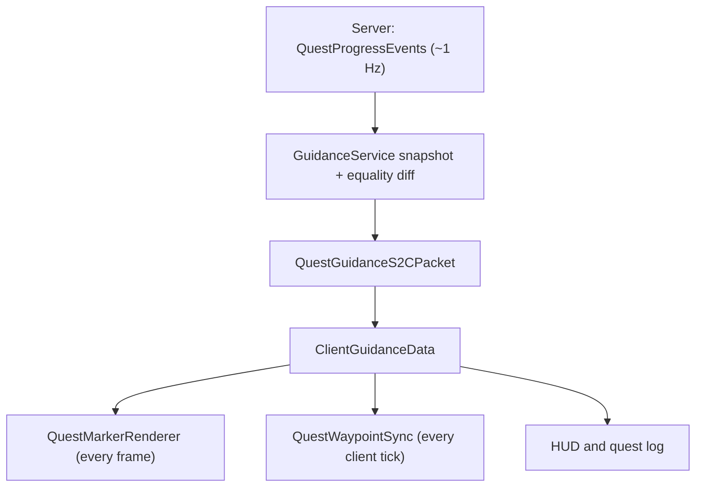

# MCA: Quests — JourneyMap/Xaero Integration and Objective Marker Specification

**Status:** implementation specification (no production code changed by this audit)  
**Repository:** `otectus/MCAQuests`  
**Audited revision:** `2c770f562b2119a2d71e417daeb77e2aac83811a` (`main`, 2026-09-03)  
**Resolved mod identity:** display name **MCA: Quests**, mod id `mcaquests`  
**Target runtime:** Minecraft 1.20.1, Forge 47.4.10, Java 17, ForgeGradle 6

All paths in this document are relative to the repository root. “Confirmed” means the behavior follows directly from the audited source or from an inspected binary named in §1.6. “Assumption” and “unverified” identify claims that require an in-game or dependency-matrix check.

## 1. Summary of current implementation

### 1.1 Executive summary

The in-world marker and the map integrations are separate consumers of the same `GuidanceSnapshot`. The server recomputes guidance approximately once per second, sends only changed snapshots, and includes a client entity id for live targets. The client then:

- renders one primary in-world marker every frame in `QuestMarkerRenderer`;
- publishes one map waypoint per eligible quest every client tick in `QuestWaypointSync`; and
- uses the same data for tracker and quest-log text.



The optional-mod class-loading boundary is currently sound: `MapWaypointCompat.init()` is called only from client setup, checks `ModList.get().isLoaded(...)` before loading the guarded implementation class, and the guarded binding resolves third-party classes with `Class.forName(name, false, loader)`. A dedicated server therefore keeps the no-op bridge and does not load either integration. This safety is enforced by `NoMinimapStaticLinkTest`.

The principal compatibility weakness is not absence handling but the JourneyMap entry point: `JourneyMapWaypoints` reflects the internal `journeymap.api.client.impl.ClientAPI.INSTANCE` instead of implementing JourneyMap’s documented `@JourneyMapPlugin(apiVersion = "2.0.0")` / `IClientPlugin` lifecycle. That internal singleton still exists in JourneyMap 1.20.1-6.0.4, but its use by an unregistered mod id is undocumented.

The two reported marker symptoms have direct, independent causes in the source:

- the icon/label is deliberately translated **25–27 blocks above** the already elevated entity anchor; and
- `Entity#getY(double)` is mistakenly called as though its argument were a partial tick. In 1.20.1 that overload returns a height-relative body Y, not an interpolated tick Y. The result sweeps through one full entity height every rendered tick. X and Z are not interpolated at all.

### 1.2 Direct JourneyMap/Xaero file map

This table is exhaustive for production source, build metadata, resources, and tests that directly name JourneyMap, Xaero, “minimap”, or the `MapWaypoint*` seam at the audited revision. Documentation-only matches (`README.md`, `CONFIG.md`, `CHANGELOG.md`, `CURSEFORGE.md`, `DATAPACK.md`, and `CLAUDE.md`) are not executable code, but must be updated when behavior/configuration changes.

| Path | Class / relevant method | Current role |
|---|---|---|
| `src/main/java/dev/otectus/mcaquests/McaQuestsConfig.java` | `McaQuestsConfig.Client` | Defines the shared `mapWaypoints` and `mapWaypointsFollowedOnly` client settings, plus marker settings. |
| `src/main/java/dev/otectus/mcaquests/client/GuidanceText.java` | `line(...)`, `markerLabel(...)`, `plain(...)` | Produces localized target/distance text and copyable coordinates consumed by the log, HUD, marker, and waypoint UI. |
| `src/main/java/dev/otectus/mcaquests/client/QuestClientSetup.java` | `onClientSetup(FMLClientSetupEvent)` | Calls `event.enqueueWork(MapWaypointCompat::init)` on the client mod bus. |
| `src/main/java/dev/otectus/mcaquests/client/QuestLogScreen.java` | `sideButtonCount(...)`, `init()`, `addWaypoint(ActiveGuidance)` | Shows the “add waypoint” button whenever any backend is available and calls `MapWaypointBridge.pin(...)`. |
| `src/main/java/dev/otectus/mcaquests/client/QuestWaypointSync.java` | `onClientTick(...)`, `wanted(...)`, `sync(...)`, `forget(...)`, `onLoggingOut(...)` | Builds/diffs desired automatic waypoints every client tick and fans changes into the bridge. |
| `src/main/java/dev/otectus/mcaquests/command/McaQuestsCommand.java` | `debugWaypoints(CommandContext<CommandSourceStack>)` | Runs map diagnostics from the common/server command dispatcher; this is not a reliable client-thread entry point. |
| `src/main/java/dev/otectus/mcaquests/compat/MapWaypointBridge.java` | `publish`, `withdraw`, `clear`, `pin`, `probe` | Always-loadable vanilla/Minecraft-only seam and global holder. |
| `src/main/java/dev/otectus/mcaquests/compat/MapWaypointCompat.java` | `init()`, `anyInstalled()` | Performs the `ModList` gate, reflectively loads the guarded implementation, and installs it in the holder. |
| `src/main/java/dev/otectus/mcaquests/compat/NoopMapWaypointBridge.java` | all interface methods | Safe server/absent-mod implementation. |
| `src/main/java/dev/otectus/mcaquests/compat/map/MapBinding.java` | `resolve(...)`, `bind(...)`, `loadOrNull(...)` | Resolves dotted class/member manifests into erased `MethodHandle`s without static third-party type references. |
| `src/main/java/dev/otectus/mcaquests/compat/map/ReflectiveMapWaypointBridge.java` | constructor and fan-out methods | Builds independent JourneyMap and Xaero backends and calls every usable backend. |
| `src/main/java/dev/otectus/mcaquests/compat/map/JourneyMapWaypoints.java` | `resolve`, `publish`, `withdraw`, `clear`, `pin`, `probe` | Reflects JourneyMap API v2 plus the internal `ClientAPI` enum singleton; tracks automatic waypoint objects. |
| `src/main/java/dev/otectus/mcaquests/compat/map/XaeroWaypoints.java` | `resolve`, `publish`, `withdraw`, `clear`, `pin`, `store` | Walks Xaero 26.x internals to the current root container’s third-party waypoint store and adds transient waypoints by origin/key. |
| `src/main/java/dev/otectus/mcaquests/event/QuestProgressEvents.java` | `onPlayerTick(...)`, `highlightTargets(...)`, logout/dimension handlers | Triggers `GuidanceService.update(...)` in the one-second server poll and forgets equality-diff state on logout/dimension change. |
| `src/main/resources/META-INF/mods.toml` | optional dependency blocks | Declares JourneyMap `[1.20.1-6.0.0,)` and Xaero’s Minimap `[26.0.0,)`, both `mandatory=false`, `ordering=AFTER`, `side=CLIENT`. |
| `src/main/resources/assets/mcaquests/lang/en_us.json` | marker/waypoint keys | English marker label, waypoint tooltip, and add-success text. |
| `src/main/resources/assets/mcaquests/lang/pt_br.json` | marker/waypoint keys | Brazilian Portuguese counterparts required by locale parity. |
| `build.gradle` | `mapProbeTest` | Provides an opt-in manifest probe for user-supplied JourneyMap/Xaero jars; neither jar is a normal dependency. |
| `src/test/java/dev/otectus/mcaquests/NoMinimapStaticLinkTest.java` | three bytecode scans | Rejects any compiled JourneyMap/Xaero type reference and any unguarded reference to `compat/map`. |
| `src/test/java/dev/otectus/mcaquests/compat/map/MapBindingProbeTest.java` | JourneyMap/Xaero probe tests | Resolves binding manifests against supplied real jars; tests are skipped when properties are absent. |
| `src/test/java/dev/otectus/mcaquests/client/GuidanceTextTest.java` | guidance text cases | Covers text used beside the map workflow, but not backend lifecycle. |

### 1.3 Adjacent guidance and marker files

These do not directly load a mapping mod but are part of the data/render path this work must change.

| Path | Role |
|---|---|
| `src/main/java/dev/otectus/mcaquests/quest/guidance/GuidanceTarget.java` | Wire model: kind, optional entity id, `BlockPos`, dimension, label, arrival radius, approximation/age flags. |
| `src/main/java/dev/otectus/mcaquests/quest/guidance/ActiveGuidance.java` | Adds quest id and giver UUID, which form the waypoint key. |
| `src/main/java/dev/otectus/mcaquests/quest/guidance/GuidanceSnapshot.java` | Immutable list plus server-chosen primary index. |
| `src/main/java/dev/otectus/mcaquests/quest/guidance/GuidanceService.java` | Computes all quest destinations and sends only when snapshot equality changes. |
| `src/main/java/dev/otectus/mcaquests/network/QuestGuidanceS2CPacket.java` | Encodes/decodes the snapshot and schedules the client handler. |
| `src/main/java/dev/otectus/mcaquests/network/QuestNetwork.java` | Strict protocol version (`"13"`) and packet registration. |
| `src/main/java/dev/otectus/mcaquests/client/QuestClientHandlers.java` | Routes packet data to `ClientGuidanceData.update(...)`. |
| `src/main/java/dev/otectus/mcaquests/client/ClientGuidanceData.java` | Volatile immutable snapshot read by marker/HUD/log/map sync; cleared on disconnect. |
| `src/main/java/dev/otectus/mcaquests/client/QuestClientInput.java` | Clears client guidance and other world-specific client caches on logout. |
| `src/main/java/dev/otectus/mcaquests/client/marker/QuestMarkerRenderer.java` | First-party level-render event subscriber and all current marker geometry/render types. |
| `src/main/java/dev/otectus/mcaquests/client/marker/MarkerGeometry.java` | Pure distance/fade/beam-height arithmetic. |
| `src/main/java/dev/otectus/mcaquests/client/marker/MarkerColours.java` | RGB color by `GuidanceKind`, also reused by JourneyMap. |
| `src/main/java/dev/otectus/mcaquests/client/marker/MarkerIcons.java` | Existing atlas sprite by `GuidanceKind`. |
| `src/test/java/dev/otectus/mcaquests/client/marker/MarkerGeometryTest.java` | Covers current linear fades/distance and explicitly asserts that the label clears the 24-block beam. |
| `src/test/java/dev/otectus/mcaquests/network/GuidanceCodecTest.java` | Guidance packet-model round trips. |
| `src/test/java/dev/otectus/mcaquests/quest/guidance/GuidanceSelectionTest.java` | Primary-guidance selection. |
| `src/test/java/dev/otectus/mcaquests/data/LocaleParityTest.java` | Ensures the two shipped locale files contain the same keys. |

### 1.4 Optional-dependency and class-loading audit

#### What is correct now

1. `mods.toml` declares both integrations as optional and client-side.
2. `QuestClientSetup` is a `Dist.CLIENT` subscriber and is the sole production caller of `MapWaypointCompat.init()`.
3. `MapWaypointCompat.init()` calls `anyInstalled()` first. Only when `ModList.get().isLoaded("journeymap")` or `isLoaded("xaerominimap")` is true does it execute `Class.forName("dev.otectus.mcaquests.compat.map.ReflectiveMapWaypointBridge")`.
4. Third-party class names inside `JourneyMapWaypoints` and `XaeroWaypoints` are dotted strings. `MapBinding.loadOrNull(...)` calls `Class.forName(name, false, loader)`, so discovery does not initialize those classes.
5. The public seam and no-op implementation contain no client-only or third-party types. A dedicated server never installs the reflective bridge.
6. `NoMinimapStaticLinkTest` scans compiled constant pools for `journeymap/` and `xaero/`, and separately ensures no class outside `compat/map/` links to that guarded package.

#### Caveats

- If either map mod is installed, `ReflectiveMapWaypointBridge` itself is loaded and constructs both first-party backend wrappers. This is safe because the absent backend’s external probe is a non-initializing name lookup, but it is broader than necessary.
- `McaQuestsCommand.debugWaypoints(...)` is registered as a common/server command. On a dedicated server it correctly declines to probe. In integrated single-player, however, `FMLEnvironment.dist == CLIENT` and the server command thread can call client map APIs through the shared static holder. That thread/side crossing is a confirmed diagnostic defect (§2.8).
- Migrating JourneyMap to its documented plugin interface introduces a deliberate static API link in one isolated package. The JVM-safety rule must become “only JourneyMap’s own plugin discovery may load that package,” not “no class in the jar may name JourneyMap.” §3.7 defines the replacement tripwire.

### 1.5 Current marker render path and work cadence

`QuestMarkerRenderer.onRenderLevel(RenderLevelStageEvent)` runs at `Stage.AFTER_PARTICLES`.

1. Per frame it checks `showQuestMarker`, fetches `ClientGuidanceData.primary()`, verifies player/level/GUI state and exact dimension equality, then resolves an entity by network id when possible.
2. `position(Minecraft, GuidanceTarget, float)` returns either the live entity position or `Vec3.atBottomCenterOf(target.pos())`.
3. The event camera position is subtracted in double precision (`at.subtract(eye)`) before the result is translated into the float-backed pose matrix. This part is correct for large world-coordinate magnitudes as long as the relative distance remains bounded.
4. `draw(...)` pushes the event pose, translates to the camera-relative anchor, emits a 24-block crossed-quad beam, pushes again, translates the icon/label by `MarkerGeometry.labelHeight(distance)`, applies `camera.rotation()` for a full billboard, emits icon and text, and pops both poses. Push/pop balance is currently correct.
5. Both custom render types use translucent blending, no culling, `NO_DEPTH_TEST`, and `COLOR_WRITE`. The font uses `Font.DisplayMode.SEE_THROUGH` and full-bright lighting. Therefore beam, icon, and label all render through walls at their full visual treatment.
6. `draw(...)` obtains the global `minecraft.renderBuffers().bufferSource()` and calls the unqualified `buffers.endBatch()`. That flushes every pending type in the shared source, not just MCA: Quests’ types.

Current per-frame allocations/work include `Optional`, at least two `Vec3` values, a marker label `Component`, entity lookup, buffer lookup, 8 beam vertices, 4 icon vertices, font batching, and a global batch flush. There is no marker work after the early exits when no primary objective is present.

Separately, `QuestWaypointSync.onClientTick(...)` executes every client tick. When a map backend is available it allocates a desired `HashMap`, a stale `HashSet`, and an `ArrayList` during lookups even if the guidance snapshot has not changed. Server guidance is recomputed in `QuestProgressEvents.onPlayerTick(...)` only when `player.tickCount % 20 == 0`; `GuidanceService.send(...)` suppresses the packet if the resulting immutable snapshot equals the last sent value.

### 1.6 Version and classpath findings

| Concern | Repository declaration / assumption | Finding |
|---|---|---|
| Core toolchain | `gradle.properties`: MC `1.20.1`, Forge `47.4.10`, official mappings `1.20.1`; Java toolchain 17 in `build.gradle` | Matches the requested baseline. |
| JourneyMap mod | Optional range `[1.20.1-6.0.0,)`; probe example `journeymap-forge-1.20.1-6.0.4.jar` | Exact 6.0.4 binary was inspected. It embeds `journeymap-api-forge-1.20.1-2.0.0.jar`, and still contains internal enum `journeymap.api.client.impl.ClientAPI.INSTANCE`. The current manifest names resolve by static inspection. The unregistered-singleton behavior remains undocumented. |
| JourneyMap API | Reflected `api.v2.*`; no build dependency | Official `1.20.1_2.0` API source uses `@JourneyMapPlugin(apiVersion = "2.0.0")`, `IClientPlugin.initialize(IClientAPI)`, and publishes compile-only artifact `info.journeymap:journeymap-api-forge:1.20.1-2.0.0`. The repository’s comment that no reachable Maven exists is stale. |
| Xaero’s Minimap | Optional range `[26.0.0,)`; probe example `xaerominimap-forge-1.20.1-26.4.2.jar` | Exact 26.4.2 dev binary was inspected. The reflected session → world manager → current root container → third-party manager/store chain, primitive nine-argument `Waypoint` constructor, and named classes/methods are present. The hard-coded color ordinals happen to match 26.4.2’s enum order; that does not make ordinals a stable contract. |
| Xaero’s World Map | No `xaeroworldmap` dependency block or separate backend | Current integration gates only on `xaerominimap`. The Minimap binary contains World Map support and both map/world waypoint readers; actual World Map propagation must be verified in-game. |
| Normal compile/runtime classpath | Neither JourneyMap nor Xaero is declared in `dependencies`; repository has no `libs/` jars | **Neither integration is actually on the checkout’s normal classpath.** `mapProbeTest` receives external paths only when properties are supplied, and otherwise skips both probe tests. Therefore the standard `check` task does not prove either supported version. |

Research binaries used only for this audit (not added to the repository):

- JourneyMap `journeymap-forge-1.20.1-6.0.4.jar`, SHA-256 `ce7b60f37a8d0ec7a67cd1e927f394c1141c2ac3b2ed697583cc5d0270feb156`.
- Xaero production `xaerominimap-forge-1.20.1-26.4.2.jar`, SHA-256 `32517c33cf8ba607208da7183796780ceb034140f799307c563ced0ed68cc3cc`; the matching dev jar (`921c18d7e4c0109667ea4a8920f506916dcf74f52843777cf862234103bfd59d`) was also inspected for the same source-level member shapes.
- JourneyMap API source branch `1.20.1_2.0`, revision `d62812125a69ce7a0a6d2be74931d6a84bb6862b`.

The attempted baseline `./gradlew test` did not start because this environment could not download the Gradle 8.8 wrapper distribution. This is an audit-environment limitation, not a test result; §7 requires a clean baseline and post-change run in a network-capable build environment.

## 2. Confirmed defects — root cause, evidence, severity

### 2.1 Defect A — icon/blip renders in the sky

**Severity: High (primary navigation is visibly wrong).**

Two confirmed offsets compound:

1. `MarkerGeometry.labelHeight(double)` returns `BEAM_HEIGHT + 1 + clamp(distance / 128) * 2`, with `BEAM_HEIGHT = 24`. `QuestMarkerRenderer.draw(...)` applies this to the icon and label, so the “blip” is intentionally 25–27 blocks above the marker anchor. At the screenshot’s reported distance of 7 blocks, this term alone is approximately 25.11 blocks.
2. For a live entity, `QuestMarkerRenderer.position(...)` returns `entity.getY(partialTick) + entity.getBbHeight()`. In Minecraft 1.20.1, `getY(double heightScale)`/`getBodyY(double)` means feet Y plus a fraction of bounding-box height; it is not interpolation. The current formula is effectively `feetY + height * partialTick + height`, placing the beam base between one and two entity heights above the feet.

The screenshot target line reports Y=63 while the faint glyph is high in the sky, consistent with the code’s roughly 25-block glyph translation plus the entity-height error.

Candidate causes ruled out by source:

- No world height, build limit, sea level, or height-map value is used.
- Camera-relative subtraction is present and performed before the pose translation.
- The fixed-position fallback is `Vec3.atBottomCenterOf(target.pos())`; it is not unconditionally replaced by terrain height.
- `getEyeY()` is not used. The problem is the semantic misuse of `getY(double)`, followed by the explicit beam-top translation.

### 2.2 Defect B — icon/blip twitches continuously

**Severity: High (continuous motion makes the target hard to read and visually broken).**

The live-entity code mixes three different temporal samples:

- Y is recomputed as a function of render `partialTick` through the wrong `getY(double)` overload. It rises by one full entity height over each tick and drops when the next tick’s partial value resets: a vertical sawtooth at 20 Hz.
- X and Z use current tick positions (`getX()`, `getZ()`) without lerping from `xo`/`zo`, so movement advances in 20 Hz steps at 60/120/144 FPS.
- The camera comes from `RenderLevelStageEvent.getCamera().getPosition()`, which is already the render-frame camera. A stepped marker relative to a smooth camera visibly jitters.

Candidate causes ruled out or scoped:

- The loaded-entity path does not use the once-per-second server `BlockPos`; it resolves and follows the local entity id. Server packet cadence is therefore not the cause of continuous twitching in the screenshot, assuming the nearby NPC is loaded.
- World coordinates remain doubles until after camera-relative subtraction, so there is no early double-to-float collapse in the current position path.
- Billboarding uses only the event camera quaternion. No noisy target-derived yaw/pitch feeds it, so it is not the source of positional jitter.
- When the entity is not loaded, the fallback can move only when a new server snapshot arrives (at most the guidance cadence). That can create occasional one-block jumps, not continuous per-frame twitching; the redesign cross-fades such retargets.

### 2.3 JourneyMap dimension update is incomplete

**Severity: High (wrong-world waypoint after dimension changes or objective transitions).**

`QuestWaypointSync.onClientTick(...)` clears only its outer `PUBLISHED` map when the client dimension changes; it does not call `bridge.clear()`. It then republishes the same stable quest key. `JourneyMapWaypoints.publish(...)` sees the existing backend object and updates only `setBlockPos(...)` and `setName(...)`; it never updates dimensions or color. A key reused after an Overworld → Nether transition can therefore retain the old JourneyMap dimension while receiving new coordinates/name.

Xaero’s `Waypoint` constructor has no dimension argument and the backend ignores its `dimension` parameter. The outer current-dimension filter prevents knowingly publishing another dimension, but failure to clear on the dimension epoch can leave an old third-party entry in a reused root store. Whether Xaero 26.4.2 reuses that exact store across a given server/dimension transition is an in-game question; the missing clear is confirmed, the visible stale result is not.

### 2.4 Manual “keep” waypoints violate their contract

**Severity: High (misleading persistence and potential deletion of user-intended data).**

- JourneyMap pins are created with `persistent=true` under mod id `mcaquests`, but `JourneyMapWaypoints.clear()` calls `removeAllWaypoints("mcaquests")`. It does not distinguish automatic objects in `published` from persistent pins, so normal automatic cleanup can remove a pin the UI says the player owns.
- Xaero pins are added to the same third-party store with a `pin/x/y/z` key. The source itself states that third-party points are not saved, so the pin is session-only despite `MapWaypointBridge.pin(...)` promising it “outlives the quest” and the quest-log success message saying it was added without qualification.
- The Xaero pin key omits dimension; equal coordinates in two dimensions collide if they share a root store.

### 2.5 Backend failures are recorded as success

**Severity: Medium–High (silent missing markers that never self-heal).**

Both backends catch `Throwable`, log at debug, and return `null`; their public mutation methods return `void`. `QuestWaypointSync.sync(...)` then writes its outer `PUBLISHED` entry unconditionally. JourneyMap also writes its internal `published` map before invoking `ADD_WAYPOINT`; Xaero adds its key to `published` after an invocation whose success is unknowable. If the API/store is not ready or an invocation fails, subsequent ticks see an equal local record and do not retry. With both mods installed, success in one and failure in the other is also collapsed into one outer success state.

Withdrawal/clear paths likewise forget local ownership before proving that removal completed, preventing reliable retries.

### 2.6 Kind/theme-only changes are ignored

**Severity: Low (stale color/icon, correct coordinates).**

`QuestWaypointSync.Published` contains only position, dimension, and label. `GuidanceKind` is passed to `bridge.publish(...)` but is not part of equality. A target whose semantic kind changes at the same position with the same label is not republished. JourneyMap’s existing-object path also never calls `setColor(...)`.

### 2.7 JourneyMap uses an undocumented internal entry point

**Severity: High compatibility risk; currently functional against inspected 6.0.4.**

`JourneyMapWaypoints.resolve(...)` loads `journeymap.api.client.impl.ClientAPI`, obtains enum constant `INSTANCE`, and relies on an internal `getPlugin` path accepting an unregistered mod id. The current probe explicitly describes this as the whole integration’s load-bearing behavior. JourneyMap’s public contract instead requires an annotated `IClientPlugin` and passes `IClientAPI` to `initialize(...)`. A patch release can change the internal implementation without breaking its public API, disabling MCA: Quests even though the declared dependency range accepts that release.

### 2.8 Waypoint diagnostics run on the wrong command side

**Severity: Medium (diagnostic can misreport or call client APIs off-thread).**

`McaQuestsCommand.debugWaypoints(...)` is a server command. A dedicated server can only say it has no client state. In integrated single-player the physical distribution is client, so the method can reach the shared bridge from the logical server command thread and run a JourneyMap add/read/remove probe there. Neither integration is documented as server-thread-safe.

All diagnostic output in this method and backend `describe/probe` responses is also hard-coded English.

### 2.9 Reconciliation does avoidable steady-state work

**Severity: Medium performance/maintenance issue (not the marker jitter cause).**

With a backend installed, `QuestWaypointSync` reconstructs collections and searches copied lists every client tick even though `ClientGuidanceData` changes only on a packet, logout, or local world/config transition. There is no need to poll/diff at 20 Hz. When no backend is installed, the event still fires but returns after the no-op `isAvailable()` check; this is small but avoidable.

### 2.10 Additional risk: duplicate native map-mod world markers

**Status: Unverified risk, not a confirmed defect.**

The current JourneyMap waypoint is not configured with `setShowInWorld(false)` or `setShowBeacon(false)`, whose API defaults are visible. Xaero’s 26.4.2 binary has both map and world readers for the same `Waypoint`, and no per-context visibility flag was found in the reflected contract. The screenshot alone cannot establish which translucent glyph/beam belongs to MCA: Quests versus a native map renderer. Runtime testing must identify duplicates. The implementation must suppress JourneyMap’s native world treatment; Xaero’s limitation remains an explicit open question (§8).

## 3. Fix specifications

### 3.1 Fix Defect A: resolve a true target anchor and stop moving the glyph to the beam top

**Target files/methods**

- Replace `QuestMarkerRenderer.position(Minecraft, GuidanceTarget, float)` with an extracted resolver, preferably new `client/marker/MarkerAnchorResolver.java`.
- Change `QuestMarkerRenderer.draw(...)` to receive a resolved base/glyph anchor and remove `pose.translate(0, MarkerGeometry.labelHeight(distance), 0)`.
- Remove `MarkerGeometry.BEAM_HEIGHT`, `BEAM_WIDTH`, and `labelHeight(...)` when the compact renderer in §4 replaces the old beam. Do not leave a test that requires a sky-height label.
- Extend `GuidanceTarget` with the entity’s last known bounding-box height for an unloaded-entity fallback; update `GuidanceTarget.ofEntity(...)`, `encode/decode`, `GuidanceCodecTest`, and bump `QuestNetwork.PROTOCOL_VERSION` from `"13"` to `"14"`.

Use a retained value object such as:

```java
record MarkerAnchor(
        double x,
        double baseY,
        double z,
        double glyphY,
        VerticalAlignment alignment,
        double targetWidth) {
    enum VerticalAlignment { CENTER_ON_BODY, BOTTOM_ON_SURFACE }
}
```

For a loaded entity, `baseY` is interpolated feet Y and `glyphY` is 72% of the current bounding-box height above it. This is a bounding-box-relative upper-body anchor, works for short/tall entities, and does not assume every target is a `LivingEntity` with an eye position.

For a fixed `BlockPos`, resolve the support surface once per guidance revision, not per frame:

1. If the block’s collision/visual shape is non-empty, use `pos.getY() + shape.max(Direction.Axis.Y)`.
2. Else, if the block below has a non-empty shape, use the top of that shape.
3. Else use `pos.getY()` and mark the anchor as the already-approximate coordinate; do not invoke a height map or scan downward every frame.
4. Use `BOTTOM_ON_SURFACE`, so the icon’s bottom is placed two apparent pixels above the surface after scale is known. Do not add a fixed world-space “magic” Y offset.

For an entity id that no longer resolves, use `target.pos()` plus `0.72 * target.entityHeight()` and `CENTER_ON_BODY`. A non-positive/corrupt height falls back to `BOTTOM_ON_SURFACE` at the transmitted position. Clamp decoded height to `[0, 64]` before use.

**Acceptance checks**

- At the screenshot case (NPC around Y=63), the icon center overlaps the NPC’s upper body, not Y≈88–92.
- Adult/baby/tall test targets remain inside their bounding boxes without per-kind constants.
- Fixed bed/workstation/portal points sit immediately above the block shape.
- No marker code reads sea level, build height, or a height map as an unconditional fallback.

### 3.2 Fix Defect B: interpolate target position with the render partial tick

**Target files/methods**

- `QuestMarkerRenderer.onRenderLevel(...)`
- extracted `MarkerAnchorResolver.resolve(...)`
- new pure tests in `client/marker/MarkerAnchorResolverTest.java`

Use the same `event.getPartialTick()` for all three entity axes. Continue using `event.getCamera().getPosition()` as the frame camera; do not interpolate the camera a second time. Subtract in doubles before any cast or `Matrix4f` mutation.

```java
static MarkerAnchor forEntity(Entity entity, float partialTick) {
    double t = Mth.clamp((double) partialTick, 0.0D, 1.0D);
    double x = Mth.lerp(t, entity.xo, entity.getX());
    double feetY = Mth.lerp(t, entity.yo, entity.getY());
    double z = Mth.lerp(t, entity.zo, entity.getZ());
    double height = entity.getBbHeight();
    return new MarkerAnchor(
            x, feetY, z,
            feetY + height * 0.72D,
            MarkerAnchor.VerticalAlignment.CENTER_ON_BODY,
            entity.getBbWidth());
}

// In onRenderLevel: keep precision until coordinates are camera-relative.
Vec3 cameraPos = event.getCamera().getPosition();
double relativeX = anchor.x() - cameraPos.x;
double relativeY = anchor.glyphY() - cameraPos.y;
double relativeZ = anchor.z() - cameraPos.z;
pose.translate(relativeX, relativeY, relativeZ);
```

Never call `entity.getY(partialTick)`. Add a source comment explaining that the double overload is body-height sampling, because its signature is easy to misuse again.

For a new server snapshot that moves an unresolved entity fallback, cross-fade old/new anchors over 120 ms; do not continuously low-pass a loaded entity, since smoothing an already interpolated entity adds visible lag.

**Acceptance checks**

- Pure tests for partial ticks `0`, `0.25`, `0.5`, `0.75`, and `1` produce exact lerps on X/Y/Z.
- At 30, 60, 120, and 144 FPS, a walking NPC’s marker has no 20 Hz lateral step and no once-per-tick vertical reset.
- At X/Z near ±29,999,000 with the target within 256 blocks, relative coordinates remain stable; no double is cast before subtraction.

### 3.3 Fix Defect 2.3: make dimension changes an explicit reconciliation epoch

**Target files/methods**

- Refactor `QuestWaypointSync.onClientTick(...)`, `wanted(...)`, `sync(...)`, and `forget(...)` as described in §3.9.
- Change the bridge/backend contract in `MapWaypointBridge` and `ReflectiveMapWaypointBridge`.
- JourneyMap update path in the new typed backend (§3.7).
- `XaeroWaypoints` current-dimension path (§3.8).

Define canonical `WaypointSpec(key, pos, dimension, label, kind)`; `dimension` is never optional and `kind` is part of equality. Each backend owns its own successfully applied state. On client login, level identity change, `ClientPlayerNetworkEvent.Clone`, and logout, increment a world epoch and call `clearAutomatic(cause)` before reconciling the new desired set.

Dimension rules:

- Never multiply/divide coordinates in the map layer. A coordinate remains paired with its original `ResourceKey<Level>`. Nether portal routing is a `GuidanceService` concern; `GuidanceKind.PORTAL` already represents the current-dimension route when available.
- JourneyMap receives every desired target in its true dimension. Set both primary dimension and the exact singleton dimension set. On any dimension change for an existing key, remove/recreate the waypoint rather than relying on an implementation-specific mutable refresh.
- Xaero 26.4.2’s reflected third-party waypoint object has no dimension field. Publish only specs whose dimension equals `Minecraft.level.dimension()`, and clear/rebuild the automatic origin on every dimension epoch. Other-dimension specs return `SKIPPED_OTHER_DIMENSION`; do not create a scaled surrogate.

### 3.4 Fix Defect 2.4: separate automatic ownership from persistent pin capability

**Target files/methods**

- `MapWaypointBridge`: add explicit capabilities, e.g. `automaticWaypoints()` and `persistentPins()`.
- `QuestLogScreen.sideButtonCount(...)`, `init()`, `addWaypoint(...)`.
- JourneyMap backend `clearAutomatic(...)` / `pinPersistent(...)`.
- Xaero backend capabilities.

Rules:

1. Automatic waypoints are tracked by exact objects/keys and cleanup removes only those objects. Do not call JourneyMap `removeAllWaypoints(modId)`.
2. JourneyMap may implement persistent pins with `persistent=true`; store their ids separately only for diagnostics, never automatic cleanup.
3. Xaero’s current third-party store must report `persistentPins=false`. Do not write or rewrite Xaero waypoint/NBT/files: no stable file contract or save-locking protocol is present in this repository, and direct file edits risk lost user data.
4. Show the quest-log star button only when at least one backend supports persistent pins. With both mods installed, send the pin only to persistent-capable backends (currently JourneyMap), while automatic points still fan out to both.
5. If product direction requires a Xaero-only action, label it explicitly “Add session waypoint” with a separate localized message and dimension-bearing key. The default implementation in this spec is to hide it and retain “copy coordinates.”

### 3.5 Fix Defect 2.5: make mutation outcomes observable and retryable

Replace void fan-out with per-backend reconciliation and explicit outcomes:

```java
enum MapMutationResult {
    APPLIED,
    UNCHANGED,
    RETRY_LATER,          // e.g. Xaero session/store not ready
    SKIPPED_OTHER_DIMENSION,
    UNSUPPORTED,
    FAILED
}
```

Each backend must:

- update its applied-state map only after an API call completes and, where possible, a read-back finds the waypoint;
- retain failed removals so cleanup can retry;
- classify “client session not constructed yet” as `RETRY_LATER`, not as a binding mismatch;
- retry transient failures after 1, 2, 4, 8, 16, 32, then 60 seconds maximum, reset on world epoch or successful call;
- log one warning per backend/version/root-cause fingerprint, expose the latest failure to diagnostics, and never emit one stack trace per tick/frame;
- isolate backend failures so JourneyMap success does not suppress a Xaero retry or vice versa.

The composite should return a structured `SyncReport`, not English strings. The client diagnostic command localizes presentation.

### 3.6 Fix Defect 2.6: use the complete desired state

`WaypointSpec.equals(...)` must include `key`, `BlockPos`, `ResourceKey<Level>`, localized rendered label, `GuidanceKind`, and automatic/persistent ownership. Approximate/last-known flags need not affect a map point unless they change its displayed label; if the waypoint label gains those qualifiers, include the resulting string.

On an in-place JourneyMap update, refresh position, name, color, icon, and dimension-related fields. Prefer remove/recreate on dimension or persistence changes; same-dimension position/name/theme changes may mutate and re-add/read-back.

### 3.7 Fix Defect 2.7: migrate JourneyMap to the documented client plugin API

**Target files**

- Add `dev/otectus/mcaquests/compat/journeymap/McaQuestsJourneyMapPlugin.java`.
- Add `dev/otectus/mcaquests/compat/journeymap/JourneyMapWaypointBackend.java`.
- Add an external-type-free client registrar/composite such as `client/ClientMapWaypointRegistry.java`, or give `MapWaypointBridge.Holder` equivalent keyed `register/unregister` behavior.
- Remove the JourneyMap manifest/internal-singleton path from `compat/map/JourneyMapWaypoints.java` and `ReflectiveMapWaypointBridge` (delete the old class once no references remain).
- Add JourneyMap’s official Maven repository and `compileOnly("info.journeymap:journeymap-api-forge:1.20.1-2.0.0")` to `build.gradle`, matching JourneyMap’s Forge setup guide; do not use `implementation` and do not bundle the API.
- Update `NoMinimapStaticLinkTest` and `MapBindingProbeTest` as below.

The isolated entry point should follow the public lifecycle:

```java
@JourneyMapPlugin(apiVersion = "2.0.0")
public final class McaQuestsJourneyMapPlugin implements IClientPlugin {
    @Override
    public String getModId() {
        return McaQuests.MOD_ID;
    }

    @Override
    public void initialize(IClientAPI api) {
        ClientMapWaypointRegistry.register(
                "journeymap", new JourneyMapWaypointBackend(api));
    }
}
```

No first-party class outside `compat/journeymap/` may import, instantiate, reflect, or mention either adapter class. When JourneyMap is absent, nothing loads this package; JourneyMap’s own annotation discovery is the only entry. Keep the optional `mods.toml` dependency client-side.

The registrar contains only first-party interfaces and supports independent keyed backends. It must accept JourneyMap registration whether the plugin callback runs before or after `QuestClientSetup`. Refactor `MapWaypointCompat.init()` so its pre-load `ModList.get().isLoaded("xaerominimap")` gate loads/registers only the guarded Xaero backend; it must no longer reflect or construct a JourneyMap implementation. A backend registration marks waypoint reconciliation dirty so an already-received guidance snapshot is applied.

For an automatic waypoint:

```java
Waypoint point = WaypointFactory.createWaypoint(
        McaQuests.MOD_ID, spec.pos(), spec.label(), spec.dimension(), false);
point.setColor(MarkerColours.of(spec.kind()));
point.setDimensions(Set.of(spec.dimension().location().toString()));
point.setPrimaryDimension(spec.dimension());
point.setShowOnMap(true);
point.setShowInWorld(false);
point.setShowBeacon(false);
api.addWaypoint(McaQuests.MOD_ID, point);
```

Read back with `api.getWaypoint(modId, point.getId())` before recording `APPLIED`. Suppressing JourneyMap’s native world icon/beacon makes the §4 renderer the single in-world visual owner. Persistent user pins may retain JourneyMap’s normal world visibility unless product direction says otherwise.

Revise the static-link test into two rules:

1. `journeymap/` references are allowed only under `dev/otectus/mcaquests/compat/journeymap/`; `xaero/` references remain forbidden everywhere.
2. No compiled class outside the JourneyMap package may reference that package’s internal name. Add an absent-JourneyMap class-loading test that loads all normal client/common entry points without loading the adapter.

JourneyMap reflection probes become unnecessary for public API members because compilation pins their signatures. Retain a runtime smoke test for plugin discovery, add/read/remove behavior, dimension placement, and visibility flags against the declared minimum and current 6.0.x release.

### 3.8 Fix Xaero fragility without writing user files

**Target files/methods**

- `compat/map/XaeroWaypoints.java`: `MANIFEST`, `resolve(...)`, `publish/reconcile`, `withdraw`, `clear`, `colour`, invocation helpers.
- `compat/map/MapBinding.java` and `MapBindingProbeTest` only as required for enum/class probes and outcome reporting.

Required changes:

- Keep the 26.4.2 third-party waypoint store mechanism for automatic quest-owned points. It matches the desired transient ownership and is present in the inspected binary.
- Remove `SET_NAME` from `MANIFEST`; it is never invoked, and an irrelevant missing member currently disables the whole backend.
- Add class probes for `xaero.hud.minimap.waypoint.WaypointColor` and `WaypointPurpose`. Resolve semantic enum names (`LIGHT_BLUE`, `GOLD`, etc.) and call `Enum.ordinal()` on the returned JDK `Enum<?>`; do not bake numeric ordinals into MCA: Quests.
- Make the automatic origin `mcaquests:quests` exclusive to auto-managed entries. Report no persistent-pin capability.
- Re-fetch the current store for mutations as now, but track store identity separately. When the returned store object changes, discard only local applied-state knowledge and reconcile the desired set into the new store. On an explicit dimension/world epoch, call the current origin’s `clear()` first.
- Return boolean/result status from reflected void calls by distinguishing “completed without exception” from “threw.” Do not use a nullable return from a `void` handle as the success signal.
- Preserve the dimension gate and never scale coordinates. Validate current dimension before constructing a waypoint.
- Probe both the declared minimum and current supported release in CI/release preflight. If 26.0.0 cannot pass, raise the documented/backend-supported minimum instead of silently accepting it.

### 3.9 Fix Defects 2.8–2.9: client diagnostics and event-driven reconciliation

Move the real probe to a client command registered from `RegisterClientCommandsEvent`, for example `/mcaquestsclient waypoints`. `McaQuestsCommand.debugWaypoints(...)` should either be removed or print one localized instruction directing the operator to the client command. The client command runs on the main client thread and reports structured backend status, detected mod version, last successful sync, pending retry, and last failure without mutating unless an explicit `probe` subcommand is used.

Replace 20 Hz map polling with a dirty/revision model:

- `ClientGuidanceData.update(...)` and `clear()` increment a monotonic revision and call `QuestWaypointSync.markDirty(GUIDANCE)` on the client main thread.
- Login, logout, client clone/respawn, level identity/dimension changes, and relevant config reloads call `markDirty(...)` or `clearAutomatic(...)` explicitly.
- `QuestWaypointSync` may keep an END client-tick subscriber solely to consume a dirty flag and scheduled backoff. If neither backend exists, unregister it or return without allocating. If the revision/config/world epoch is unchanged and no retry is due, allocate nothing.
- On the server, keep the one-second pass as a safety net and for inherently polled/located objectives, but mark guidance dirty from the centralized mutations `QuestManager.accept(...)`, `turnIn(...)`/`completeQuest(...)`, `abandon(...)`, `failQuest(...)`, and `track(...)`, plus respawn/dimension hooks. Event-driven objective handlers should mark dirty after a progress transition; inherently polled objectives may wait for the existing pass. Coalesce multiple mutations and recompute once at server-tick end. `GuidanceService.send(...)` retains equality-based packet suppression.
- Add `GuidanceService.forget(...)`/dirty handling to the respawn lifecycle so strict equality cannot suppress the first post-death snapshot.

Typical guidance payloads are already small and change-diffed; do not add compression. The proposed entity-height float adds four bytes per target. Add a codec size assertion for a representative five-target snapshot and keep it under 1 KiB with 64-character labels.

## 4. Marker redesign specification

### 4.1 Design outcome and non-negotiable criteria

The default marker becomes a compact, stable upper-body/surface glyph with a short anchor cue. The 24-block sky beam is removed from the default style. It must satisfy all of the following:

- zero positional bobbing or animation; a loaded target and camera use one partial-tick sample;
- camera-relative subtraction in double precision, stable near the world border;
- one full billboard for icon/text, with ground cue kept in world orientation;
- depth-tested visible treatment plus a visibly different occluded outline, never the current full-strength no-depth rendering;
- 18–24 apparent-pixel glyph size through the normal distance range;
- deterministic edge clamping and behind-camera behavior;
- eased acquire/clear/retarget transitions;
- bbox/shape-relative vertical anchors;
- renderer-owned buffers, balanced poses, RenderType-contained state, and no global buffer flush;
- no per-frame collection creation, no per-frame target label reconstruction when rounded distance is unchanged, and near-zero work without an active target.

### 4.2 Visual components and exact values

| Component | Default `COMPACT` specification |
|---|---|
| Glyph | Existing kind glyph, nominal 20 px, centered inside a 24 px diamond frame. |
| Visible frame | 2 px `#101820` outer outline; 2 px semantic-color inner stroke; fill behind glyph at 35% black. Main composite alpha 0.95. |
| Occluded treatment | Hollow 24 px semantic-color diamond at 0.22 alpha with a 2 px dark outline at 0.30 alpha. No filled glyph, text, ring, or full beam. |
| Entity anchor | Glyph center at interpolated feet Y + `0.72 * entity.getBbHeight()`. |
| Fixed anchor | Glyph bottom 2 apparent pixels above resolved block/support surface. |
| Ground ring | Depth-tested 32-segment ring; entity radius `clamp(0.65 * bbWidth, 0.30, 0.90)` blocks, fixed radius 0.45; stroke 0.035 blocks; Y = base/surface + 0.02; semantic color at 0.55 alpha. |
| Stem | Depth-tested camera-facing 0.025-block strip from ring center to glyph anchor, never beyond it; semantic color at 0.35 alpha. Omit when vertical length is <0.15 blocks. |
| Label | Visible/unoccluded only; centered 4 px above frame; native font size, 2 px horizontal/1 px vertical padding, black background alpha 0.65, text `#F2F2F2` alpha 0.95, maximum width 160 px with ellipsis. Default only at horizontal distance ≤48 blocks. |
| `HIGH_VISIBILITY` style | Adds a depth-treated 0.18-block-wide, 6-block-tall tapered column from base, alpha 0.28 → 0; it does **not** move the glyph. |
| `ICON_ONLY` style | Glyph/frame only; no ring, stem, label, or column. Edge behavior remains available. |

The frame/glyph is never positioned at the top of a column. Visual animation may affect opacity only; it must not change position, rotation, or scale over time.

### 4.3 Billboarding decision

Use a full spherical billboard for glyph and label by applying the render event camera quaternion after translation. This keeps the icon square and text readable while looking steeply up/down, which is the primary use case when a target is above/below the player. A Y-axis-only billboard is rejected for glyph/text because it foreshortens at high pitch and can make text unreadable. The ring stays horizontal in world space; the thin stem is camera-facing around its vertical axis only.

### 4.4 Distance scaling

Define `d` as horizontal distance for arrival/far behavior, preserving tracker semantics. Define `z` as positive camera-space depth for projection size. Let `m11 = projection.m11()` and `H` be framebuffer height in physical pixels:

```java
double apparentPixels(double distance, int maxDistance) {
    double t = smoothstep(12.0D, Math.max(13.0D, maxDistance), distance);
    return Mth.lerp(t, 24.0D, 18.0D); // exact on-screen bounds
}

double worldPerPixel(double cameraDepth, Matrix4f projection, int framebufferHeight) {
    return 2.0D * cameraDepth / (projection.m11() * framebufferHeight);
}

double requestedWorldSize = apparentPixels(d, maxDistance)
        * worldPerPixel(z, event.getProjectionMatrix(), window.getHeight());
double worldSize = Math.min(requestedWorldSize, 6.0D);
```

Do not impose a world-space minimum that makes the marker enormous up close. The apparent target size is bounded to 18–24 px. If the 6-block world-size cap would make the glyph smaller than 18 px, render the glyph in the HUD projection layer at its true projected position (or edge) at 18 px and omit world ring/stem/label. This avoids a giant billboard spanning terrain while preserving legibility.

Use `worldSize / 24` as the world-units-per-logical-pixel scale for frame, glyph, gaps, and label. Recompute projection scale per frame because FOV/window size can change; cache all texture, text, and geometry data.

### 4.5 Depth and occlusion pipeline

Keep `RenderLevelStageEvent.Stage.AFTER_PARTICLES` unless shader testing proves another Forge 47 stage is required. At that stage:

1. Resolve/calculate primitive anchor and camera-relative doubles.
2. Render the no-depth **occluded outline first**. It writes color only, not depth, and uses the hollow/dim treatment.
3. Render the main frame/glyph, ring, stem, and optional high-visibility column with `LEQUAL_DEPTH_TEST`, translucent blending, color-only write, and no culling as appropriate. Where the target is behind terrain, this pass fails and only the dim outline remains. Where visible, it covers the dim underlay.
4. Render the label only in the depth-tested pass. Do not use `Font.DisplayMode.SEE_THROUGH` for the main label.
5. Flush only the renderer-owned source after all marker/font consumers are emitted.

Create a dedicated `MultiBufferSource.BufferSource` once on the client render thread (for example from a renderer-owned `BufferBuilder` sized for the marker). `endBatch()` is then safe because it cannot flush another renderer’s vertices. Alternatively, if the shared source must be used, call `endBatch(renderType)` only for every owned explicit type and leave font flushing to the normal renderer. The unqualified global `minecraft.renderBuffers().bufferSource().endBatch()` is forbidden.

All blend/depth/cull/write-mask behavior belongs in immutable `RenderType` composite state. Do not call raw `RenderSystem.enable/disable*` methods. Wrap every pose push in `try/finally`:

```java
private static final RenderType VISIBLE_ICON = RenderType.create(
        McaQuests.MOD_ID + ":marker_visible",
        DefaultVertexFormat.POSITION_COLOR_TEX,
        VertexFormat.Mode.QUADS, 512, false, true,
        RenderType.CompositeState.builder()
                .setShaderState(RenderStateShard.POSITION_COLOR_TEX_SHADER)
                .setTextureState(new RenderStateShard.TextureStateShard(
                        GuiTextures.ICON_SHEET, false, false))
                .setTransparencyState(RenderStateShard.TRANSLUCENT_TRANSPARENCY)
                .setCullState(RenderStateShard.NO_CULL)
                .setDepthTestState(RenderStateShard.LEQUAL_DEPTH_TEST)
                .setWriteMaskState(RenderStateShard.COLOR_WRITE)
                .createCompositeState(false));

private static final RenderType OCCLUDED_OUTLINE = RenderType.create(
        McaQuests.MOD_ID + ":marker_occluded",
        DefaultVertexFormat.POSITION_COLOR,
        VertexFormat.Mode.QUADS, 256, false, true,
        RenderType.CompositeState.builder()
                .setShaderState(RenderStateShard.POSITION_COLOR_SHADER)
                .setTransparencyState(RenderStateShard.TRANSLUCENT_TRANSPARENCY)
                .setCullState(RenderStateShard.NO_CULL)
                .setDepthTestState(RenderStateShard.NO_DEPTH_TEST)
                .setWriteMaskState(RenderStateShard.COLOR_WRITE)
                .createCompositeState(false));

pose.pushPose();
try {
    pose.translate(relativeX, relativeY, relativeZ);
    // emit marker passes
} finally {
    pose.popPose();
}
```

### 4.6 Acquire, clear, arrival, and range fades

Retain a client-only `MarkerVisualState` keyed by quest id + giver UUID + guidance target identity.

- Acquire: 160 ms, `easeOutCubic(t) = 1 - (1 - t)^3`.
- Clear: 120 ms, `1 - smoothstep(0, 1, t)`.
- Retarget to a different key: old target clears over 120 ms while new target acquires over 160 ms. A same-key live entity move does not create a retarget.
- Arrival: `smoothstep(arriveRadius, arriveRadius + 8, d)`.
- Far range: `1 - smoothstep(maxDistance - 32, maxDistance, d)`; clamp the lower edge to be greater than `arriveRadius` when bands overlap.
- Final alpha: `lifetimeAlpha * min(arrivalAlpha, farAlpha)`.
- Reduced motion: make acquire/retarget immediate and use only the distance fades. This setting changes opacity timing, never position.

Use the standard cubic Hermite form:

```java
static double smoothstep(double edge0, double edge1, double x) {
    if (edge1 <= edge0) return x >= edge1 ? 1.0D : 0.0D;
    double t = Mth.clamp((x - edge0) / (edge1 - edge0), 0.0D, 1.0D);
    return t * t * (3.0D - 2.0D * t);
}
```

### 4.7 Screen-edge and behind-camera behavior

An edge indicator is warranted because the marker represents a navigation target, not ambient world decoration. Render it in `RenderGuiOverlayEvent.Post` using a same-frame projection state captured during level rendering.

- Show only for a same-dimension target whose final distance alpha is non-zero and whose glyph center is outside the safe rectangle or behind the camera.
- Safe rectangle: GUI-scaled screen bounds inset 18 px on every side.
- Indicator: 18×18 px diamond, 2 px dark outline, semantic fill at 0.90 alpha, with a centered 8×8 px chevron rotated toward the unclamped target direction. Show rounded distance in 9 px text immediately inward from the edge; no full label.
- A target behind the camera uses the negated projected X/Y direction. If both components are within `1e-5`, choose bottom center, signaling “turn around” deterministically.
- Hide the world-space billboard when the edge indicator is active; never draw a clamped world quad.

Projection/clamp outline (confirm JOML multiplication order with the tests in §7):

```java
Vector4f clip = new Vector4f((float) relativeX, (float) relativeY,
        (float) relativeZ, 1.0F)
        .mul(event.getPoseStack().last().pose())
        .mul(event.getProjectionMatrix());

boolean behind = clip.w <= 0.0F;
double ndcX = clip.x / Math.max(Math.abs(clip.w), 1.0e-6F);
double ndcY = clip.y / Math.max(Math.abs(clip.w), 1.0e-6F);
double dirX = ndcX;
double dirY = -ndcY; // GUI Y grows downward
if (behind) { dirX = -dirX; dirY = -dirY; }
if (Math.abs(dirX) < 1e-5 && Math.abs(dirY) < 1e-5) dirY = 1.0;

double halfW = guiWidth * 0.5D;
double halfH = guiHeight * 0.5D;
double scale = Math.min(
        (halfW - 18.0D) / Math.max(Math.abs(dirX), 1e-6D),
        (halfH - 18.0D) / Math.max(Math.abs(dirY), 1e-6D));
double edgeX = halfW + dirX * scale;
double edgeY = halfH + dirY * scale;
```

No reliable cross-mod “occupied HUD rectangle” API was found. The fixed safe inset is the default; a user-adjustable inset is a later option only if overlap with the installed minimap is demonstrated.

### 4.8 Color, icon, and accessibility specification

Use a colorblind-safe semantic palette and preserve kind-specific glyphs so color is never the only signal.

| `GuidanceKind` | RGB | Xaero named palette target | Short semantic initials |
|---|---:|---|---|
| `VILLAGER` | `#56B4E9` | `LIGHT_BLUE` | `V` |
| `HOME` | `#E69F00` | `GOLD` | `H` |
| `WORKSTATION` | `#E69F00` | `GOLD` | `W` |
| `VILLAGE` | `#009E73` | `GREEN` | `VG` |
| `STRUCTURE` | `#D55E00` | `RED` | `ST` |
| `BIOME` | `#0072B2` | `BLUE` | `B` |
| `PORTAL` | `#CC79A7` | `PURPLE` | `P` |
| `LOCATION` | `#F0E442` | `YELLOW` | `Q` |

JourneyMap receives the exact RGB and, once dedicated assets exist, the matching kind glyph. Xaero receives the named enum ordinal discovered at runtime and semantic initials; pixel-identical rendering is not possible through its current waypoint contract, so parity means same kind, color family, label, and ownership—not identical artwork.

High-contrast mode replaces semantic fill with `#FFFFFF`, uses a 3 px `#000000` outline, keeps the kind glyph/initials, raises the occluded outline alpha to 0.40, and uses an 80% black label background. It does not disable depth semantics.

### 4.9 Marker/config surface

Retain existing keys for compatibility and add only these client keys:

| Key | Type/default | Behavior |
|---|---|---|
| `showQuestMarker` | boolean / `true` | Existing master switch. Turning it off clears visual state immediately. |
| `questMarkerMaxDistance` | int / `256` | Existing same-dimension world/edge range. |
| `questMarkerStyle` | `COMPACT`, `ICON_ONLY`, `HIGH_VISIBILITY` / `COMPACT` | Visual treatment defined in §4.2. |
| `questMarkerOcclusion` | `DIM_OUTLINE`, `HIDDEN`, `FULL` / `DIM_OUTLINE` | `FULL` is an explicit accessibility/legacy choice; default is distinct occlusion. |
| `questMarkerEdgeIndicator` | boolean / `true` | Enables projected edge/behind indicator. |
| `questMarkerLabels` | `NEARBY`, `ALWAYS`, `NEVER` / `NEARBY` | `NEARBY` uses the 48-block threshold. |
| `questMarkerHighContrast` | boolean / `false` | Applies §4.8 high-contrast treatment. |
| `questMarkerReducedMotion` | boolean / `false` | Removes time-based acquire/retarget animation. |

Do not expose arbitrary RGBA, scale, easing, beam-height, or per-kind knobs in this pass; they multiply the test surface and undermine a reproducible default. Add them only after a concrete accessibility/use case.

### 4.10 Marker performance requirements

- With no primary guidance or marker disabled: no entity lookup, label construction, buffer acquisition, projection allocation, or vertex emission.
- With a marker: keep anchor/projection calculations in primitives; cache label `Component` by target identity + rounded distance + approximation flags; reuse renderer buffers and immutable geometry.
- Never scan terrain vertically per frame. Fixed support-surface resolution is cached and invalidated on target revision or relevant block update.
- Edge state is one retained struct stamped with the render frame id; the GUI event ignores stale frames.
- Target CPU budget on a documented test machine: <0.10 ms average and <0.50 ms 99th percentile for one marker at 144 FPS, measured without including the map mods’ own rendering.

## 5. Enhancements, decisions, rationale, and effort

Effort estimates assume one developer familiar with Forge 1.20.1 and include unit tests but not external translation turnaround: **XS** <2 hours, **S** 0.5–1 day, **M** 1–2 days, **L** 3–5 days.

### 5.1 Required cross-system decisions

| Topic requested for evaluation | Decision | Rationale | Priority / effort |
|---|---|---|---|
| Waypoint creation/update/deduplication/cleanup | **Accept.** Replace the outer best-effort diff with per-backend successful-state reconciliation and explicit lifecycle epochs. | Stable quest/giver keys are already good, but current cleanup and success accounting are not. | P0 / M |
| Objective completion | **Accept event-driven invalidation.** Reconcile as soon as the changed/empty snapshot arrives; keep the one-second pass as a safety net. | Removes stale points promptly without increasing packet spam because equality diff remains. | P0 / S |
| Dimension change | **Accept explicit clear/reconcile.** JourneyMap uses true dimensions; Xaero only publishes current-dimension points. | Fixes the confirmed stale JourneyMap dimension and avoids inventing Xaero dimension metadata. | P0 / M |
| World unload/logout | **Accept explicit automatic cleanup.** Never clear manual pins. Reset world epoch and retry state. | Prevents a waypoint leaking into the next server/session. | P0 / S |
| Player death/respawn | **Accept clear then republish.** Quests persist, so active points return after the new client player/snapshot is valid. | Avoids stale entity ids and does not incorrectly treat death as quest completion. | P0 / S |
| Nether coordinate scaling | **Reject in the map layer.** Preserve coordinate + dimension exactly; route to a portal in guidance when appropriate. | Blind 8:1 conversion is wrong for modded dimensions, custom coordinate scales, and targets that already represent a portal. | P0 / XS test/rule |
| Modded dimensions | **Accept by `ResourceKey<Level>`, never string heuristics.** JourneyMap gets the exact resource location; Xaero skips other dimensions. | Works for arbitrary namespace/path and avoids assuming only Overworld/Nether/End. | P0 / S |
| JourneyMap/Xaero icon parity | **Accept semantic parity, reject pixel identity.** Same kind/color family/label; JourneyMap may use custom glyph, Xaero uses named palette + initials. | Xaero’s reflected waypoint contract does not expose JourneyMap-equivalent arbitrary RGB/texture controls. | P1 / M |
| Dedicated-server/client split | **Accept and strengthen.** Typed JourneyMap code is isolated behind plugin discovery; Xaero remains reflection-only after a pre-load `ModList` check; diagnostics move client-side. | Preserves absent-mod and server safety while using the supported JourneyMap API. | P0 / M |
| Objective sync cadence | **Accept a hybrid event-driven + 1 Hz safety model.** | Current packets are already equality-diffed; the waste is recompute latency/client polling, not repeated payloads. | P1 / M |
| Payload size | **Retain current model; add one 4-byte entity height and a size test.** | A representative five-target snapshot remains comfortably below 1 KiB; compression adds complexity without value. | P1 / S |
| Per-frame/client-tick allocation | **Accept elimination of avoidable allocation.** Cache marker text/geometry and map desired state by revision. | Directly addresses steady-state cost and simplifies correctness. | P1 / M |
| Cost with neither map installed | **Target no reconciliation subscriber work after initialization.** | Absence is the common path and should remain effectively free. | P1 / S |
| Configuration | **Accept per-integration toggles and the compact marker settings in §4.9.** Retain the existing master keys. | Users may have both map mods and need independent control; defaults remain zero-setup. | P1 / S |
| Reflection/API mismatch | **Accept log-once degradation with structured status/backoff.** | A compatibility failure must never crash or flood logs, and must not block the other backend. | P0 / M |
| Localization | **Accept all UI/command/waypoint-facing strings.** Logs may remain English. | Current target labels are components, but diagnostics and some state messages are literals. | P1 / S |
| Accessibility | **Accept colorblind-safe colors, distinct glyphs, high contrast, and reduced motion.** | Color alone and full-strength through-wall visuals are insufficient. | P1 / M |

### 5.2 JourneyMap enhancements

| Enhancement | Specification | Rationale | Priority / effort |
|---|---|---|---|
| Official plugin lifecycle | Implement §3.7 and remove internal `ClientAPI.INSTANCE` reflection. | Converts a patch-fragile internal dependency into the documented API 2.0 contract. | P0 / M |
| Scoped automatic ownership | Track exact automatic `Waypoint` instances and remove those only. Never call `removeAllWaypoints(modId)`. | Preserves persistent pins and any future MCA: Quests JourneyMap object that is not an automatic quest target. | P0 / S |
| Correct dimensions | Set singleton dimensions + primary dimension on creation; recreate on dimension change. | Fixes the confirmed stale-dimension path and supports modded dimensions. | P0 / S |
| Suppress native world duplicate | For automatic points call `setShowInWorld(false)` and `setShowBeacon(false)`, keep `setShowOnMap(true)`. | Makes MCA: Quests’ redesigned renderer the sole in-world visual owner. | P0 / XS |
| Persistent pin read-back | Create with `persistent=true`, add, read back by id, and return success only if present. | Makes the quest-log success message truthful. | P0 / S |
| Kind-specific custom icons | Add dedicated 16×16 or 32×32 textures under `assets/mcaquests/textures/map/waypoints/`; set identifier/size via API. Do not point JourneyMap at the existing atlas without UV support. | Gives semantic parity with the in-world glyph. | P2 / M |
| Bounded compatibility range | Test 6.0.0 and current 6.0.x; document API `2.0.0`. Re-evaluate before accepting 7.x. | The current unbounded range advertises future compatibility without evidence. | P1 / S |

### 5.3 Xaero Minimap + World Map enhancements

| Enhancement | Specification | Rationale | Priority / effort |
|---|---|---|---|
| Keep third-party automatic store | Continue using `ThirdPartyWaypointManager` / `ThirdPartyWaypoints` for quest-owned transient markers. | Exact 26.4.2 contains the mechanism and it naturally avoids stale files after uninstall. | P0 / S |
| Named palette/purpose | Resolve `WaypointColor`/`WaypointPurpose` by enum name and derive ordinal; remove numeric constants. | Prevents silent recoloring if enum declaration order changes. | P0 / S |
| Minimal manifest | Remove unused `SET_NAME`; split essential and optional members if custom presentation is added. | One unused method must not disable all automatic waypoints. | P0 / XS |
| Store/world epoch handling | Detect store identity changes, clear/rebuild the automatic origin on dimension/client-player/world transitions, and track success per store. | Addresses current container replacement/reuse behavior without retaining stale containers. | P0 / M |
| Persistent pins | **Reject for current backend.** Advertise `persistentPins=false`; hide the persistent pin UI for Xaero-only installs. | Third-party entries are not saved. Editing Xaero files/NBT without a supported transaction/API risks corruption and races with Xaero saves. | P0 / S |
| World Map propagation smoke test | Test the matching Xaero World Map build with Minimap 26.4.2 and confirm the third-party point appears/clears in full-screen and minimap views. | Current code assumes shared consumption but has no separate World Map gate/test. | P1 / S |
| Native in-world duplicate research | Determine whether a per-origin map-only display mode exists in supported Xaero builds. Until verified, do not bind deeper private renderer internals. | 26.4.2 contains both map/world readers, but no stable per-context flag was found. | P2 / M research; implementation TBD |
| Version probe matrix | Run exact binary probes for declared minimum plus current 26.x. Raise minimum or disable backend outside proven range. | Current optional probe skips in ordinary builds and the range is unbounded. | P0 / M |

### 5.4 Shared integration enhancements

| Enhancement | Specification | Rationale | Priority / effort |
|---|---|---|---|
| Backend capability/status model | Add automatic/persistent-pin capabilities, structured status, mutation results, last error, and version. | UI and retry logic cannot be correct with only `isAvailable()`. | P0 / M |
| Per-backend desired-state reconciler | Backend owns applied state; outer layer supplies immutable desired specs. | Prevents partial success in one map suppressing retries in the other. | P0 / M |
| Event-driven dirty path | Reconcile on guidance/config/world revision; timer only for retry. | Eliminates 20 Hz allocations and reduces completion/track latency. | P1 / M |
| Independent toggles | Add `journeyMapWaypoints=true` and `xaeroWaypoints=true`; existing `mapWaypoints=false` overrides both. | Lets dual-map users choose intentionally without breaking existing configs. | P1 / S |
| Client diagnostics | Add localized `/mcaquestsclient waypoints [status|probe]` on the main client thread. | Produces actionable real client state safely. | P1 / S |
| Log-once policy | Warn once on permanent bind failure and once per changed transient fingerprint; debug status on request. | Prevents spam while preserving diagnosis. | P0 / S |
| Localization | Replace raw diagnostic strings with status enums + translation keys in both `en_us.json` and `pt_br.json`; keep locale parity test green. | All visible UI/command feedback must honor client language. | P1 / S plus translation review |
| Documentation | Update `README.md`, `CONFIG.md`, `CHANGELOG.md`, `CURSEFORGE.md`, and stale Maven/reflection comments. | Current documentation promises behavior that pins and classpaths do not deliver. | P1 / S |

### 5.5 Marker enhancements beyond the two root fixes

| Enhancement | Specification | Rationale | Priority / effort |
|---|---|---|---|
| Compact depth-aware visual | Implement §§4.2–4.5. | Removes the 24-block sky composition and distinguishes visible/occluded state. | P0 / L |
| Projection/edge indicator | Implement §4.7 with pure projection/clamp tests. | Gives useful direction when the true target is off-screen/behind without a horizon beam. | P1 / M |
| Lifecycle fades | Implement §4.6 in retained state. | Removes hard pops while preserving positional stability. | P1 / M |
| Apparent-pixel scaling | Implement §4.4 using event projection/FOV and fallback HUD projection. | Keeps the marker legible at near/far distances and across resolutions/FOV. | P1 / M |
| Accessibility | Implement §4.8 plus config. | Ensures kind remains readable without hue discrimination and supports high contrast/reduced motion. | P1 / M |
| Optional high-visibility column | Retain only as an explicit style; cap at 6 blocks and never move the icon. | Offers strong wayfinding without restoring the default sky marker. | P2 / S |

## 6. Prioritized, dependency-aware execution plan

Every work item below has a separately testable stopping point. Do not combine them into one unreviewable rendering/compatibility rewrite.

### WP0 — Establish the reproducible baseline and regression fixtures (P0)

**Files:** existing tests plus new test fixtures only; CI/build configuration.  
**Depends on:** nothing.

1. Run `./gradlew clean test` in a network-capable environment and record the audited revision’s result.
2. Make the release/preflight map-probe job fail when its required JourneyMap/Xaero artifacts are missing instead of passing by assumption.
3. Add pure regression tests that encode the bad cases without yet changing production: entity previous/current coordinates and partial tick; a fixed target at Y=63; same waypoint key changing dimension/kind; one backend failing while another succeeds; automatic cleanup with a persistent pin present.

**Exit:** baseline result recorded; tests fail only for the known behaviors they are designed to drive.

### WP1 — Correct marker anchor and interpolation (P0)

**Files:** `QuestMarkerRenderer.java`, new `MarkerAnchorResolver.java`, `GuidanceTarget.java`, `QuestNetwork.java`, `GuidanceCodecTest.java`, new resolver tests.  
**Depends on:** WP0.

Implement §§3.1–3.2, including protocol version 14 and the 4-byte last-known entity height. Remove the `labelHeight(...)` translation immediately. Preserve the current rendering style temporarily if necessary, but the glyph itself must be on the correct body/surface anchor and stable.

**Exit:** resolver/math tests pass; a walking NPC at 144 FPS is stable; icon is not at beam top. This commit alone fixes Defects A and B.

### WP2 — Isolate render state and buffers (P0)

**Files:** `QuestMarkerRenderer.java`, optionally new `MarkerRenderTypes.java` / `MarkerBuffers.java`.  
**Depends on:** WP1.

Introduce renderer-owned buffering, explicit visible/occluded render types, and `try/finally` pose balance. Remove the global shared `endBatch()` and see-through font mode for the visible label. Keep the current geometry until this state-only change passes visual/shader smoke tests.

**Exit:** no GL/buffer leakage under F3 reload, GUI open/close, resource reload, or shader toggle; other translucent renderers remain unaffected.

### WP3 — Implement compact world marker and depth semantics (P0)

**Files:** marker renderer, geometry, colors/icons, textures as needed, `MarkerGeometryTest`.  
**Depends on:** WP1–WP2.

Implement §§4.2–4.6 except the screen-edge layer: frame/glyph, ring/stem, two-pass occlusion, apparent-pixel size, exact fades, label cache, and compact/high-contrast palette. Remove legacy 24-block constants and tests.

**Exit:** on-screen marker meets the pixel/color/alpha measurements, visible and occluded treatments are unmistakably different, and no positional animation exists.

### WP4 — Add HUD projection, edge clamping, and accessibility config (P1)

**Files:** new `MarkerProjection.java`, new/updated client GUI overlay subscriber, `McaQuestsConfig.java`, `en_us.json`, `pt_br.json`, projection/state tests.  
**Depends on:** WP3.

Implement §§4.7–4.9. Test JOML matrix order against known front/right/left/up/behind vectors before relying on it. Stamp projection state by frame so an overlay can never render an old target.

**Exit:** every off-screen/behind case clamps to the defined safe rectangle and points toward the shortest screen turn; high-contrast and reduced-motion modes satisfy §4.

### WP5 — Replace the bridge contract with per-backend reconciliation (P0)

**Files:** `MapWaypointBridge.java`, `NoopMapWaypointBridge.java`, `ReflectiveMapWaypointBridge.java` (or replacement composite), `QuestWaypointSync.java`, fake-backend tests.  
**Depends on:** WP0; may run in parallel with WP1–WP4 in a separate branch, but merge before WP6/WP7.

Add `WaypointSpec`, capabilities, structured status/results, per-backend applied state, lifecycle causes, and retry scheduling (§§3.3–3.6). Include `GuidanceKind` in desired equality. Remove outer unconditional `PUBLISHED` success bookkeeping.

**Exit:** deterministic fake-backend tests cover create/update/dedupe/partial failure/removal retry/clear without either real map mod.

### WP6 — Migrate JourneyMap to API 2.0 plugin lifecycle (P0)

**Files:** new isolated JourneyMap adapter/backend, `build.gradle`, `mods.toml` range/docs, static-link tests, JourneyMap smoke tests.  
**Depends on:** WP5.

Implement §3.7. Suppress native automatic in-world display, preserve manual pins, use exact dimensions, and remove internal singleton reflection. Keep the API compile-only and prove the jar starts with JourneyMap absent.

**Exit:** JourneyMap-only 6.0.0 and current 6.0.x clients pass plugin discovery, automatic lifecycle, dimension, visibility, and persistent-pin tests; absent-mod and dedicated-server boots pass.

### WP7 — Harden Xaero 26.x backend (P0)

**Files:** `XaeroWaypoints.java`, `MapBinding.java` if needed, `MapBindingProbeTest.java`, backend tests.  
**Depends on:** WP5.

Implement §3.8: minimal manifest, named enum mapping, operation outcomes, store identity, dimension gate, log-once/backoff, and no persistent-pin claim/file writing.

**Exit:** supported-version probes pass; Xaero-only automatic points update and clear through the full lifecycle; Xaero-only UI does not claim durable pins.

### WP8 — Wire lifecycle and event-driven guidance/map sync (P0/P1)

**Files:** `QuestWaypointSync.java`, `ClientGuidanceData.java`, `QuestClientHandlers.java`, `QuestClientInput.java`, `QuestProgressEvents.java`, quest mutation entry points, lifecycle tests.  
**Depends on:** WP5–WP7.

Implement §3.9 and the lifecycle table in §7.4. Keep the 1 Hz server safety pass; add coalesced dirty triggers. Clear/reapply on client clone/death and world epochs. Ensure no map-reconcile allocations when revision/config/world state is unchanged.

**Exit:** lifecycle matrix passes with no stale points and no packet/reconcile loop in steady state.

### WP9 — Finish configuration, diagnostics, localization, and documentation (P1)

**Files:** `McaQuestsConfig.java`, new client command class, `QuestLogScreen.java`, language JSON files, `LocaleParityTest`, user docs.  
**Depends on:** WP4, WP6–WP8.

Add per-backend toggles/capability-aware pin UI, structured localized client diagnostics, all §4 config keys, and updated documentation. Preserve existing config defaults/master switch.

**Exit:** locale parity passes; no user-visible literal remains in marker/waypoint/diagnostic paths; config toggles reconcile immediately.

### WP10 — Release matrix, performance gate, and visual sign-off (P0 release gate)

**Files:** CI/release scripts and test evidence; no required production change.  
**Depends on:** all prior work.

Run §7 in full, attach before/after captures at the screenshot location if the world is available, record dependency hashes/versions and profiler hardware, and resolve or explicitly waive every §8 question.

**Exit:** all automated/manual matrices pass, performance budget is recorded, no open P0 question remains.

## 7. Verification plan

### 7.1 Build and static checks

Run from a clean checkout with Java 17:

```text
./gradlew clean test
./gradlew mapProbeTest \
  -PjourneymapJar=<journeymap-forge-1.20.1-supported.jar> \
  -PxaeroJar=<xaerominimap-forge-1.20.1-supported.jar>
./gradlew build
```

For the new typed JourneyMap adapter, compilation against `journeymap-api-forge:1.20.1-2.0.0` is mandatory, but it does not replace runtime plugin-discovery smoke tests. Run `mapProbeTest` (or successor) once for every declared minimum/current Xaero version and runtime JourneyMap version. A release job must not skip because a path/property is empty.

`NoMinimapStaticLinkTest` must prove:

- no `xaero/` constant-pool reference anywhere;
- `journeymap/` references only in `compat/journeymap/`;
- no outside class links to `compat/journeymap/` or guarded Xaero implementation classes; and
- normal/common/client entry points load with both map jars absent.

Start a dedicated Forge server first with the built MCA: Quests jar and neither map mod, then with the supported JourneyMap server jar as well. Both must reach “Done”; the typed **client** adapter must not initialize on either run, Xaero code must not load, and logs must contain no `ClassNotFoundException`, `NoClassDefFoundError`, or client-class error.

### 7.2 Automated checks to add/update

| Test | Required assertions |
|---|---|
| `MarkerAnchorResolverTest` (new) | Exact XYZ lerp at five partial ticks; 72% bbox anchor for multiple heights; fixed-shape surface rules; corrupt/unloaded height fallback. |
| `MarkerGeometryTest` (replace legacy cases) | 18–24 px scale curve; world-size cap/fallback condition; smoothstep arrival/range values and bounds; no `labelHeight`/24-block assumption. |
| `MarkerProjectionTest` (new) | Center/front; each edge; diagonal corner; behind-camera inversion; center-behind bottom fallback; safe inset; GUI/framebuffer scaling. |
| `MarkerVisualStateTest` (new) | 160 ms acquire, 120 ms clear, retarget cross-fade, same-key movement without fade restart, reduced-motion behavior, stale frame rejection. |
| `GuidanceCodecTest` (update) | Entity-height round trip/clamp, protocol model compatibility, representative five-target encoded size <1 KiB. |
| `WaypointReconcilerTest` (new) | Create/update/dedupe/withdraw; kind-only update; dimension change; config disable; objective removal; independent partial backend failure and retry; removal retry. |
| `WaypointLifecycleTest` (new) | Login, dimension, level identity, logout, client clone/death, no-objective empty set; pins excluded from automatic clear. |
| `JourneyMapWaypointBackendTest` (new with API mock) | Exact dimension set/primary dimension; color; `showOnMap=true`; `showInWorld=false`; `showBeacon=false`; read-back before success; automatic clear preserves pin. |
| `XaeroWaypointsTest` (new binding/store doubles) | Named enum mapping; other-dimension skip; store identity change republish; origin clear; no persistent capability; no state commit after thrown add/remove. |
| `MapBindingProbeTest` (update) | Essential Xaero manifest resolves for every supported binary; optional presentation members do not disable essentials; test job fails if configured artifact is unavailable. |
| `NoMinimapStaticLinkTest` (update) | Isolation rules in §7.1. |
| `GuidanceDirtyDispatchTest` (new) | Multiple same-tick server mutations coalesce to one recompute; equal snapshot sends no packet; changed/empty snapshot sends immediately; 1 Hz safety remains. |
| `LocaleParityTest` (existing) | All new `en_us` keys exist in `pt_br`; no UI/command status is a literal. |

### 7.3 Manual marker verification

Use the same quest/NPC/world from the supplied screenshot if available; otherwise create a deterministic dev target at known coordinates.

1. **Anchor:** Put an adult MCA villager at Y=63. Stand 7 blocks away. Confirm the glyph center stays on the upper body and the fixed target coordinate remains `(…, 63, …)`. Capture side-on and steep-up/down screenshots.
2. **Different heights:** Repeat with baby/short and tall debug-target entities. The center must remain at 72% of each bbox, not at a shared world offset.
3. **Movement/FPS:** Walk the NPC in a straight and diagonal path at 30, 60, 120, and 144 FPS. Record 10 seconds. Frame-step the video: no 20 Hz XYZ step, no vertical sawtooth, no trailing filter lag.
4. **Camera-only motion:** Keep NPC still; strafe, rotate, change FOV, toggle sprint FOV, and switch first/third person. The marker remains fixed to the target and the billboard remains square/readable.
5. **Large coordinates:** Teleport player and target near X/Z ±29,999,000, keep separation 8, 64, and 255 blocks, and repeat camera/movement checks. No subpixel shimmer attributable to absolute-coordinate float loss is allowed.
6. **Depth:** View target unobstructed, behind glass, behind one opaque block, and behind a thick wall. Unobstructed shows full glyph/ring/label; opaque occlusion shows only the 22% hollow outline; no raw full label through walls.
7. **Distance:** Cross arrival radius, arrival+8, 48, max−32, and max distance slowly. Confirm smooth boundary behavior, 48-block default label cutoff, and no pop/flicker.
8. **Scale:** Test 70° and Quake Pro FOV at 720p, 1080p, 1440p, and UI scales 1–4. Measure captures: glyph is between 18 and 24 apparent pixels or uses the 18 px projected fallback.
9. **Edges/behind:** Move target beyond each screen edge and directly behind. Indicator stays exactly within the 18 px safe inset, rotates correctly, and bottom-centers in the degenerate directly-behind case.
10. **Transitions:** Track, untrack, complete, abandon, and retarget quests. Confirm exact acquire/clear behavior and no stale overlay frame. Repeat with reduced motion.
11. **Accessibility:** Validate every kind in normal, common deuteranopia/protanopia simulation, and high-contrast mode. Kind remains distinguishable by glyph/initials without color.
12. **Render safety:** Open/close GUI, toggle F1/F3, reload resources (F3+T), resize window, toggle shaders if present, and render other translucent entities/particles. No lost/corrupted batches or leaked depth/blend state.

### 7.4 Manual waypoint lifecycle matrix

For every supported backend combination, inspect minimap and full-screen map after each transition.

| Transition | Expected automatic result | Expected persistent-pin result |
|---|---|---|
| Objective acquires target | One point per eligible quest, correct label/kind/color/dimension. | Unchanged. |
| Same target, unchanged snapshot | No API mutation/reconciliation allocation. | Unchanged. |
| Target position/name/kind changes | Existing stable key updates once; no duplicate. | Unchanged. |
| Objective completes / quest turns in | Its automatic point disappears on changed snapshot. | Unchanged. |
| Quest abandoned | Its automatic point disappears immediately. | Unchanged. |
| Followed-only toggled | Reconcile to exactly primary or all targets immediately. | Unchanged. |
| Backend toggle/master disabled | Only that backend/all automatic points clear. | Unchanged. |
| Overworld → Nether | JourneyMap points retain true target dimensions; Xaero clears/rebuilds current-dimension origin. No coordinate scaling. | JourneyMap pin remains; no Xaero persistent pin is offered. |
| Modded dimension | Exact namespace/path retained; no Overworld/Nether string branch. | Same. |
| Player death/respawn | Automatic points clear during transition and return for still-active quests after valid snapshot/player. | Unchanged. |
| World unload/logout | All automatic points owned by this session clear; state/retries reset. | JourneyMap persistent pin remains by design. |
| Join another server/world | Only new world’s automatic set appears; no prior keys. | JourneyMap’s own persistence/scoping behavior is respected; MCA: Quests does not bulk-delete. |
| API/store transient failure | Other backend continues; failed backend logs once and retries with backoff. | UI reports failure; no false success toast. |

### 7.5 Compatibility matrix

Run at least these configurations:

1. MCA: Quests only (client + dedicated server), plus dedicated server with JourneyMap present to prove client-plugin isolation.
2. JourneyMap declared minimum 6.0.0 only.
3. JourneyMap current supported 6.0.x only (6.0.4 at audit time).
4. Xaero Minimap declared/validated minimum only.
5. Xaero Minimap 26.4.2 only.
6. Xaero Minimap 26.4.2 plus its matching supported Xaero World Map build.
7. JourneyMap + Xaero Minimap together.
8. Both absent while config toggles are changed/reloaded.
9. Each map combination with Oculus/shader pack if that is part of the supported modpack.

For each, verify startup, map appearance, full lifecycle, client diagnostics, log-once mismatch behavior, and clean shutdown. Record exact filenames and SHA-256 hashes in release evidence.

### 7.6 Performance and network checks

- Use Java Flight Recorder, Spark, or equivalent allocation profiling for 60 seconds each: no guidance, fixed marker, moving entity marker, five map waypoints. With unchanged state, `QuestWaypointSync` must not appear as a 20 Hz allocator.
- Record marker render average/p99 against the §4.10 budget with hardware, resolution, FOV, and shader state.
- Capture packets for five minutes of an unchanged quest: after initial sync there must be no repeated guidance packets. Trigger accept/progress/complete/track/dimension transitions and confirm one coalesced changed snapshot per transition.
- Assert no packet carries a derived/scaled cross-dimension coordinate.
- Search logs after forced API mismatch: one actionable warning per backend/root cause, no per-tick stack spam, no crash.

## 8. Open questions and assumptions requiring confirmation

1. **Screenshot ownership (unverified):** The screenshot clearly matches the first-party 24-block composition, but it cannot prove whether JourneyMap/Xaero also drew a coincident native world marker. Identify each rendered layer with map integrations toggled independently before final visual sign-off.
2. **Exact installed map versions (unknown):** The repository has no map jars on its classpath. This audit independently inspected JourneyMap 6.0.4 and Xaero Minimap 26.4.2, which match the probe examples, but the user’s actual instance filenames/hashes were not supplied.
3. **Xaero declared minimum (unverified):** Only 26.4.2 was inspected here. Do not claim `[26.0.0,)` support until 26.0.0 and current 26.x both pass the essential manifest/runtime matrix. Decide whether to narrow to `[26.4.2,27)` if older probes fail.
4. **Xaero World Map build (unknown):** Confirm the exact matching World Map version and that it consumes/clears the Minimap third-party origin in both minimap and full-screen views.
5. **Xaero native world visibility (unverified):** The 26.4.2 classes show both map and world readers but no stable per-waypoint “map only” flag in the current binding. Decide after runtime testing whether the native duplicate is acceptable, whether users must disable Xaero’s global world-waypoint view, or whether a separately tested optional private binding is justified.
6. **Xaero persistent-pin product choice — Resolved (1.5.3):** The **session waypoint** path was chosen. On Xaero-only installs (no JourneyMap), the quest log's add-waypoint button explicitly offers a session waypoint with distinct tooltip and success message. With JourneyMap installed, pins go there instead (persistent). This keeps the button visible rather than hiding it, fixing the false permanence claim while offering better UX.
7. **Protocol bump — Resolved (1.5.3):** `QuestNetwork.PROTOCOL_VERSION` is now `"14"`. `GuidanceTarget` carries a trailing `float entityHeight` (0–64, used when the target entity is unloaded). Client and server must match; strict channel version enforces this.
8. **Marker style product choice — Resolved (1.5.3):** `HIGH_VISIBILITY` shipped. It renders a depth-tested 6-block solid column (reusing old beam code, glyph centered), accessible via `questMarkerStyle = HIGH_VISIBILITY` enum. `COMPACT` (24 px diamond) is the default. `ICON_ONLY` skips ring and stem.
9. **Localization review:** Both `en_us` and `pt_br` keys must be present. A fluent Brazilian Portuguese reviewer should approve new diagnostic/config/marker wording before release.
10. **HUD overlap:** No general API was found for JourneyMap/Xaero occupied HUD rectangles. Verify the 18 px safe inset with the user’s minimap corner/scale. Add a configurable inset only if a reproducible overlap remains.
11. **Shaders and render stage:** `AFTER_PARTICLES` is retained because it is the current Forge hook and has a populated scene depth buffer. If Oculus or a supported shader pipeline clears/replaces depth before this event, select the latest compatible stage with valid depth and document the tested shader/version; do not silently revert to full no-depth rendering.
12. **Fixed-target Y semantics:** The spec assumes a transmitted fixed `BlockPos` is either the target block or a walkable location at that Y. Verify all `GuidanceTarget.ofPos(...)` call sites against the support-shape rule; mark any authored coordinates that intentionally mean center/ceiling with explicit anchor metadata rather than a global offset.
13. **Build baseline:** The audit environment could not download Gradle 8.8, so the existing test suite was not executed. WP0 must establish a clean baseline before production edits.
14. **Repository/screenshot alignment:** This specification assumes the screenshot was produced by behavior still present at audited commit `2c770f5`. The relevant marker/map code is present at that commit; if the screenshot came from another build, reproduce on this exact revision before comparing pixels.

15. **JourneyMap API maven — Resolved (1.5.3):** The spec's original coordinate `info.journeymap:journeymap-api-forge:1.20.1-2.0.0` was correct about the artifact and version. JourneyMap's own Nexus does not host a 1.20.1 build of API 2.0 (only 1.21+ and 1.19 variants are published there); modmaven.dev mirrors the artifact that JourneyMap 1.20.1-6.0.x embeds and is the reachable source. The typed `compat/journeymap/JourneyMapWaypointBackend` compiles against it; a new `mapProbeTest` task (with `-PrequireMapJars=true`) verifies the compiled API matches what is embedded in a user-supplied JourneyMap jar. Fallback: `-PjourneymapApiJar=<path>` uses a git-ignored `libs/` copy.

16. **Fixed-anchor cache invalidation — Resolved (1.5.3):** `QuestMarkerRenderer` caches computed surface anchors (private static `fixedAnchor`, `fixedAnchorRevision`, `fixedAnchorPos`, `fixedAnchorDimension`, `fixedAnchorTick`, with `FIXED_ANCHOR_TICKS = 20L` at :108) keyed by `(guidance revision, BlockPos, dimension)` and refreshes on revision change **or every 20 client ticks**, rather than on block updates. No reliable client-side block-change hook exists; the 20-tick safety pass prevents drift for stationary targets. Applied entity-height value is sent by the server on every guidance packet.

Once questions 2–5 and 11 are tested, update this section with exact answers rather than deleting the uncertainty silently.
