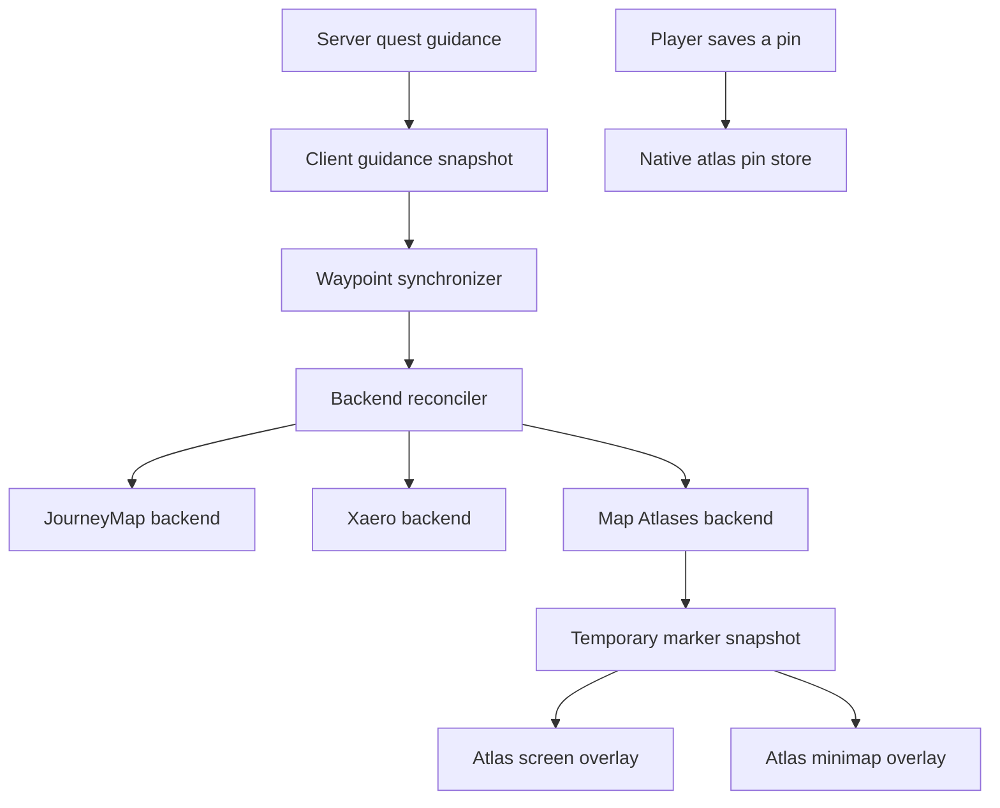

# MCA: Quests × Map Atlases
## Research-backed integration and implementation specification

**Research date:** 7 September 2026  
**Audience:** the coding agent implementing the integration, maintainers, and release testers  
**Primary implementation target:** MCA: Quests 1.6.2 source on `main`, Minecraft 1.20.1 / Forge  
**Companion platform:** separate guidance for the existing Minecraft 1.21.1 / NeoForge branch  
**Release number:** intentionally unassigned; use the next appropriate MCA: Quests release  
**Status:** implementation specification. The proposed integration has not been built or run.

**Quick navigation:** [Architecture](#5-architecture-to-implement) · [Rendering](#6-rendering-strategy-and-exact-source-hooks) · [Coverage and dimensions](#7-atlas-ownership-map-coverage-dimensions-and-height) · [Personal pins](#10-personal-pin-implementation) · [File changes](#18-file-level-implementation-checklist) · [Tests](#19-automated-verification) · [Runtime matrix](#20-production-runtime-acceptance-matrix)

## 1. Recommended implementation

Add Map Atlases as a third independent backend in MCA: Quests’ existing map waypoint system. Reuse the server-generated quest guidance and its existing reconciliation lifecycle. Render automatic quest markers as temporary client overlays inside Map Atlases’ actual map viewport. Keep deliberately saved personal pins in Map Atlases’ native pin system.

The recommended automatic-marker implementation uses a small, version-checked client mixin at Map Atlases’ existing rendering methods. It collects the transforms of map tiles that the atlas actually displays, then renders quest markers after the terrain pass while the atlas clipping region remains active. This covers the full atlas screen and minimap without adding quest markers to atlas items, vanilla map saved data, or persistent waypoint files.

This recommendation follows three findings:

1. MCA: Quests already provides a backend interface, immutable guidance snapshots, independent backend status, cleanup, retries, and world-session handling. A new quest-location resolver would duplicate established behavior. See the [backend contract][mca-backend], [synchronizer][mca-sync], and [reconciler][mca-reconciler].
2. Moonlight exposes a dynamic client marker callback, but the inspected implementation invokes it while applying map packets. Omitting a previously returned marker does not always remove its existing decoration. A callback-only bridge would therefore depend on unrelated map updates for some changes and removals. See [Moonlight’s API][moon-api] and [packet handler][moon-packet].
3. Map Atlases’ shared renderer already supplies the correct tile, dimension, zoom, rotation, and clipping context. Its personal pins use a separate persistent store. These are useful, distinct integration surfaces. See [shared atlas rendering][atlas-widget] and [native client pins][atlas-pins].

**Completion means:** working automatic markers on the full map and minimap, reliable lifecycle cleanup, correct dimensions and map coverage, contextual “Show in atlas” and personal pin actions, coexistence with JourneyMap and Xaero’s, useful diagnostics, and production-runtime validation.

### Interpretation of requirements

- **MUST / P0:** required for a reliable integration release.
- **SHOULD / P1:** part of the intended complete experience; implement before describing the integration as complete, or explicitly document a deferred capability.
- **MAY / P2:** optional enhancements that should not delay the working integration.
- Statements labeled **verified** describe inspected source or official release metadata.
- Proposed classes, configuration keys, limits, and tests below are **design requirements**, not claims that those APIs already exist.

## 2. Scope and version baselines

### 2.1 Pinned source and release evidence

| Component | Inspected baseline | Practical consequence |
| --- | --- | --- |
| MCA: Quests, Forge | `main` at `ef4b8c32be196ab384c4a4773d0e2367fe1ef041`; `mod_version=1.6.2`; Minecraft 1.20.1; Forge 47.4.10; Java 17 | Implement against this architecture, then recheck the checkout before editing. |
| MCA: Quests, NeoForge | `1.21.1` at `edf8c9fdd46f3965e93b15f194bda4678c4122ff`; version 1.6.2; NeoForge 21.1.248; Java 21 build target | A separate maintained platform exists. It needs its own adapter verification. |
| Map Atlases, Forge | `multiloader` at `3d1935c30310ebffb033b35783ad5a28d09fcc7a`; source declares `1.20-6.0.20` | Primary source baseline. Despite the repository name ending in “neoforge,” this branch targets 1.20.1. |
| Map Atlases, Forge release | `map_atlases-1.20-6.0.20.jar`; CurseForge file `8146282`; uploaded 25 May 2026 | First exact released artifact to validate. Modrinth version ID: `Zcz2vXIl`. |
| Moonlight used by the inspected atlas build | Actual build coordinate `curse.maven:selene-499980:7541536`, corresponding to `moonlight-1.20-2.16.27-forge.jar` | Use the resolved dependency, not an unused version property, when reproducing the baseline. |
| Matching Moonlight source | `966be9094d32e879b5d667175ffe50a2b75fe20b`, source version 1.20-2.16.27 | The packet-callback limitation is verified on matching-version source. |
| Map Atlases, NeoForge source | `1.21.1` at `88248953d636175615a7af71a92410dd36eae47c`; properties declare `1.21-6.7.1` | Its renderer is different from Forge’s. |
| Map Atlases, NeoForge release | Official listing advertises `1.21-6.7.3-neoforge`, CurseForge file `8787762`, 1 September 2026 | The release is newer than the inspected source-declared version. Exact release-JAR inspection is required before selecting hooks. |

Sources: [MCA Forge properties][mca-properties], [MCA Forge build][mca-build], [MCA NeoForge properties][mca-neo-properties], [Map Atlases Forge properties][atlas-properties], [Forge build dependency][atlas-build], [Forge release][atlas-release], [Modrinth release coordinates][atlas-modrinth], [Moonlight artifact][moon-release], [Moonlight version source][moon-properties], [Map Atlases NeoForge properties][atlas-neo-properties], and [NeoForge release][atlas-neo-release].

The MCA Forge commit is dated 7 September 2026 UTC; this document uses the inspected commit rather than assuming that a release-note date uniquely identifies the code.

### 2.2 Identity and installation rules

The mod to integrate with is **Map Atlases**, by MehVahdJukaar and the credited original authors, using mod ID **`map_atlases`** and source package **`pepjebs.mapatlases`**. Do not substitute Antique Atlas, a different similarly named mod, or the historical Fabric implementation when resolving dependencies.

Map Atlases is an item-bearing client-and-server mod. Its integration code in MCA: Quests should be client-side, but that does not make Map Atlases itself a client-only minimap. Preserve each mod’s normal installation and connection requirements. See the [official project listing][atlas-project] and [mod entry point][atlas-mod].

Map Atlases’ Forge metadata declares Moonlight optional, while the inspected source also uses Moonlight utility and configuration classes outside its optional pin code. Treat this as an upstream dependency ambiguity to test, not proof that the released atlas runs without Moonlight. Compare an upstream control instance before attributing a missing-Moonlight startup failure to MCA: Quests. Do not add Moonlight as an unconditional MCA: Quests dependency to conceal the discrepancy. See [atlas metadata][atlas-metadata], [atlas entry point][atlas-mod], and [client configuration][atlas-config].

### 2.3 Scope boundaries

The required first implementation is for the repository’s default Forge branch. Preserve the same behavior when implementing the companion NeoForge adapter, using the separate process in section 17.

This feature does not require a new quest engine, a loader port, new quest rewards, atlas crafting changes, cartography automation, world-map terrain generation, or new structure searches. Existing datapacks and quest saves should continue to work without migration.

“Full compatibility” means correct interaction with supported map features and honest handling of unavailable ones. It does not mean drawing destinations on fabricated map pages, overriding a map type’s marker policy, or claiming compatibility with untested future releases.

## 3. Current MCA: Quests architecture and integration hazards

The following source paths are relative to `src/main/java/dev/otectus/mcaquests/` unless specified otherwise.

| Existing seam | Verified role | Required integration use |
| --- | --- | --- |
| `quest/guidance/GuidanceService` | Resolves the player’s quest destinations and produces guidance snapshots | Continue to own target selection on the server. |
| `quest/guidance/GuidanceTarget` | Carries position, real dimension, label, kind, optional loaded entity ID, arrival radius, approximate/last-known flags, and entity height | Preserve relevant presentation information for atlas rendering. |
| `client/ClientGuidanceData` | Stores the current client snapshot and revision; marks map synchronization dirty when replaced | Reuse this lifecycle and revision. |
| `client/QuestWaypointSync` | Builds automatic waypoint specifications from all resolvable quests or the primary quest, according to configuration | Add an independent Map Atlases enable check. |
| `compat/MapWaypointBackend` | Defines apply, withdraw, automatic cleanup, personal pin, status, probe, and epoch reset operations | Implement another backend through this contract. |
| `client/map/ClientMapWaypointRegistry` | Holds independent backends and permits late registration | Register under one stable atlas backend ID. |
| `client/map/WaypointReconciler` | Withdraws stale keys, applies desired state, isolates failures, and retries failed operations | Retain as the only automatic marker reconciler. |
| `compat/WaypointSpec` | Identifies each marker and its presentation, dimension, and ownership | Extend presentation deliberately; do not build a disconnected atlas target model. |
| `client/marker/MarkerColours` | Assigns semantic colors and fallback initials | Reuse its mapping. |
| `client/QuestLogScreen` | Provides follow, coordinate copy, and pin controls | Add contextual atlas navigation and explicit pin destination selection. |

Sources: [guidance service][mca-guidance], [guidance target][mca-target], [client guidance cache][mca-guidance-client], [synchronizer][mca-sync], [backend contract][mca-backend], [registry][mca-registry], [reconciler][mca-reconciler], [waypoint model][mca-spec], [marker palette][mca-colours], and [quest log][mca-log].

### 3.1 Fix independent startup

`client/map/MapWaypointCompat.init()` currently initializes Xaero and returns early when Xaero is absent. Appending atlas initialization below that return would break an atlas-only installation.

Refactor into independent initialization paths. Atlas absence, an unsupported atlas signature, or a failed atlas initialization must not prevent Xaero initialization. JourneyMap must continue arriving through its existing plugin callback. See [current bootstrap][mca-bootstrap].

### 3.2 Resolve personal pin routing explicitly

The existing registry chooses the greatest available `PinSupport`. The quest-log handler then pins into every usable backend with that durability. Adding a persistent atlas backend would therefore change one click into a multi-destination write when JourneyMap is also present.

Replace this decision at the user-action layer with a contextual destination choice:

- One eligible destination: retain a single-click action with a destination-specific tooltip.
- Multiple eligible destinations: show a small destination menu.
- Offer an explicit “All available maps” choice only if each selected destination is listed and results can be reported individually.
- Do not silently send pins to every backend with the same durability.
- Preserve Xaero’s truthful “this session” description.
- Include map availability and target dimension in eligibility.

The global `bestPinSupport()` result alone cannot answer whether a particular atlas contains a map for a particular target. See [registry implementation][mca-registry] and [quest-log pin action][mca-log].

### 3.3 Preserve metadata that the current map model drops

`WaypointSpec` currently omits `GuidanceTarget.approximate`, `lastKnown`, `arriveRadius`, and `entityId`. It also has no quest title or primary-selection flag.

Add a small immutable first-party presentation value to the map model, or an equally explicit immutable envelope passed through the synchronizer. Include only information actually displayed or needed for safe interpolation:

- Approximate and last-known flags.
- Arrival radius.
- Primary/followed presentation state.
- Optional session-scoped entity reference information if live interpolation is implemented.
- Optional quest title and ready-to-turn-in state, joined from the existing client quest data by quest ID and giver UUID.

Do not claim a ready-to-turn-in marker merely because its kind is `VILLAGER`. Do not label a point “approximate” by guessing from its name. Changes to presentation must participate in equality or a deliberately documented revision mechanism. Update existing constructors and tests together. This is a local map-presentation change; the inspected guidance packet already supplies the essential location flags. See [waypoint model][mca-spec] and [guidance target][mca-target].

## 4. Player-facing behavior contract

### 4.1 Automatic markers

The integration MUST:

1. Create one automatic marker per active quest with a currently valid guidance target, subject to the existing global followed-only setting.
2. Use the existing stable identity of quest ID plus giver UUID. An objective changing location updates that marker.
3. Show the same destination as MCA: Quests’ guidance at the same snapshot revision.
4. Move a marker when its target changes.
5. Remove it when that quest no longer supplies guidance, including completion, abandonment, invalidation, and relevant tracking changes.
6. Change to the actual hand-in destination only when the server guidance does.
7. Keep automatic markers temporary and specific to the receiving player’s current session.
8. Remain independent of the availability of JourneyMap and Xaero.
9. Honor both the existing master map-waypoint control and a default-enabled Map Atlases integration control.
10. Avoid altering another backend’s automatic state.

A “followed-only” change removes other automatic markers; unfollowing while “all active” is enabled only changes emphasis. A quest that temporarily has no resolvable target must have no fabricated atlas location.

### 4.2 Fullscreen atlas

The full atlas SHOULD show all eligible automatic markers for the **displayed dimension and selected map layer**, with the primary marker emphasized.

Hover information should contain the destination label, semantic kind, available quest title, approximate/last-known status, and coordinates when coordinate display is enabled. Distances must identify their meaning: planar map distance or existing MCA guidance distance. Never display a normal walking distance to another dimension.

A compact “Quest destinations” control should provide a keyboard-accessible list of currently relevant targets and a “Focus followed quest” action. Selecting an entry pans the atlas to an existing eligible map. It must not teleport, create a map, accept a quest, or change quest progress.

Automatic markers should not appear in the native editable/deletable pin bookmark collection. Provide MCA-owned interactions for them.

### 4.3 Minimap

The minimap MUST render eligible quest markers through the actual atlas viewport, respecting its position, scale, rotation, active atlas, selected layer, and visibility rules.

A separate primary-target rim indicator SHOULD be available. It must disappear when the marker is already visible or within the configured arrival behavior. It must not create a persistent focused pin to obtain native edge tracking.

The rim indicator is limited to the primary target by default. Native personal-pin tracking remains under the player’s control. If both share an edge, use a small offset or collision layout without changing the native pin’s focus.

### 4.4 Personal pins

“Save pin in Map Atlases” means the player is deliberately copying the current destination into Map Atlases’ personal pin store. It is a snapshot:

- It remains when the quest ends.
- It does not follow a moving villager.
- Its persistence follows Map Atlases’ native behavior.
- It is never removed by automatic quest cleanup.
- Its creation is reported separately from automatic marker visibility.
- It requires a supported native pin facility and an actual eligible map in the selected atlas.

When this action is unavailable, explain the immediate reason, such as “Open an atlas containing this location” or “Map Atlases pin support is unavailable.”

### 4.5 In-hand rendering

In-hand atlas markers are P2, default off. The shared fullscreen/minimap hook does not automatically cover the separate hand renderer.

If added, render them only in that atlas item’s own map context, use the same privacy and coverage policy, and add a separate capability and test. Do not use a generic `isDrawingAtlas()` check as evidence that all atlas surfaces have been implemented: the [separate in-hand renderer][atlas-inhand] also sets that flag.

## 5. Architecture to implement

### 5.1 Data flow



Only the personal-pin action should enter the native pin store. All automatic changes go through the reconciler into an in-memory render snapshot.

### 5.2 Proposed implementation units

Names below are proposed; adapt naming to repository conventions while preserving the responsibilities.

| Proposed unit | Responsibility |
| --- | --- |
| `compat/mapatlases/MapAtlasesWaypointBackend` | Existing backend contract; applied automatic marker state; optional native pin delegate; status and epoch lifecycle |
| `compat/mapatlases/MapAtlasesBinding` | Exact mod identity, version metadata, native member manifest, and feature-level capability results |
| `compat/mapatlases/MapAtlasesMixinPlugin` | Early, client-only, bytecode-based gating of atlas mixins |
| `client/map/WaypointPresentation` or a first-party equivalent | Shared metadata missing from the current waypoint record |
| `compat/mapatlases/client/AtlasQuestOverlay` | Map projection, render-only filtering, marker drawing, and current-frame hit targets |
| `compat/mapatlases/client/AtlasRenderFrame` | One draw pass’s captured tiles, copied matrices, surface identity, clip context, and snapshot revision |
| `compat/mapatlases/client/AtlasNavigation` | Normal atlas-open request, pending focus, existing map/layer selection, and cancellation |
| `compat/mapatlases/client/AtlasPinBridge` | Explicit native pin creation and contextual eligibility; separately guarded Moonlight linkage |
| `mixin/mapatlases/AbstractAtlasWidgetMixin` | Capture tile context and invoke the final automatic overlay pass |
| `mixin/mapatlases/AtlasHudMixin` | Optional primary rim indicator at a verified point in the native HUD |
| `mixin/mapatlases/AtlasScreenAccessor` | Minimal access to the existing map widget for focus, if needed |
| `mcaquests.mapatlases.mixins.json` | Dedicated optional client mixin configuration |

Keep all third-party types inside the isolated atlas compatibility/mixin implementation. Shared backend contracts and common quest code must remain free of atlas, Moonlight, and Minecraft client types where the existing contract requires that separation.

### 5.3 Backend semantics

Use backend ID `map_atlases` consistently in registration, configuration dispatch, diagnostics, and tests.

For a fully bound Forge overlay backend:

- `automaticWaypoints = true`.
- `currentDimensionOnly = false`: the backend can retain markers for other dimensions and draw them when the player selects that dimension in the atlas.
- `pins = PERSISTENT` only when the native pin feature is actually bound; otherwise `NONE`.
- `isUsable()` means the adapter can accept and manage automatic state. It does not mean the player is currently holding an atlas.

`apply(spec)` publishes to an immutable in-memory snapshot and acknowledges the stored specification. It must not call native pin creation. `withdraw` and `clearAutomatic` affect only this snapshot. `resetEpoch` drops all session state, pending focus, interpolation references, and render caches.

A target outside current map coverage is still a valid accepted automatic specification. Store it, suppress its rendering with a reason, and make it appear when an eligible atlas map becomes available. Do not issue endless `RETRY_LATER` results merely because the atlas screen is closed or the player has no relevant map.

Expose **accepted marker count** separately from **visible marker count**. Neither count should pretend to be the other.

### 5.4 Contextual actions

Add first-party action availability results, preferably through default methods or a narrow optional navigation interface so existing backend implementations remain easy to maintain.

The action query must answer:

- Is this backend enabled for this action?
- Is the feature supported by the binding?
- Is a player/world session present?
- Does the target’s real dimension work for this backend?
- Is an appropriate atlas selected or accessible through the native flow?
- Does that atlas contain the necessary map/layer?
- Is map synchronization still pending?
- Is the native personal-pin facility enabled?

Return a stable reason key and localizable parameters. Do not open a screen, create a map, or mutate state while answering availability.

Define the existing master `mapWaypoints` and new `mapAtlasesWaypoints` controls as automatic-marker controls in their tooltips. Explicit atlas navigation and personal pin actions get separate enable controls below. This preserves a useful configuration where automatic overlays are hidden but a player can still deliberately open an atlas or save a point.

## 6. Rendering strategy and exact source hooks

### 6.1 Why the Moonlight callback is not the default

The verified API is `MapDataRegistry.addDynamicClientMarkersEvent`. Map Atlases itself uses this mechanism for client pins and radar. However, the inspected callback is applied by `MapItemDataPacketMixin.handleExtraData` during map packet handling, with returned markers inserted into a shared custom-decoration map.

A correct callback-based alternative would need immediate owned-key reconciliation, explicit stale-key removal, session invalidation, custom type/renderer setup, and suppression outside atlas contexts. This is possible, but it adds mutable shared map state to a feature whose desired state already exists elsewhere.

The chosen direct overlay avoids those obligations. Do not quietly substitute the callback-only implementation because its registration looks simpler. See [Moonlight registration][moon-api], [packet handling][moon-packet], and [Map Atlases’ Moonlight integration][atlas-moon].

### 6.2 Forge capture and final render pass

Verified source locations:

- `pepjebs.mapatlases.client.AbstractAtlasWidget.drawMap` receives the tile’s `MapDataHolder` and draws it with a tile-local pose.
- Within that method, the vanilla `MapRenderer.render` call is followed by tile outline bookkeeping and a pose pop.
- `drawAtlas` loops over tiles, flushes the terrain buffer, optionally draws borders, then restores the pose and disables the scissor.
- Both `MapWidget` and `MapAtlasesHUD` extend this base.

See [shared widget][atlas-widget], [fullscreen map widget][atlas-mapwidget], and [HUD][atlas-hud].

Implement the following logical hooks, with production descriptors derived from the actual supported JAR:

1. **Begin:** at the start of `drawAtlas`, reset the frame state for this widget and capture one current automatic marker snapshot, epoch, and presentation revision.
2. **Capture:** within `drawMap`, after native map rendering and before the tile pose is popped, capture the tile identity, projection metadata, and a copied matrix.
3. **Overlay:** in `drawAtlas`, after the first terrain `endBatch()` following the tile loop and before border drawing/scissor teardown, render the eligible quest markers from the captured frame.
4. **Cleanup:** flush owned buffers while clipping is active and release the frame data. Every owned push/pop or temporary render-state change must be protected by a matching cleanup path.

The final overlay pass prevents later terrain tiles from painting over a marker near a tile seam. It is preferable to immediately drawing markers inside each tile iteration.

Avoid fragile local-variable capture where method arguments and copied pose matrices supply the same information. Validate the anchor’s surrounding instruction sequence and uniqueness; do not rely on an unverified `ordinal=0` as the entire compatibility contract.

A smaller single-tile injection is acceptable only if production tests prove correct depth and seam behavior. Record that deviation and its evidence.

### 6.3 Important matrix and batching rules

- Copy matrices; never retain a mutable `PoseStack.Pose` or a buffer object for later frames.
- A captured full transform already contains the current viewport scale/rotation. Do not multiply it by the current atlas transform a second time.
- Apply the native icon counterrotation/decoration scaling once at the icon center. The public helpers are `MapAtlasesClient.modifyDecorationTransform` and `modifyTextDecorationTransform`.
- Draw the marker plane above terrain, below native foreground/UI controls, and with consistent label ordering.
- Flush before the atlas disables its clipping region.
- Preserve blending, shader color, depth behavior, buffer ownership, and the scissor state expected by the surrounding renderer.
- Do not reset global rendering state to guessed defaults.
- Limit captured frame data to the current render pass. A failed render must not leave old tiles or hitboxes eligible in the next world/frame.
- If native rendering fails before the integration runs, do not claim that catching integration exceptions can repair the upstream render pass.

Source support: [native transform helpers][atlas-client], [tile and batch ordering][atlas-widget], and [HUD render state][atlas-hud].

### 6.4 Projection and marker ownership at map seams

For the supported vanilla/sliced vanilla map projection, derive coordinates from the **rendered tile’s** saved map data:

```text
scaleFactor = 1 << mapData.scale
u = 64 + (worldX - mapData.centerX) / scaleFactor
v = 64 + (worldZ - mapData.centerZ) / scaleFactor
```

This is a continuous tile-local projection, not an API call. Choose a consistent anchor convention: use block centers for fixed `BlockPos` targets and the validated live entity position when interpolation is enabled.

Use half-open tile bounds to assign a target to exactly one map tile. Include tests at every boundary and for negative coordinates. Avoid integer division or byte quantization for the projection. Use sufficiently wide arithmetic before subtraction near world-coordinate limits.

Do not assume every foreign map type uses the vanilla center rule. `MapKey.at` delegates to the map type’s center calculation, and Twilight Forest magic maps have special handling. Use the native type/key functions where applicable, then validate actual projection. See [map key][atlas-key], [map type][atlas-type], and [map holder][atlas-holder].

If duplicate map entries could represent the same displayed location, deduplicate by quest marker identity and current viewport/layer, choosing a deterministic eligible tile. Never use numeric map ID alone as the cross-type or cross-session cache key.

## 7. Atlas ownership, map coverage, dimensions, and height

### 7.1 Derive context from the actual surface

| Surface | Authoritative atlas/map context |
| --- | --- |
| Fullscreen opened from inventory or keybind | The actual `AtlasOverviewScreen` instance and its selected map collection/layer |
| Lectern atlas | The atlas the native lectern screen is displaying |
| Minimap | The atlas and active map accepted by native HUD rendering |
| In-hand, if implemented | The actual rendered atlas item and selected map |
| “Save pin” | The atlas and target map explicitly selected for that action |

Do not substitute `MapAtlasesClient.getCurrentActiveAtlas()` for a lectern screen’s atlas. A player can be viewing a different atlas from the one that would drive their minimap. See [screen state][atlas-screen] and [HUD selection][atlas-hud].

Map coverage must remain correct after copying, merging, swapping, shearing, or removing atlas maps. Automatic markers are derived from current coverage; they are never transferred as item data.

### 7.2 Coverage and fog are different concepts

Default policy: **existing atlas map coverage**.

- Draw a target only when the selected atlas has an eligible map covering that location in the displayed dimension/layer.
- A map sheet existing in the atlas does not prove every pixel has been explored.
- A quest marker may identify a server-disclosed destination on an unexplored portion of an existing map. This does not reveal terrain.
- Never populate blank terrain pixels, request remote terrain for the marker, or create/consume maps.
- When the atlas lacks the target’s map, show a text state such as “Not mapped in this atlas.”
- Offer a stricter `EXPLORED_PIXELS` option only for map types whose unexplored-pixel semantics are verified. Do not assume a universal byte/color value across all foreign map types.

For the default rim indicator, require target coverage somewhere in the active atlas’s eligible selected layer, even if that map is outside the visible viewport. A P2 “direction to known destinations beyond atlas coverage” option can relax this, but must be off by default and still reveal no terrain.

### 7.3 Dimensions

Always pair coordinates with their real `ResourceKey<Level>`.

- Fullscreen markers are filtered by the displayed map’s dimension, not solely the player’s current dimension.
- Minimap markers and rim arrows must correspond to the active minimap dimension.
- When guidance points at a portal in the current dimension, draw that portal.
- When guidance points directly to another dimension, retain its true coordinates for the relevant fullscreen tab and suppress a current-world walking arrow.
- Do not automatically multiply/divide X/Z by eight, including for Nether guidance.
- Unknown or unavailable dimensions produce a text state, not an Overworld fallback.
- A focus action may select an existing dimension tab. It may not synthesize a missing tab or map.

These rules follow the dimensional contract already documented in [MCA’s waypoint model][mca-spec] and [guidance target][mca-target].

### 7.4 Slices and vertical uncertainty

Map Atlases represents the selected layer with `Slice`, including dimension, map type, and nullable height. Null means an unsliced/top layer. That metadata does not establish how accurately the quest knows a target’s Y coordinate. See [Slice][atlas-slice].

Use an explicit display policy:

| Situation | Default behavior |
| --- | --- |
| Unsliced map | Draw the eligible 2D position; show Y in details when available and enabled. |
| Sliced map and useful target Y | Draw the projected marker with an above/below indicator relative to the selected slice where appropriate. |
| Approximate location or uncertain vertical meaning | Clearly mark uncertainty; do not imply the objective is on this exact floor. |
| Strict-slice mode enabled | Draw exact-Y targets only within the configured vertical tolerance; withhold vertically uncertain targets and explain why. |
| Layer changed manually | Reevaluate immediately; do not change the player’s selection back automatically. |
| Focus requested for a target without reliable layer information | Keep a suitable existing layer or offer available layers; do not guess a new underground level. |

Suggested strict-slice tolerance: 8 blocks, configurable. This is a presentation policy, not a claim that all maps depict an eight-block-thick volume.

Do not infer exact Y merely because `BlockPos` has an integer Y field. Reuse provenance already available in guidance; default to uncertainty when it is insufficient. Do not expand the guidance protocol solely to decorate a tooltip unless a concrete target category demonstrates the need.

### 7.5 Foreign map types

`MapType.hasMarkers()` excludes Twilight Forest `MAGIC` maps in the inspected Forge source. Respect that native marker policy by default. Display “Quest markers are hidden on this map type” in the quest destination control instead of silently drawing an unverified projection.

Validate supported maze/ore-maze and Supplementaries slice behavior on real installations. A P2 override for a normally marker-free map type needs its own verified transform and clear setting. An unknown map type must never be treated as vanilla merely because it exposes a numeric map ID. See [MapType][atlas-type].

## 8. Marker appearance, interaction, and accessibility

### 8.1 Reuse MCA’s visual semantics

Reuse the existing `MarkerColours` mapping:

| Guidance kind | Existing color | Suggested atlas glyph |
| --- | --- | --- |
| `VILLAGER` | `#56B4E9` | Person |
| `HOME` | `#E69F00` | House |
| `WORKSTATION` | `#E69F00` | Work/tool |
| `VILLAGE` | `#009E73` | Settlement |
| `STRUCTURE` | `#D55E00` | Structure |
| `BIOME` | `#0072B2` | Landscape |
| `PORTAL` | `#CC79A7` | Portal |
| `LOCATION` | `#F0E442` | Location diamond |

The colors are verified in [MarkerColours][mca-colours]; the glyph descriptions are implementation recommendations. Reuse existing appropriate textures where available, and create small atlas-specific resources only where necessary.

Use shape as well as color. Add a contrasting outline against grass, water, snow, parchment, and lava. The primary marker can use a slightly larger outline or steady ring. Avoid continuous animation by default.

Approximate and last-known markers need visible differences and text labels. A hollow/dashed outline is suitable; do not rely on reduced opacity alone.

### 8.2 Density and labels

Render glyphs by default and show longer labels on hover or focus. The primary target may have a short label if enabled.

Use deterministic collision handling. At the same point, keep the primary marker identifiable and provide a grouped count/list for additional quests. Avoid randomly reordering markers as the camera or atlas pans.

Start with a world-map visual budget of 128 glyphs and a minimap budget of 32, configurable within bounded limits if needed. These are proposed protective defaults. Overflow must be represented by a count and accessible destination list rather than silently making quests disappear. The backend still retains every valid specification.

Cache text and glyph selection by presentation/resource revision. Do not rewrap every quest title for every visible tile each frame.

### 8.3 Mouse and keyboard behavior

Use the same projection and clipping result for drawing and hit testing. A clipped marker is not clickable outside the map viewport.

Do not consume input while the native screen is placing a pin, shearing maps, editing text, dragging the map, or handling its own special action. Native controls and their reserved modifier behavior take priority.

Recommended interactions:

- Hover: tooltip.
- Marker click when no native tool is active: show a small quest action panel or select its destination-list entry.
- “View quest”: open the existing quest UI for the matching quest identity.
- “Follow quest”: use MCA’s existing server-validated tracking request; await authoritative guidance.
- “Save personal pin”: run the explicit pin flow.
- No automatic-marker shift-delete behavior.

Provide normal focusable buttons/list entries with narrator text. Preserve focus and scroll position across guidance refreshes. Do not add a complete new row of tiny buttons to every quest-log card if it breaks the existing responsive layout; use a compact action menu.

See [quest-log focus/layout handling][mca-log], [atlas screen tools][atlas-screen], and [native map-widget interaction][atlas-mapwidget].

### 8.4 Resource reload and appearance packs

Resource reload must invalidate cached sprites/fonts and repaint without duplicating markers. Missing custom assets must fall back to an existing glyph or text initial. Test both normal and alternative book textures, and a resource pack that changes atlas appearance.

Keep all strings localizable. Update both `en_us.json` and `pt_br.json` to preserve the repository’s existing language coverage.

## 9. “Show in atlas” and focus flow

### 9.1 Open using the native request sequence

Map Atlases’ normal keybind sends `C2S2COpenAtlasScreenPacket` because the client may not yet have all required maps. Calling `MapAtlasesClient.openScreen` directly is not equivalent to that synchronization flow. See [native key handling][atlas-events] and [screen construction helper][atlas-client].

Implement a short-lived pending navigation request containing:

- Current world/session epoch.
- Quest ID and giver UUID.
- Requested action: focus only or open then focus.
- Initial target revision and a bounded expiration time.
- The atlas context selected by the player/native flow, where available.

Then:

1. Recheck action eligibility.
2. If the matching native atlas screen is already open, focus it directly.
3. Otherwise invoke the supported native open/request path.
4. Wait for the resulting screen and necessary map data.
5. Re-resolve that quest from current guidance within the same epoch.
6. Select an existing appropriate dimension/layer.
7. Center the native map widget on the target.
8. Clear the pending request.

Use `AtlasOverviewScreen.selectDimension` and `MapWidget.resetAndCenter` through narrowly scoped access where appropriate. Exact layer-selection behavior must be verified before exposing automatic layer selection. See [atlas screen][atlas-screen] and [map widget][atlas-mapwidget].

### 9.2 Cancellation and failure rules

Cancel the request when the user closes/replaces the screen, changes world, the quest ends, the requested atlas changes incompatibly, or the request expires. A delayed packet must not reopen an atlas after the user dismissed the action.

If coverage is missing, leave the atlas usable and show a concise reason. Never loop requests or repeatedly re-center during a user’s pan.

Opening the atlas is an explicit player action; ordinary marker synchronization never opens screens or sends open-atlas requests.

For a lectern, preserve the native interaction and distance/access checks. Do not open a remote lectern by inventing a block position.

## 10. Personal pin implementation

### 10.1 Use native persistence only for explicit pins

The inspected `ClientMarkers.addPin` records map-associated markers and updates map decoration state. `saveClientMarkers` and world lifecycle methods handle the separate local pin store. It is appropriate for a deliberate saved point, not an automatic marker. See [ClientMarkers][atlas-pins].

Before exposing `PinSupport.PERSISTENT`:

1. Verify the native pin symbols and Moonlight-dependent feature.
2. Respect the native pin setting.
3. Resolve a real map in the selected atlas containing the target, including dimension/type/slice.
4. Verify the native pin type/tag is available after resource/data reload.
5. Validate input text length and the chosen style.
6. Confirm the operation’s actual result before reporting success.

Do not assume that a `void` method guarantees a successful durable disk write. The backend can report a pin accepted into the native store after verifying the insertion; persistence across restart remains a release test. If invoking native save for this explicit action, respect its error behavior and do not claim fsync/crash durability it does not promise.

### 10.2 Position and ownership rules

Pass the authorized X/Z destination to the native operation for the selected map. Native unsliced pin placement may derive Y differently from quest guidance; therefore treat the saved pin as a map location and do not claim that it preserves live entity height or exact underground provenance.

Use native marker styling and naming. Do not introduce a new synchronized marker registry type merely to save a quest location.

Double-clicking must not queue duplicate asynchronous operations. A pending action belongs to one session and one selected atlas. If the map is not synchronized, explain that state or complete the normal open flow before offering the commit.

Saved pins never enter `appliedKeys()` and never share automatic marker identifiers. Do not delete pins based on a name beginning with “Quest,” a matching coordinate, or another mod’s origin string.

### 10.3 Multi-map results

For an explicitly requested multi-destination save, report each destination separately. JourneyMap success must not hide an atlas failure or Xaero session limitation. A failed destination must not roll back a successful player-owned pin elsewhere unless the UI explicitly offered an atomic operation, which is unnecessary here.

## 11. Minimap rim indicator

Native `ClientMarkersRenderer.drawSmallPins` enumerates saved client pins and checks their focused state. It will not automatically draw an edge arrow for the temporary overlay. See [native rim pin renderer][atlas-pin-renderer].

Implement a separate, small HUD-scoped pass that:

1. Runs only when the native atlas HUD actually renders.
2. Uses the primary resolved marker and the current atlas map/layer.
3. Uses the active viewport center; do not assume it is always centered on the player.
4. Uses the same rotation state and projection as the minimap.
5. Draws one rim indicator only if the target is outside the visible map viewport but satisfies coverage policy.
6. Suppresses the rim indicator when the main glyph is visible.
7. Respects arrival fading and an optional user toggle.
8. Avoids overlapping native pin arrows/cardinal labels where feasible.

`MapAtlasesHUD.getDirectionPos` provides native square-edge geometry, but its angle convention and local coordinate space must be validated before reuse. Compute edge intersection from the actual viewport geometry, rather than hardcoding a screen corner or copying native constants without their surrounding transform.

Do not automatically disable MCA: Quests’ existing world marker or edge indicator. They are independently configurable navigation aids. If a player wants a quieter HUD, document the relevant settings.

## 12. Coexistence with JourneyMap, Xaero, and other mods

### 12.1 Independent backends

All enabled map backends may display the same quest on their own surfaces. One backend’s absence, refresh failure, or unsupported version must not change the others’ registration, configuration, or cleanup.

Add Map Atlases to existing independent-backend regression tests. Keep JourneyMap’s plugin initialization and Xaero’s reflective binding intact.

### 12.2 Xaero conversion is not live integration

The inspected Map Atlases code reads local Xaero waypoint files and converts contained points into native client pins when its conversion setting is enabled. The setting is off by default and its description warns users to turn it back off after conversion. This is not a live provider callback. See [Xaero conversion code][atlas-xaero] and [configuration][atlas-config].

Consequences:

- Do not require Xaero for Map Atlases quest support.
- Do not use file conversion as the integration.
- Do not disable Xaero globally to avoid a hypothetical duplicate.
- Do not delete or rewrite its waypoint files.
- Do not automatically delete an imported pin whose label/coordinates happen to match a quest.
- Where an automatic glyph and a saved pin occupy the same point, preserve both identities and use visual grouping/offsets.
- If a real test shows exported automatic points becoming persistent imports, document that exact path and add an ownership-aware remedy only where ownership is provable.

### 12.3 Native atlas behavior to preserve

Test active-atlas inventory rules, offhand, Curios where supported by the atlas, multiple atlases, locked atlases, lectern access, empty-map consumption, copying/merging, and shearing. Automatic markers must not alter these behaviors.

Supplementaries and Twilight Forest support should reuse the displayed map type/layer. Do not add them as hard MCA dependencies. Existing MCA integrations such as Capitals, Townstead, Bountiful, or family-target quests should benefit automatically when they provide normal guidance; no atlas-specific quest JSON should be necessary.

### 12.4 Rendering compatibility

Validate with the graphics combinations actually supported by the release pack. Include ImmediatelyFast because the inspected atlas explicitly changes batching behavior when it is present. Include one representative shader/performance-rendering setup if it is part of the maintained support matrix.

Treat the atlas project’s own stated incompatibilities as upstream constraints. Test a clean upstream control before attempting to patch unrelated portal rendering or map replacement behavior in MCA: Quests.

## 13. Configuration and migration

Use the [existing client configuration system][mca-config]. The following names are proposals; maintain consistent Java/TOML naming with the repository.

| Setting | Default | Meaning |
| --- | --- | --- |
| Existing `mapWaypoints` | Preserve existing default | Master automatic-map-marker control |
| Existing `mapWaypointsFollowedOnly` | Preserve existing default, currently false | All active resolvable quests versus primary guidance only |
| `mapAtlasesWaypoints` | true | Enable automatic Map Atlases markers when the adapter is supported |
| `mapAtlasesWorldMap` | true | Draw automatic markers in the atlas screen |
| `mapAtlasesMinimap` | true | Draw automatic markers on the atlas minimap |
| `mapAtlasesPrimaryEdgeArrow` | true | Show the primary target at the minimap rim when eligible |
| `mapAtlasesNavigation` | true | Offer explicit open/focus actions |
| `mapAtlasesPins` | true | Offer explicit native saved-pin actions when supported |
| `mapAtlasesCoverage` | `COVERED_MAPS` | Require an existing map; optional stricter explored-pixel policy only where supported |
| `mapAtlasesSlicePolicy` | `SHOW_WITH_HEIGHT_HINT` | Avoid falsely presenting every target as exactly on the selected floor |
| `mapAtlasesSliceTolerance` | 8 | Vertical tolerance used only in strict mode |
| `mapAtlasesMarkerScale` | 1.0 | Additional bounded scale multiplier applied once with native scaling |
| `mapAtlasesLabels` | `HOVER_AND_PRIMARY` | Label density |
| `mapAtlasesInHand` | false | Optional P2 capability; omit the setting until implemented |

Avoid exposing implementation details such as mixin anchors or reflection member names in player-facing settings.

Config changes should refresh visibility immediately and reconcile automatic cleanup through the normal path. Do not require reconnecting merely to hide/show an overlay. Install/version/mixin changes may require restart; say so only for those cases.

No automatic markers are persisted, so there is no automatic-marker save migration. Preserve existing settings and default behavior for JourneyMap and Xaero. The pin destination menu is the intentional user-visible change to the old durability-based fan-out.

## 14. Build, optional loading, and version gates

### 14.1 Forge dependencies

The exact verified Map Atlases Maven artifact is:

```gradle
compileOnly fg.deobf("maven.modrinth:4hwXMFif:Zcz2vXIl")
```

Reuse the repository’s existing scoped Modrinth Maven configuration and ForgeGradle deobfuscation route. Add runtime dependencies only behind an explicit development/test property.

If the native pin bridge directly compiles against Moonlight, the inspected atlas baseline resolves:

```gradle
compileOnly fg.deobf("curse.maven:selene-499980:7541536")
```

Use a narrowly scoped Curse Maven repository if choosing this coordinate. Do not copy the upstream mod’s entire development dependency list. Pin test artifacts, inspect resolved filenames and loader metadata, and record hashes. Do not bundle Map Atlases or Moonlight inside MCA: Quests.

These coordinates are verified in [Modrinth’s version page][atlas-modrinth], [atlas build file][atlas-build], and [Moonlight’s artifact page][moon-release]. They identify the research baseline, not every version that should be advertised as supported.

The existing MCA build requires compatible MCA: Reputation class output at configuration time. Prepare that existing dependency or use the documented property override before attempting the build. Do not remove this unrelated guard to make atlas tests pass. See [MCA build][mca-build].

### 14.2 Dedicated optional mixin configuration

Do not append atlas mixins to the existing Bountiful-specific config/plugin. Add a dedicated atlas client config and register it in the build and packaged metadata.

The plugin MUST:

- Check physical client side before considering rendering hooks.
- Use loading-stage mod metadata; the existing `BountifulMixinPlugin` explains why ordinary `ModList` is unavailable when mixins are being selected.
- Avoid loading optional target classes while probing them.
- Read and inspect class bytes for the exact target class, descriptor, expected anchor, and surrounding structure.
- Verify all hooks needed for a feature before advertising that feature.
- Reject an unknown or incompatible implementation without crashing unrelated quest functionality.
- Record whether required hooks actually applied; an optional `require=0` injection that silently matched nothing is not a successful integration.
- Keep preflight and post-apply checks small, deterministic, and independent of player/world state.

See the repository’s [existing optional-mixin pattern][mca-mixin-plugin]. Reuse its approach where suitable, but preserve a separate atlas feature manifest.

### 14.3 Production mapping checks

Third-party class/method names and Minecraft member references do not necessarily use the same remapping policy on Forge.

For each hook, document which names are upstream-owned and which Minecraft invocation targets must be remapped. Verify the packaged refmap and actual production JAR. A working development client does not prove the hook works in an obfuscated Forge instance.

Keep `verifyReobfJar` in the required build. Extend optional static-link tests to atlas and Moonlight classes and to references into their guarded implementation packages.

### 14.4 Loader metadata versus support claims

Any optional dependency declaration should remain optional and client-scoped where appropriate. Avoid a narrow loader-enforced version range that prevents the whole game starting when the intended behavior is to disable only an unsupported adapter.

Use separate runtime capability checks and a documented tested-version matrix. Forge’s dependency metadata and physical-side behavior are described in [mod-file documentation][forge-modfiles] and [sides documentation][forge-sides].

Do not silently claim all 6.x or all future versions because a single required class exists. For initial release, validate exact artifacts first. Broaden supported ranges only after signature and runtime evidence establishes the relevant compatibility.

## 15. Networking, lifecycle, and privacy

### 15.1 No new quest-location network authority

Automatic atlas rendering should require no new quest-location packet. The client already receives authorized `GuidanceTarget` data.

Do not read another player’s quest state, scan all villagers, request arbitrary structure locations, or query the integrated server directly from client code. Do not send automatic marker data into shared atlas/map packets.

Explicit open/focus may use the atlas’s normal networking. Explicit follow actions use the existing MCA tracking request. Neither gives the client authority to complete quests. Forge’s [side separation][forge-sides] and [network handling guidance][forge-network] reinforce this boundary.

### 15.2 Required lifecycle handling

| Event | Required behavior |
| --- | --- |
| Guidance revision changes | Reconcile specifications; rebuild presentation caches only as needed |
| Target moves | Update from current guidance; optional safe client interpolation between updates |
| Quest changes objective | Replace marker position/kind/label under the same automatic identity |
| Quest ends or stops resolving | Withdraw its automatic marker |
| Follow selection changes | Update primary emphasis; followed-only mode removes other points |
| Client config reload | Reconcile automatic enable changes and invalidate affected render/UI state |
| Atlas/map collection changes | Reevaluate coverage, action availability, and view caches |
| Dimension/layer changed in atlas | Refilter against the selected view |
| Player changes dimension or respawns | Respect existing clone/epoch lifecycle and await current guidance |
| Disconnect/reconnect | Drop automatic state, entity references, pending actions, and hitboxes |
| Join another server/world with reused map IDs | Never display old markers or reuse old action requests |
| Resource reload | Replace graphics references and presentation caches safely |
| Optional feature becomes unavailable | Disable that feature with a reason; retain other functioning backends |

Do not keep strong references to old levels, entities, screens, or atlas item stacks in long-lived static caches.

### 15.3 Moving entities

Baseline correctness is the latest authoritative guidance position. The inspected target also provides an optional loaded entity network ID.

Smooth client following is P1, but it must be bounded by the same epoch and current dimension. Resolve only an already-loaded entity; never load chunks for it.

Network IDs can be reused. Validate the entity reference against the existing client guidance/entity-binding logic before following it. If identity cannot be established safely, fall back to the server position. Never use a stale numeric entity ID from a previous world. Approximate or last-known targets must not become live tracking of a different entity.

Do not increase server guidance polling frequency just to make the atlas animation smoother.

## 16. Performance and diagnostics

### 16.1 Performance requirements

- No world search, file I/O, network request, registry registration, or native pin save in the render loop.
- Preserve the existing quiet-tick behavior in `QuestWaypointSync`.
- Index accepted markers by dimension and suitable spatial buckets when the snapshot changes.
- During rendering, consider only markers potentially visible on captured tiles or needed for the primary rim indicator.
- Bound collision work and label layout; avoid pairwise processing of every marker on every tile.
- Reuse immutable/cached presentation values across frames.
- Drop stale caches at epoch changes and resource reload.
- Do not allocate full copies of every quest for each tile.

Measure baseline versus integrated atlas rendering on the same scene and configuration. Proposed engineering targets, not measured results: less than 0.5 ms p95 additional CPU frame time for a 100-destination fullscreen test and less than 0.25 ms p95 for a 32-marker minimap test on the documented reference machine. If the hardware differs, report absolute and comparative results rather than declaring these values universal.

Include a larger stress scenario and verify that clustering/budgets bound the visible work without losing backend state.

### 16.2 Read-only status

Extend `/mcaquestsclient waypoints status` through the existing diagnostics system.

Atlas details should include:

- Installed version and recognized binding profile.
- Which surfaces and actions are supported.
- Automatic integration enabled/disabled.
- Current session readiness and atlas availability.
- Accepted versus visible/suppressed counts.
- Suppression categories: no coverage, other displayed dimension, unsupported map type, slice policy, budget, or hidden native HUD.
- Last binding/render failure fingerprint.
- Pending native open/map synchronization, if any.

Do not label “no active atlas” as a broken binding. Do not print quest coordinates in the routine compatibility summary or logs unless the user explicitly requests destination details.

### 16.3 Probe behavior

The existing `probe` operation is explicitly mutating; `status` is not. Keep that distinction.

An atlas automatic-overlay probe should insert and remove a clearly temporary synthetic marker only in its own probe state, preferably on the current eligible map. It must not save a native personal pin or generate maps.

Separate results:

- Binding manifest passed.
- Required hooks applied.
- Temporary state accepted and removed.
- Viewport captured.
- Rendering observed, if a runtime test actually observed it.

A bytecode probe or successful state insertion cannot certify that the marker was visible. See [diagnostics implementation][mca-diagnostics] and [backend probe contract][mca-backend].

## 17. NeoForge 1.21.1 companion implementation

The MCA: Quests NeoForge branch exists at the same mod version, but the atlas renderer has changed. In the inspected NeoForge source, `MapWidget` extends `AbstractAtlasDisplay`, not Forge’s `AbstractAtlasWidget`. The published atlas version is also newer than the inspected source-declared version. See [NeoForge MCA properties][mca-neo-properties], [NeoForge map widget][atlas-neo-widget], and [release metadata][atlas-neo-release].

Do not transplant the Forge mixin descriptors or dependency coordinates.

For the companion implementation:

1. Inspect the exact Map Atlases 1.21.1 release JAR and any associated matching source.
2. Record its full version, filename, loader metadata, dependencies, and SHA-256.
3. Trace the actual full-map and HUD draw sequence in `AbstractAtlasDisplay` or its release equivalent.
4. Identify equivalent tile/view capture and final overlay boundaries, including any changed rendering APIs.
5. Build a separate member/anchor manifest and client mixin config for that branch.
6. Adapt any item component, packet, map-ID, resource, or rendering changes based on inspected code.
7. Reuse the first-party marker semantics, contextual pin routing, lifecycle rules, and pure projection/policy tests.
8. Revalidate the native open/focus and personal pin flows; do not assume Moonlight 2.x APIs match the 3.x dependency line.
9. Run the production NeoForge matrix separately.

Forge support can be released when its required gates pass. Do not advertise NeoForge support until its adapter and runtime gates pass. If both artifacts are intended for the same release, track them as separate rows in the release checklist.

## 18. File-level implementation checklist

| Existing file or location | Required work |
| --- | --- |
| `client/map/MapWaypointCompat.java` | Split independent initialization paths; add guarded atlas registration; preserve JourneyMap callback behavior |
| `client/QuestWaypointSync.java` | Add atlas enable dispatch; carry explicit presentation metadata; preserve existing key/lifecycle logic |
| `compat/WaypointSpec.java` | Add or reference immutable presentation metadata with tested equality/default behavior |
| `compat/MapWaypointBackend.java` and related first-party contracts | Add contextual action availability only where needed; keep third-party/client linkage isolated |
| `client/map/ClientMapWaypointRegistry.java` | Support target-specific action choices; replace durability-only selection for the updated UI |
| `client/QuestLogScreen.java` | Contextual pin destination menu and atlas navigation; preserve keyboard focus and responsive sizing |
| `McaQuestsConfig.java` | Add bounded client settings and documented defaults |
| `client/map/WaypointDiagnostics.java` | Distinguish binding, readiness, accepted state, and visible state |
| `client/ClientCommands.java` | Expose atlas diagnostics through existing waypoint status/probe commands |
| New `compat/mapatlases/` implementation | Backend, bindings, rendering, navigation, and optional pin bridge |
| New `mixin/mapatlases/` implementation | Minimal independently gated render and accessor hooks |
| New `src/main/resources/mcaquests.mapatlases.mixins.json` | Dedicated optional client mixin configuration |
| `build.gradle` / `gradle.properties` | Compile-only exact artifacts, optional dev runtime, artifact probe task inputs, mixin packaging |
| `src/main/resources/META-INF/mods.toml` | Appropriate optional metadata without imposing atlas on all users |
| `src/main/resources/assets/mcaquests/lang/en_us.json` and `pt_br.json` | New settings, action labels, reasons, status, and narrator strings |
| `src/main/resources/assets/mcaquests/textures/` | Only needed new marker resources; preserve reload/fallback behavior |
| `README.md`, `CONFIG.md`, `CURSEFORGE.md` | Installation, features, tested versions, coverage and pin persistence |
| `DATAPACK.md` where relevant | Explain that normal guidance works without atlas-specific quest data |
| New `MAPATLASES.md` | Player/pack-author usage and troubleshooting |
| New `docs/map-atlases-validation.md` | Exact tested artifacts, outcomes, screenshots, unresolved limitations |
| Existing test packages | Extend backend isolation, lifecycle, pin routing, and static-link coverage |

Recheck paths on the implementation checkout. Do not use the older JourneyMap/Xaero spec as a substitute for current code: the current backend interface supersedes older composite-bridge designs.

## 19. Automated verification

Write tests for the concrete risks below, reusing existing test infrastructure. Avoid tests that merely restate a getter or configuration default without validating behavior.

### 19.1 Backend and lifecycle tests

Extend `WaypointReconcilerTest` and `WaypointLifecycleTest`, and add an atlas backend test with an in-memory overlay store.

Required cases:

- Atlas registers and synchronizes when Xaero is absent.
- Atlas failure does not prevent JourneyMap or Xaero updates.
- A quest from two different givers creates two identities.
- Same quest advancing/moving updates one marker.
- Label, kind, approximate/last-known, and primary-state changes update presentation.
- Completing or abandoning removes the automatic marker.
- Untracking semantics differ correctly between all-active and followed-only modes.
- Disabling atlas automatic markers clears its state and preserves other backends.
- No atlas or no coverage does not trigger repeated failed mutations.
- Personal pins remain outside applied automatic keys and cleanup.
- Reconnect, clone, dimension transition, and server switch invalidate pending actions and old entity references.
- Source snapshot and frame snapshot cannot mix epochs.

### 19.2 Projection and policy tests

Extract pure projection/eligibility code and test:

- Vanilla scale values 0 through 4.
- Negative X/Z and exact tile boundaries.
- Corners and a marker crossing each of four seams.
- Large positive/negative coordinates without arithmetic overflow.
- One owner tile for a target on a boundary.
- Real-dimension filtering independent of player dimension on fullscreen maps.
- Null slice height, strict-slice boundaries, and uncertain target Y.
- Missing map coverage versus unexplored pixels within existing coverage.
- Unsupported map type behavior.
- Grouped/coincident markers with stable order and primary priority.
- Screen hitboxes clipped to the rendered viewport.
- Rim indicator cardinal/intercardinal angles in rotating and north-up modes.
- No simultaneous on-map glyph and rim arrow for the same primary target.

### 19.3 Action routing tests

- One eligible pin backend produces one write.
- Multiple eligible backends require a destination selection.
- Disabled explicit pin feature is not selectable.
- Atlas missing coverage does not suppress a working JourneyMap option.
- Cross-dimension ineligibility is handled per backend.
- Explicit multi-destination results preserve each result.
- Repeated clicks do not duplicate pending native actions.
- “Show in atlas” waits for normal map synchronization, then focuses once.
- User cancellation or session change prevents delayed reopen/refocus.
- Status/availability queries do not mutate native state.

### 19.4 Optional-loading and artifact tests

Extend `NoMinimapStaticLinkTest` and add exact atlas probe coverage.

Verify:

- No atlas or Moonlight linkage leaks into always-loaded code.
- Dedicated-server-safe bootstrap never loads client render types.
- Unknown bytecode profiles skip the atlas hooks.
- Required method descriptors and instruction anchors exist exactly where expected.
- Packaged mixin config and refmap entries are present.
- Post-apply checks establish hook installation.
- Probe tasks cannot pass a required release gate by skipping missing JARs.
- Production artifact remains reobfuscated and contains neither atlas nor Moonlight dependency classes.

Suggested task design: add `mapAtlasesProbeTest` with `-PmapAtlasesJar=...` and, for native pins, `-PmoonlightJar=...` plus `-PrequireMapAtlasesJars=true`. Alternatively extend `mapProbeTest`, but do not make an atlas-only check accidentally require every unrelated map JAR.

These task/property names are proposed. Implement them before documenting them as working commands.

## 20. Production-runtime acceptance matrix

Record exact Minecraft, loader, MCA, MCA: Quests, Map Atlases, Moonlight, and optional graphics/mod versions for each run. A compilation or unit-test pass does not replace these observations.

| ID | Scenario | Required observation |
| --- | --- | --- |
| R01 | MCA: Quests with no map mods | Starts and works; no atlas linkage error or empty mandatory UI |
| R02 | Dedicated server without Map Atlases | Starts; no client classloading from the new integration |
| R03 | Normal matching client/server atlas installation | Connects and preserves native atlas behavior |
| R04 | Atlas installed, Xaero absent | Automatic markers work |
| R05 | All three map backends installed | Independent markers and controls work |
| R06 | Unsupported atlas signature/profile | Atlas feature reports unsupported; quests and other maps remain usable |
| R07 | No active atlas | No atlas HUD marker; diagnostics explain normal absence |
| R08 | Active atlas with no map covering destination | No false map glyph; navigation explains missing coverage |
| R09 | Covering map becomes available | Marker appears without needing a quest change or reconnect |
| R10 | Quest accepted, progressed, ready, then turned in | One identity updates and finally disappears |
| R11 | Quest abandoned while standing still | Marker disappears without waiting for an unrelated map packet |
| R12 | Moving villager/escort target | Marker follows latest valid guidance; no trail of old markers |
| R13 | Target unloads or becomes last-known | Correct fallback and label; no tracking of another entity |
| R14 | Same quest from two villagers | Two independent destinations |
| R15 | All-active versus followed-only | Correct selection, emphasis, and cleanup |
| R16 | Config disabled and reenabled | Immediate visibility/state response without duplicate markers |
| R17 | Nether portal guidance | Correct portal in current world and correct destination after transition |
| R18 | View another mapped dimension while remaining in Overworld | Fullscreen shows that dimension’s targets only |
| R19 | Custom dimension with reused numeric map ID | No collision with Overworld or another map type |
| R20 | Full-map pan, smooth zoom, GUI scaling, window resize | Glyphs and hitboxes remain aligned |
| R21 | All map scales and negative-coordinate seams | No wrap, duplicate, missing, or terrain-overpainted marker |
| R22 | Rotating/north-up and player-follow/grid minimap modes | Markers, labels, and rim direction remain correct |
| R23 | HUD moved/scaled; effects present; inventory/F3 hiding | Integration follows native viewport and visibility |
| R24 | Primary target moves on/off minimap | Exactly one appropriate on-map or rim representation |
| R25 | Normal and alternative book texture | Controls fit; markers stay clipped to the map |
| R26 | Lectern atlas differs from inventory atlas | Correct displayed atlas coverage; no item substitution |
| R27 | Swap atlases, merge/copy, shear a relevant map | Coverage refreshes; no markers serialized into items |
| R28 | Locked atlas and empty-map inventory | Integration does not unlock, consume, or create maps |
| R29 | Supplementaries slices, including Nether | Correct layer policy and vertical hints |
| R30 | Twilight Forest map types | Native marker policy honored; supported types verified separately |
| R31 | Save a native personal pin, then complete quest | Pin remains; automatic marker disappears |
| R32 | Restart after saving pin | Native pin persists, automatic marker is reconstructed only from current quests |
| R33 | Native pin deletion/focus | Works normally; generated marker does not hijack those actions |
| R34 | JourneyMap plus atlas personal-pin button | Explicit destination, no accidental fan-out |
| R35 | Xaero conversion setting enabled in a controlled test | No integration file rewriting/deletion; any duplicate is explained and non-destructive |
| R36 | Two players view the same/duplicated atlas maps | Each sees only their authorized automatic quests |
| R37 | Disconnect and join a different world/server | No stale marker, hitbox, or pending focus request |
| R38 | Resource reload while atlas open | No duplicate marker or invalid texture reference |
| R39 | Native pin/shear/text-edit/drag tools active | Quest overlay does not steal their input |
| R40 | Keyboard/narrator, small window, long translated labels | All actions usable and readable |
| R41 | ImmediatelyFast and maintained graphics stack | Correct flush/clipping/depth; no unrelated HUD corruption |
| R42 | Stress scene and ordinary play | Record comparative frame/CPU cost and bounded allocation behavior |
| R43 | Upstream no-Moonlight control and matching integrated test | Resolve real dependency behavior; never claim optionality solely from metadata |
| R44 | Exact production Forge JAR, not only dev runtime | All required mixins, textures, and actions work |
| R45 | NeoForge companion, if claimed | Repeat relevant tests on its own exact release artifacts |

For R27/R28/R36, compare relevant data before and after controlled integration actions. Native atlas updates may legitimately change map state during ordinary play; isolate the integration’s contribution rather than interpreting every NBT difference as a defect.

Capture screenshots at map seams, rotated minimap edges, alternate textures, lectern context, and sliced maps. Validate initial and final marker state after lifecycle transitions. Record failed and unrun tests plainly.

## 21. Implementation sequence and release gates

### Phase A: establish the exact baseline

1. Inspect the current checkout and repository instructions.
2. Record source SHA and intended release platform.
3. Resolve/download the exact atlas and Moonlight test artifacts through their official distribution.
4. Inspect metadata, hash the JARs, and verify hook/member candidates against actual bytecode.
5. Confirm a clean upstream atlas instance works.
6. Add the independent bootstrap and optional-loading guard.

**Gate A:** atlas-only initialization and no-atlas/server startup pass; no rendering support claimed yet.

### Phase B: automatic marker backend and renderer

1. Implement the in-memory backend and presentation model.
2. Add the scoped tile-capture/final-overlay hooks.
3. Implement projection, coverage, dimension, and slice filtering.
4. Wire config cleanup and epoch invalidation.
5. Validate seams, clipping, moving targets, and completion while standing still.

**Gate B:** fullscreen and minimap automatic markers pass the core lifecycle and rendering scenarios, with no persistent map mutation.

### Phase C: complete navigation experience

1. Add primary rim indication.
2. Implement normal open/sync/focus flow.
3. Add contextual pin selection and native personal pins.
4. Add accessible quest destination controls, localization, and resource fallback.
5. Verify coexistence with native tools, personal pins, and all installed map backends.

**Gate C:** the intended P1 player flows work or are explicitly marked deferred; no incomplete feature is described as full support.

### Phase D: hardening and documentation

1. Complete exact artifact probes and production reobfuscation checks.
2. Run the relevant runtime matrix and comparative performance measurements.
3. Verify multiplayer isolation and atlas inventory/lectern scenarios.
4. Update player/pack-author documentation and release notes.
5. If shipping NeoForge, complete its separate implementation and evidence rows.

**Gate D:** advertise only the platforms, artifacts, surfaces, and optional-mod combinations actually verified.

### Definition of done

The implementation is complete when:

- Required functionality and source-level hazards in this specification are handled.
- Exact tested artifact identities and runtime outcomes are recorded.
- Automatic markers never persist as personal pins or leak between players/sessions.
- Existing JourneyMap and Xaero behavior remains functional.
- Atlas-only users receive the full required experience.
- Unsupported combinations degrade with truthful status.
- The release artifact and documentation agree about what was tested.
- Remaining P2 ideas are clearly separated from delivered functionality.

## 22. Research limitations and implementation judgment

This document is based on official distribution metadata and direct inspection of the repositories at the stated commits. It does not certify binary equivalence, successful mixin transformation, visual correctness, performance, or Minecraft runtime behavior.

The material unresolved checks are specific:

1. Validate the published Forge JAR against the selected source hooks and production mappings.
2. Resolve the practical Moonlight requirement with an upstream control launch.
3. Verify graphical seam/depth behavior, selected-layer projection, and screen hit testing in game.
4. Verify native pin insertion/save/restart behavior through the actual released artifact.
5. Inspect the newer NeoForge release before assigning exact hooks or claiming parity.

The recommended architecture is a source-supported design inference. If the implementation baseline exposes a stable official atlas render event with all required context, prefer it after proving that it meets the same lifecycle, clipping, and privacy requirements. Do not preserve a mixin unnecessarily. Conversely, do not invent a public waypoint API or rely on a packet callback alone where the inspected source does not provide the required behavior.

Research stopped after the core architecture, native persistence/opening paths, version discrepancies, and high-impact integration risks were grounded in primary evidence. The remaining checks are concrete implementation/runtime gates rather than unanswered broad research questions.

**Document verification:** Markdown structure, reference definitions, and acceptance-matrix completeness were checked. A rendered Markdown preview was not inspected.

## 23. Source register

All sources were accessed on 7 September 2026. GitHub links below are pinned where exact implementation details matter. Official project descriptions provide feature context; source code takes precedence for version-specific behavior.

| Source group | Publisher / maintainer | Date / version basis | What it supports |
| --- | --- | --- | --- |
| MCA: Quests Forge source | otectus | Commit `ef4b8c3`, 7 September 2026 | Existing guidance, backend architecture, UI, config/build patterns, and test seams |
| MCA: Quests NeoForge source | otectus | Commit `edf8c9f`, 7 September 2026 | Separate 1.21.1 platform baseline |
| Map Atlases Forge source | MehVahdJukaar and contributors | Commit `3d1935c`, 25 May 2026 | Renderer hooks, atlas context, native pins, map types, configuration, and open flow |
| Map Atlases release pages | Author-published CurseForge / Modrinth pages | Forge release 25 May 2026; NeoForge release 1 September 2026 | Artifact identity, platform, version, and Maven coordinates |
| Moonlight matching source | MehVahdJukaar and contributors | Commit `966be909`, 28 January 2026 | Dynamic marker API and packet update/removal semantics |
| Moonlight release page | Author-published CurseForge page | 1.20-2.16.27, 28 January 2026 | Exact dependency file identity |
| Map Atlases NeoForge source | MehVahdJukaar and contributors | Inspected `8824895`, source-declared 6.7.1 | Different base renderer; need for independent release validation |
| Forge documentation | MinecraftForge | Versioned 1.20.x documentation, accessed 7 September 2026 | Physical/logical sides, optional metadata, and network boundaries |

[mca-properties]: https://github.com/otectus/MCAQuests/blob/ef4b8c32be196ab384c4a4773d0e2367fe1ef041/gradle.properties
[mca-build]: https://github.com/otectus/MCAQuests/blob/ef4b8c32be196ab384c4a4773d0e2367fe1ef041/build.gradle
[mca-neo-properties]: https://github.com/otectus/MCAQuests/blob/edf8c9fdd46f3965e93b15f194bda4678c4122ff/gradle.properties
[mca-backend]: https://github.com/otectus/MCAQuests/blob/ef4b8c32be196ab384c4a4773d0e2367fe1ef041/src/main/java/dev/otectus/mcaquests/compat/MapWaypointBackend.java
[mca-spec]: https://github.com/otectus/MCAQuests/blob/ef4b8c32be196ab384c4a4773d0e2367fe1ef041/src/main/java/dev/otectus/mcaquests/compat/WaypointSpec.java
[mca-sync]: https://github.com/otectus/MCAQuests/blob/ef4b8c32be196ab384c4a4773d0e2367fe1ef041/src/main/java/dev/otectus/mcaquests/client/QuestWaypointSync.java
[mca-reconciler]: https://github.com/otectus/MCAQuests/blob/ef4b8c32be196ab384c4a4773d0e2367fe1ef041/src/main/java/dev/otectus/mcaquests/client/map/WaypointReconciler.java
[mca-guidance]: https://github.com/otectus/MCAQuests/blob/ef4b8c32be196ab384c4a4773d0e2367fe1ef041/src/main/java/dev/otectus/mcaquests/quest/guidance/GuidanceService.java
[mca-target]: https://github.com/otectus/MCAQuests/blob/ef4b8c32be196ab384c4a4773d0e2367fe1ef041/src/main/java/dev/otectus/mcaquests/quest/guidance/GuidanceTarget.java
[mca-guidance-client]: https://github.com/otectus/MCAQuests/blob/ef4b8c32be196ab384c4a4773d0e2367fe1ef041/src/main/java/dev/otectus/mcaquests/client/ClientGuidanceData.java
[mca-registry]: https://github.com/otectus/MCAQuests/blob/ef4b8c32be196ab384c4a4773d0e2367fe1ef041/src/main/java/dev/otectus/mcaquests/client/map/ClientMapWaypointRegistry.java
[mca-bootstrap]: https://github.com/otectus/MCAQuests/blob/ef4b8c32be196ab384c4a4773d0e2367fe1ef041/src/main/java/dev/otectus/mcaquests/client/map/MapWaypointCompat.java
[mca-log]: https://github.com/otectus/MCAQuests/blob/ef4b8c32be196ab384c4a4773d0e2367fe1ef041/src/main/java/dev/otectus/mcaquests/client/QuestLogScreen.java
[mca-colours]: https://github.com/otectus/MCAQuests/blob/ef4b8c32be196ab384c4a4773d0e2367fe1ef041/src/main/java/dev/otectus/mcaquests/client/marker/MarkerColours.java
[mca-diagnostics]: https://github.com/otectus/MCAQuests/blob/ef4b8c32be196ab384c4a4773d0e2367fe1ef041/src/main/java/dev/otectus/mcaquests/client/map/WaypointDiagnostics.java
[mca-mixin-plugin]: https://github.com/otectus/MCAQuests/blob/ef4b8c32be196ab384c4a4773d0e2367fe1ef041/src/main/java/dev/otectus/mcaquests/compat/bountiful/BountifulMixinPlugin.java
[atlas-project]: https://www.curseforge.com/minecraft/mc-mods/map-atlases-forge
[atlas-release]: https://www.curseforge.com/minecraft/mc-mods/map-atlases-forge/files/8146282
[atlas-modrinth]: https://modrinth.com/mod/map-atlases-forge/version/1.20-6.0.20
[atlas-properties]: https://github.com/MehVahdJukaar/mapatlases-neoforge/blob/3d1935c30310ebffb033b35783ad5a28d09fcc7a/gradle.properties
[atlas-build]: https://github.com/MehVahdJukaar/mapatlases-neoforge/blob/3d1935c30310ebffb033b35783ad5a28d09fcc7a/forge/build.gradle
[atlas-metadata]: https://github.com/MehVahdJukaar/mapatlases-neoforge/blob/3d1935c30310ebffb033b35783ad5a28d09fcc7a/forge/src/main/resources/META-INF/mods.toml
[atlas-mod]: https://github.com/MehVahdJukaar/mapatlases-neoforge/blob/3d1935c30310ebffb033b35783ad5a28d09fcc7a/common/src/main/java/pepjebs/mapatlases/MapAtlasesMod.java
[atlas-widget]: https://github.com/MehVahdJukaar/mapatlases-neoforge/blob/3d1935c30310ebffb033b35783ad5a28d09fcc7a/common/src/main/java/pepjebs/mapatlases/client/AbstractAtlasWidget.java
[atlas-client]: https://github.com/MehVahdJukaar/mapatlases-neoforge/blob/3d1935c30310ebffb033b35783ad5a28d09fcc7a/common/src/main/java/pepjebs/mapatlases/client/MapAtlasesClient.java
[atlas-mapwidget]: https://github.com/MehVahdJukaar/mapatlases-neoforge/blob/3d1935c30310ebffb033b35783ad5a28d09fcc7a/common/src/main/java/pepjebs/mapatlases/client/screen/MapWidget.java
[atlas-screen]: https://github.com/MehVahdJukaar/mapatlases-neoforge/blob/3d1935c30310ebffb033b35783ad5a28d09fcc7a/common/src/main/java/pepjebs/mapatlases/client/screen/AtlasOverviewScreen.java
[atlas-hud]: https://github.com/MehVahdJukaar/mapatlases-neoforge/blob/3d1935c30310ebffb033b35783ad5a28d09fcc7a/common/src/main/java/pepjebs/mapatlases/client/ui/MapAtlasesHUD.java
[atlas-pins]: https://github.com/MehVahdJukaar/mapatlases-neoforge/blob/3d1935c30310ebffb033b35783ad5a28d09fcc7a/common/src/main/java/pepjebs/mapatlases/integration/moonlight/ClientMarkers.java
[atlas-pin-renderer]: https://github.com/MehVahdJukaar/mapatlases-neoforge/blob/3d1935c30310ebffb033b35783ad5a28d09fcc7a/common/src/main/java/pepjebs/mapatlases/integration/moonlight/ClientMarkersRenderer.java
[atlas-moon]: https://github.com/MehVahdJukaar/mapatlases-neoforge/blob/3d1935c30310ebffb033b35783ad5a28d09fcc7a/common/src/main/java/pepjebs/mapatlases/integration/moonlight/MoonlightCompat.java
[atlas-config]: https://github.com/MehVahdJukaar/mapatlases-neoforge/blob/3d1935c30310ebffb033b35783ad5a28d09fcc7a/common/src/main/java/pepjebs/mapatlases/config/MapAtlasesClientConfig.java
[atlas-events]: https://github.com/MehVahdJukaar/mapatlases-neoforge/blob/3d1935c30310ebffb033b35783ad5a28d09fcc7a/common/src/main/java/pepjebs/mapatlases/lifecycle/MapAtlasesClientEvents.java
[atlas-holder]: https://github.com/MehVahdJukaar/mapatlases-neoforge/blob/3d1935c30310ebffb033b35783ad5a28d09fcc7a/common/src/main/java/pepjebs/mapatlases/utils/MapDataHolder.java
[atlas-slice]: https://github.com/MehVahdJukaar/mapatlases-neoforge/blob/3d1935c30310ebffb033b35783ad5a28d09fcc7a/common/src/main/java/pepjebs/mapatlases/utils/Slice.java
[atlas-key]: https://github.com/MehVahdJukaar/mapatlases-neoforge/blob/3d1935c30310ebffb033b35783ad5a28d09fcc7a/common/src/main/java/pepjebs/mapatlases/map_collection/MapKey.java
[atlas-type]: https://github.com/MehVahdJukaar/mapatlases-neoforge/blob/3d1935c30310ebffb033b35783ad5a28d09fcc7a/common/src/main/java/pepjebs/mapatlases/utils/MapType.java
[atlas-xaero]: https://github.com/MehVahdJukaar/mapatlases-neoforge/blob/3d1935c30310ebffb033b35783ad5a28d09fcc7a/common/src/main/java/pepjebs/mapatlases/integration/XaeroMinimapCompat.java
[moon-api]: https://github.com/MehVahdJukaar/Moonlight/blob/966be9094d32e879b5d667175ffe50a2b75fe20b/common/src/main/java/net/mehvahdjukaar/moonlight/api/map/MapDataRegistry.java
[moon-packet]: https://github.com/MehVahdJukaar/Moonlight/blob/966be9094d32e879b5d667175ffe50a2b75fe20b/common/src/main/java/net/mehvahdjukaar/moonlight/core/mixins/MapItemDataPacketMixin.java
[moon-properties]: https://github.com/MehVahdJukaar/Moonlight/blob/966be9094d32e879b5d667175ffe50a2b75fe20b/gradle.properties
[moon-release]: https://www.curseforge.com/minecraft/mc-mods/selene/files/7541536
[atlas-neo-properties]: https://github.com/MehVahdJukaar/mapatlases-neoforge/blob/88248953d636175615a7af71a92410dd36eae47c/gradle.properties
[atlas-neo-widget]: https://github.com/MehVahdJukaar/mapatlases-neoforge/blob/88248953d636175615a7af71a92410dd36eae47c/common/src/main/java/pepjebs/mapatlases/client/screen/MapWidget.java
[atlas-neo-release]: https://www.curseforge.com/minecraft/mc-mods/map-atlases-forge/files/8787762
[forge-sides]: https://docs.minecraftforge.net/en/1.20.x/concepts/sides/
[forge-modfiles]: https://docs.minecraftforge.net/en/1.20.x/gettingstarted/modfiles/
[forge-network]: https://docs.minecraftforge.net/en/1.20.x/networking/simpleimpl/

[mca-config]: https://github.com/otectus/MCAQuests/blob/ef4b8c32be196ab384c4a4773d0e2367fe1ef041/src/main/java/dev/otectus/mcaquests/McaQuestsConfig.java
[atlas-inhand]: https://github.com/MehVahdJukaar/mapatlases-neoforge/blob/3d1935c30310ebffb033b35783ad5a28d09fcc7a/common/src/main/java/pepjebs/mapatlases/client/AtlasInHandRenderer.java
