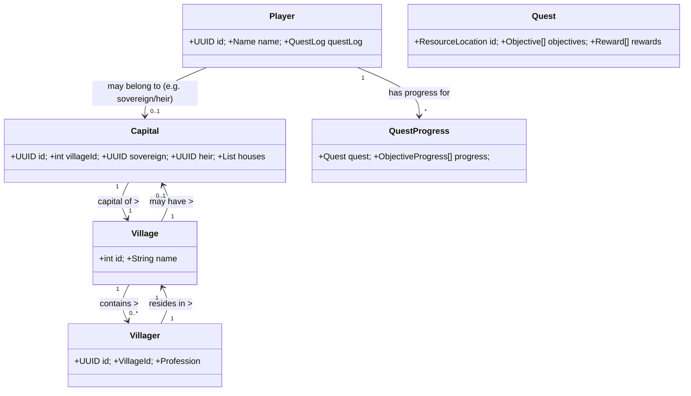
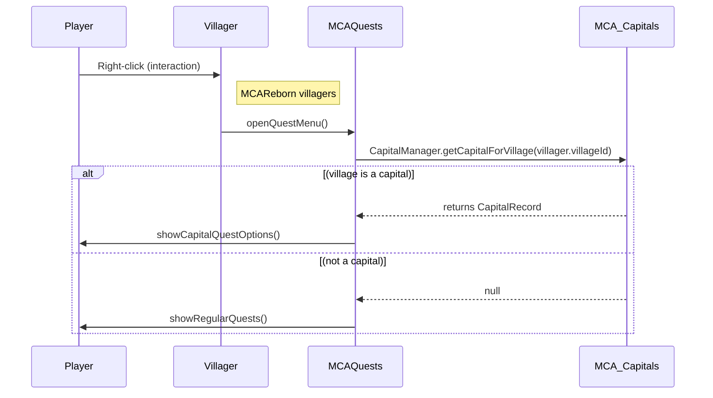

# MCAQuests–MCA Capitals Integration (v1.6.0 Spec)

**Executive Summary:** This specification describes the full integration between **MCA: Quests** (an RPG quest system for MCA Reborn villagers) and **MCA Capitals** (a monarchy addon for MCA Reborn). MCAQuests allows players to accept/complete data-driven quests for MCA villagers, and MCA Capitals adds a full Monarchy system (with events, titles, and succession) to those villages.  By integrating these mods, we create capital-themed quests, conditions, and rewards that deepen gameplay: villagers can give quests about royal events (crowning a king, guarding the sovereign, founding houses, etc.), and players can earn or influence capital titles and reputation. All new features are *optional by default* and only enabled when MCA Capitals is present.

This spec covers the goals, scope, compatibility, data mappings, feature definitions (quests, triggers, conditions, objectives, rewards, localization, config, permissions, persistence), integration hooks (APIs, events, pseudocode), migration and testing plans, performance/security, configuration examples, and a roadmap. Tables compare quest types, reward schemas, and config options.  Entity-relationship and event-flow **Mermaid** diagrams illustrate the architecture, and sample JSON/YAML show quest and config formats. Where relevant, we cite code from both repos as source references.

## Goals & Scope

- **Objective:** Extend MCAQuests to leverage MCA Capitals features, enabling quests that revolve around the monarchy system (royal titles, houses, courts, events). The integration should feel seamless: capital quests show up automatically in capital villages, use new conditions (e.g. “is sovereign”, “is capital member”), and offer appropriate rewards (titles, items, hearts) tied to capital gameplay.  
- **Scope:** Design and implement MCAQuests *1.6.0* (for MC 1.16.5) with full Capitals integration. This includes adding compatibility code, conditions, objectives, and quest data; providing a data model mapping between the two mods; default built-in capital quests; config options; and developer/API hooks. The integration is **optional and server-configurable**: it detects MCA Capitals at runtime and enables capital-specific content by default, with toggles to disable it if desired. Existing MCAQuests features (villager quests, Townstead, reputation) remain unchanged except for this added layer.  No changes to MCA Capitals are assumed; we rely on its public APIs and events.  

- **Assumptions:** Target versions are **MC 1.16.5**, MCAReborn (latest), MCAQuests 1.6.0, and MCA Capitals (current release). We assume MCAQuests already integrates with MCAReborn and Townstead, as documented. If any detail is unspecified (e.g. missing API in Capitals), this spec notes it as a future consideration.

## Compatibility Matrix

| Component         | Supported Versions        | Dependencies                 |
|-------------------|---------------------------|------------------------------|
| Minecraft         | 1.16.5                    |                              |
| MCAReborn         | (any 1.16.5-compatible)   | Required by both mods        |
| MCAQuests         | v1.6.0                    | MCAReborn, Forge             |
| MCA Capitals      | (latest 1.16.5 build)     | MCAReborn, Forge             |
| Other Mods        | Townstead (optional)      | (MCAQuests already supports) |

- **Forge API:** Use the same Forge version as MCAReborn (expected ~1.16.5). No new core dependencies beyond existing ones. The integration is conditional: if MCA Capitals is absent, none of the capital features load.  

## Architecture & Data Model Mapping

The integration ties together the **villager/quest system** (MCAQuests) with the **monarchy data** (MCA Capitals). The key entities are:

- **Player:** A Minecraft player who accepts quests. 
- **Villager (NPC):** An MCAReborn villager with a profession and hearts. MCAQuests already lets villagers offer quests.
- **Village:** An MCAReborn village (collection of villagers/houses). Capitals associates each capital with one village.
- **Capital:** A capital kingdom (represented by `CapitalRecord`) with fields like sovereign, houses, heir, etc. Capitals adds a `CapitalManager` singleton that tracks all capitals (see below).
- **Quest / QuestProgress:** A quest definition (JSON) and per-player progress. MCAQuests stores quests in data packs (JSON) and tracks acceptance/progress per player.

**Data Model Integration:**  
- Each *capital* is tied to one `villageId` (the village that serves as the capital). This mapping comes from `CapitalRecord.getVillageId()`. We will use `CapitalManager.getCapitalByVillageId(villageId)` to find if a given village is a capital.  
- A *player or villager* can be part of a capital by checking their UUID against a `CapitalRecord`. The `CapitalManager.getCapitalForResident(residentId)` utility will return the capital record if that resident (player or villager) holds any role or title in that capital. (Internally it checks sovereign, consort, houses, guards, etc). We can leverage this to implement “is member of capital” conditions.  
- **MCAIntegrationBridge:** MCA Capitals provides `MCAIntegrationBridge` utilities (e.g. `isMCAVillagerEntity`, `getSpouse`, `getVillageName`, `isFemale`) to query MCAReborn data. MCAQuests can also use these to translate between villagers and capital roles.  
- **Quest ↔ Capital:** We will add new quest conditions and objectives that query the above data. For example, a `CapitalMemberCondition` will use `CapitalManager.getCapitalForResident(playerId)` to check membership. Quest rewards may use Capitals APIs: e.g. calling `CapitalFoundationService.appointPlayerSovereign(...)` if a quest should grant a title.

**Architecture Diagram:** Key relationships are shown below.



This shows that each **Village** may host one **Capital** and many **Villagers**. A **Player** can have active **QuestProgress** and may hold a role in a Capital (sovereign, consort, etc.). Quests reference villagers and players and may be gated by capital data.

## Feature List

### 1. Capital-Themed Quest Categories

We will introduce a set of new quest *archetypes* related to monarchy. Each quest is fully data-driven (JSON) and tied to MCA Capitals concepts. Example categories include:

- **Escort/Protect Missions:** E.g. “Protect the Sovereign” (defend a capital’s sovereign villager), “Escort the Heir Home” (escort an NPC from point A to the capital). Uses `EscortEntityObjective` or `ProtectEntityObjective`, targeting capital figures.
- **Delivery Tasks:** “Deliver Royal Decree” (take an item to the sovereign or another capital), “Carry Petition” (deliver to another capital). Uses `DeliverToVillagerObjective`.
- **Gather/Build Quests:** “Raise New Banner” (collect wool and sticks to craft a flag for the capital), “Fortify the Walls” (build blocks at a specified location inside the capital).
- **Social/Dialogue Quests:** “Attend Coronation” (player goes to throne room at appointed time), “Pledge Fealty” (talk to the sovereign and choose a pledge).
- **Investiture/Ranks:** “Become a Knight” (player gathers items or hearts to earn knighthood), “Fund a Noble House” (donate resources to found a house).
- **Saga Quests:** Multi-stage quest chains involving capital events (e.g. succession crises, arranged marriages). These can branch based on outcomes.

Each built-in quest will be **optional** and default-enabled only if MCA Capitals is present. We will ship a sample set of quests (JSON) as part of MCAQuests 1.6.0. (Players and modpack makers can add or disable their own via data packs.)

#### Table: Quest Type Comparison

| Quest Type         | Trigger/Context              | Objectives                   | Rewards                       |
|--------------------|------------------------------|------------------------------|-------------------------------|
| **Escort VIP**     | Sovereign/heir under threat  | EscortEntity (target=sov.)   | Hearts, Items, Title “Protector” |
| **Deliver Item**   | Petition or decree needed    | DeliverToVillager (target=sovereign/ally) | Hearts, Items (decree scroll) |
| **Protect Location**| Capital invasion/raid       | DefendLocation (capital center) | Hearts, Titles (e.g. “Guard”) |
| **Royal Event**    | Coronation, wedding          | ReachLocation (castle/church), TalkToProfession (to spouse), etc. | Hearts, Titles (e.g. “Knight”), XP |
| **Building Project**| Capital upgrade             | BuildNearLocation (materials at capital) | Village Reputation, Items |
| **Royal Family**   | Heir born/death/wedding      | DeliverToVillager (offer gifts) | Hearts, Titles, Reputation   |

*(This table is illustrative; actual quest JSON will define specific triggers and flows.)*

### 2. Triggers & Conditions

Quests will use new **conditions** to check capital-related state. We will register these similarly to the existing Townstead conditions, so datapacks parse the same with or without MCA Capitals. Key new conditions include:

- `capital_available`: (flag) True if MCA Capitals mod is loaded. (Like `townstead_available`.)
- `is_capital_resident`: Player is part of *any* capital (sovereign, consort, heir, house member, guard) – uses `CapitalManager.getCapitalForResident(playerUUID)`.
- `capital_id` or `capital_name`: Checks if a quest applies to a specific capital (by UUID or name).
- `has_capital_title`: Player holds a specific title/role. E.g. `"sovereign"`, `"heir"`, `"duke"`, `"knight"`, `"lord"`, `"guard"`. Implementation: find the player’s CapitalRecord, then check fields (`capital.getSovereign()`, `capital.isLord(...)`, etc). 
- `capital_relationship`: Compare player’s standing (e.g. spouse of sovereign) – possibly use MCAIntegrationBridge to check spouse in same capital.
- `capital_flag`: Custom flags (e.g. “at war”, “festival_day”) if Capitals defines any state events.

Conditions use the standard MCAQuests JSON syntax. For example:
```json
"conditions": [
  { "type": "capital_available" },
  { "type": "has_capital_title", "role": "heir" }
]
```
This ensures the quest only appears when Capitals is enabled and the player is currently heir of a capital.

*(In code, conditions would be new classes like `IsCapitalResidentCondition`, `HasCapitalTitleCondition`, etc. and registered in `ConditionTypes`.)* For reference, Townstead conditions are registered in `ConditionTypes` using `register("townstead_available", TownsteadAvailableCondition.CODEC)`; our capitals conditions would follow the same pattern (e.g. `register("capital_available", CapitalAvailableCondition.CODEC)`). See **Code Snippet** below for a pseudocode example of one condition:

```java
public class IsSovereignCondition extends QuestCondition {
    public static final ResourceLocation ID = new ResourceLocation("mcaquests", "is_sovereign");
    private final boolean requireSovereign;
    // Codec parsing for JSON omitted...
    @Override
    public boolean testCondition(ServerPlayer player) {
        CapitalRecord capital = CapitalManager.getCapitalForResident(player.getUUID());
        if (capital == null) return false;
        return player.getUUID().equals(capital.getSovereign());
    }
}
```
*(In registration: `ConditionTypes.register("is_sovereign", IsSovereignCondition.CODEC)`.)*

### 3. Objectives & Mechanics

New **objective types** will allow quest tasks to involve capital-specific actions. We can reuse or slightly extend existing objective classes, or create new ones:

- **DeliverToVillagerObjective:** Already supports delivering items to a specific villager. We can target capital roles. E.g. `targetType: "mca:sovereign"` and then at runtime resolve to the sovereign entity in that village.
- **EscortEntityObjective:** Escort a moving capital figure. Data could specify escorting the sovereign (special NPC).
- **ProtectEntityObjective:** Protect a character (e.g. give `targetType: "capital_soldier"`).
- **ReachLocationObjective:** Go to a landmark location, e.g. the capital’s village center or “Throne Room” (a pre-defined spot in the capital village).
- **BuildNearLocationObjective:** Gather or place blocks at a given coordinate within the capital (e.g. build a statue in the capital square).
- **TalkToProfessionObjective:** Already allows talking to any profession; use it for talking to a noble or consort (`profession: "capital_consort"`).
- **Custom Objectives:** If needed, new classes like `FormAllianceObjective` or `FoundHouseObjective` could be added.

Each objective type is fully data-driven. For example, an escort quest JSON might include:
```json
"objectives": [
  {
    "type": "escort_entity",
    "entityId": "sovereign",        // special tag resolved via CapitalManager
    "destination": { "x": 100, "y": 64, "z": -50 },
    "distance": 5
  }
]
```
The implementation would use the Capital API to find the sovereign’s Entity by `CapitalManager.getCapitalForVillage(villageId).getSovereign()`, etc.

We will document new *objective keywords* in the mod’s datapack schema. Quest designers can combine capital objectives with existing ones (e.g. deliver, build) to create rich tasks.

### 4. Rewards

Quests tied to capitals can award **special rewards** that reflect royal favor or material benefit:

- **Hearts/XP/Items:** As usual, quests can reward MCA hearts, experience (XP), and item stacks. For capitals, items might be special (crowns, banners, ingots for building, etc.). Example: a “Grant Title” quest might reward a *royal heirloom* item and hearts.
- **Titles:** MCAQuests already has `GrantTitleReward` which awards an MCAReborn social title (e.g. “Sir Alice”). We’ll use this for capital ranks. For example, a quest could reward the “Knight” or “Lord” title by calling `GrantTitleReward`. This ties into MCAReborn’s title system and shows in the Journal.  
- **Village Reputation:** Some capital quests might increase the player’s standing in the capital’s home village. MCAQuests supports `VillageReputationReward`. (Capitals itself has no separate reputation score, but uses Chronicle entries instead.) 
- **Custom Capital Effects:** We could implement new rewards by using `CommandReward` to invoke Capitals API. For example, a quest might auto-appoint the player to a minor noble house by running a server command (if Capitals exposes one). Or we could create a `GrantCapitalHouseReward` that calls `CapitalFoundationService.appointVillagerSovereign(...)` for players (see code sample below).
- **Loot Tables:** Use `LootTableReward` to drop custom loot relevant to capitols (e.g. using a custom loot table “capital_crown”).

##### Table: Reward Schema (selected types)

| Reward Type      | Data Fields                                    | Example Use                           |
|------------------|------------------------------------------------|---------------------------------------|
| **HeartsReward** | `amount: Int`                                   | +5 MCA hearts with the quest giver    |
| **ItemReward**   | `item: ItemID`, `count: Int`, `data: ...`      | 1 royal scepter (itemstack)           |
| **XpReward**     | `levels: Int` or `xp: Int`                     | +10 XP (character progression)        |
| **GrantTitleReward** | `titleKey: String` (e.g. "knight") | Title “Sir” granted via quest         |
| **CommandReward**| `commands: [String]`                           | `/function mcacapitals:make_duke @p` |
| **VillageReputationReward** | `amount: Int`                      | +50 rep for that village              |
| **LootTableReward** | `table: ResourceLocation`                   | Roll custom “capital_loot” table      |

For example, a quest that succeeds in stopping an assassination might reward:
```json
"rewards": [
  { "type": "hearts", "amount": 10 },
  { "type": "item", "item": "minecraft:shield", "count": 1 },
  { "type": "grant_title", "title": "knight" }
]
```
This gives hearts, a shield, and the MCAReborn “knight” title to the player.

### 5. Localization

All new quest texts (dialogue, titles, journal entries) must be localizable. We'll prefix keys with `mcaquests.capitals.`. For example, quest titles in JSON use keys like:
```json
"title": "capitals.quest.knight_in_training.title",
"story": "capitals.quest.knight_in_training.story",
```
And in `en_us.json` (or other languages) we provide:
```json
"capitals.quest.knight_in_training.title": "Knight in Training",
"capitals.quest.knight_in_training.story": "The Duke needs your help...",
```
Likewise, GUI text (objectives, conditions) uses keys under `mcaquests:capitals...`. This ensures full translation support. We will add any needed entries to the mod’s language files or provide a template.

### 6. Configuration & Permissions

Integration features are toggleable:

- **Config Toggles (in `mcaquests-config.toml` or similar):** 
  - `capitals.enabled = true` (master toggle for all capital integration). Default **true** (when Capitals is detected).
  - `capitals.spawnQuests = true` (toggle built-in capital quests).
  - `capitals.requireTitleToAccept = false` (if true, only players with a specific role can accept certain quests).
  - (Any other capstone options, e.g. quest frequency or reputation multipliers.)
  
- **Quest-level toggles:** In quest JSON, authors can use `config:` tags or conditions referencing config. E.g. disable a quest if `!capital.enabled`.

- **Permissions:** By default, any player in the capital’s village can get quests from capital NPCs. We may define a permission node (if needed) like `mcaquests.capitals` to allow admin control. (Not strictly necessary unless content is server-limited.)

Default settings example (in TOML):

```toml
[capitals]
enabled = true
spawnQuests = true
requireTitleToAccept = false
```

##### Table: Key Config Options

| Key                      | Type  | Default | Description                                     |
|--------------------------|-------|---------|-------------------------------------------------|
| `capitals.enabled`       | bool  | true    | Enable capital-related quests (auto if mod present) |
| `capitals.spawnQuests`   | bool  | true    | Enable built-in capital quest datapacks        |
| `capitals.requireTitleToAccept` | bool | false | Only allow quest if player has a capital title   |
| *(others as needed)*     |       |         |                                                 |

### 7. Persistence & Data Flow

Quest states are persisted by MCAQuests in player NBT or server data as usual. Capital integration does not require extra persistence beyond existing data. However, when spawning world-state events, we may use WorldSave data (like situations/projects). For example, if we implement **Capital Projects** (analogous to Village Projects), we would store progress per capital in world data (like how project contributions are tracked in `ProjectProgressEvents`). If not, we rely on immediate quest results and Chronicle entries in Capitals.

**Data Flow Example:** When a player completes a capital quest, we:
1. Grant rewards (titles, items, hearts).
2. If the quest should alter capital state (e.g. appoint a new noble), we include a `CommandReward` that calls Capitals API (or directly call `CapitalFoundationService` in code). This may call `CapitalManager.putCapital(capital)` and mark the world dirty.
3. MCAQuests updates any quest progress and closes the quest UI. The player’s new title or reputation is saved by MCAReborn systems automatically.

## API Hooks & Code Snippets

Integration code will reside in a new compat package, e.g. `dev.otectus.mcaquests.compat.capitals`. Key hooks include:

- **Forge Events:** We subscribe to relevant events. For example, listen to MCAQuests’s villager interaction or world ticks:
  ```java
  @Mod.EventBusSubscriber(modid="mcaquests", bus=Bus.FORGE)
  public class CapitalsCompatEvents {
      @SubscribeEvent
      public static void onVillagerInteract(PlayerInteractEvent.EntityInteract event) {
          if (!event.getWorld().isClientSide() && MCAIntegrationBridge.isMCAVillagerEntity(event.getTarget())) {
              Villager villager = (Villager) event.getTarget();
              // Check if villager’s village is a capital
              CapitalRecord cap = CapitalManager.getCapitalForVillage(MCAIntegrationBridge.getVillageId(villager));
              if (cap != null) {
                  // Possibly add capital quests to the villager's quest list
                  // (MCAQuests automatically does that if quests are registered for this villager by data)
              }
          }
      }
      @SubscribeEvent
      public static void onVillagerDeath(LivingDeathEvent event) {
          // Example: If an important capital NPC dies, we could trigger a world quest situation
          if (MCAIntegrationBridge.isMCAVillagerEntity(event.getEntity())) {
              UUID id = event.getEntity().getUUID();
              for (CapitalRecord cap : CapitalManager.getAllCapitalRecords()) {
                  if (cap.isSovereign(id)) {
                      // Sovereign died – maybe trigger succession quests
                  }
              }
          }
      }
  }
  ```
  *(Use `CapitalManager.getAllCapitalRecords()` and `cap.isSovereign(...)` logic.)*

- **Custom API Calls:** If a quest should modify capital data, we call Capitals services. For example, a reward could run:
  ```java
  // Pseudocode in a custom quest reward
  public class GrantDukeReward extends QuestReward {
      private final String villagerName;
      @Override
      public void grant(ServerPlayer player) {
          // Find capital of player
          CapitalRecord capital = CapitalManager.getCapitalForResident(player.getUUID());
          if (capital != null) {
              // Promote a villager to Duke
              Entity dukeVillager = findVillagerByName(capital.getVillageId(), villagerName);
              if (dukeVillager != null) {
                  CapitalFoundationService.assignDuke(player.serverLevel, capital, dukeVillager.getUUID());
              }
          }
      }
  }
  ```
  This calls `CapitalFoundationService.assignDuke(...)`, which in the Capitals code raises a villager to ducal rank and logs it. MCAQuests can use similar hooks.

- **Condition/Objective Registration:** In `ModMain` initialization, register new condition and objective types (e.g. `ConditionTypes.register("is_sovereign", ...); QuestObjectiveType.register("visit_capital", VisitCapitalObjective.CODEC);` etc).

- **Sample JSON Quest:** An example quest file (YAML/JSON) might be:
  ```yaml
  type: quest
  id: capitals:escort_sovereign
  display:
    name: "Escort the Sovereign"
    description: "The king is moving through the lands. Ensure his safety."
  conditions:
    - type: capital_available
    - type: has_capital_title
      role: none  # any player can take it
  objectives:
    - type: escort_entity
      target: sovereign
      destination:
        x: 0; y: 64; z: 0
      distance: 5
  rewards:
    - type: hearts; amount: 10
    - type: item; item: "minecraft:diamond_sword"; count: 1
    - type: grant_title; title: "knight"
  ```
  This would use a new placeholder `target: sovereign` that the quest handler resolves via `CapitalManager.getCapitalForResident()`.

## Migration Plan

Since this is a new feature for MCAQuests 1.6.0, there is no prior capital integration to migrate. Existing world saves won’t have capital-specific quests until updated to 1.6.0. We should note:

- **Backward Compatibility:** If a 1.6.0 pack is used without MCA Capitals, the capital quests and conditions will simply never activate (similar to Townstead’s unconditional registration). We will ensure the code checks for Capitals presence (the modid “mcacapitals”) before performing any API calls.
- **Upgrade Path:** If a server updates MCAQuests from <1.6.0, nothing breaks except that new config keys (capitals.enabled, etc.) will appear in the config file. We should handle missing config keys with defaults. Also ensure old quest datapacks still load (they will, as we don’t remove any existing types).

## Testing & QA

A robust test plan ensures reliability:

- **Unit Tests:** Write tests for each new condition and objective (mock players/villagers, test CapitalManager queries). E.g. test `IsSovereignCondition` returns true only for the sovereign player ID.  
- **Integration Tests:** Simulate scenarios with MCA Capitals and check quest behavior. For example:
  1. **Enable Capitals:** With MCA Capitals installed, approach a capital villager. The quests menu should show capital quests. Verify conditions (e.g. only appear when capital_present=true).
  2. **Disable Capitals:** Remove MCA Capitals or turn `capitals.enabled=false`. The capital quests should not appear (MCAQuests should skip parsing or offering them).
  3. **Role Gating:** If `requireTitleToAccept=true`, only players with specified roles can see/accept certain quests.
  4. **Objectives:** Test each objective type. For instance, the “Visit Capital” objective should only complete when the player reaches the capital location (we can define the capital’s coordinates, then move the player).
  5. **Rewards:** Ensure hearts, items, XP, and titles are granted correctly. Specifically, verify `GrantTitleReward` successfully adds an MCA title.
- **QA Checklist:** (to be run by testers)
  - [ ] **Compatibility:** Verify integration only loads with Capitals mod; no errors if Capitals is absent.
  - [ ] **UI/Localisation:** All new text keys display properly in game (check English at minimum, ensure format).
  - [ ] **Persistence:** Quest progress and world events persist through save/reload.
  - [ ] **Chronicle Sync:** If quest affects a capital (e.g. makes a duke), the Capitals chronicle/log correctly reflects it.
  - [ ] **Config:** Toggling `capitals.enabled` and other options produces expected behavior.
  - [ ] **Performance:** No lag spikes or memory leaks during capital quest events (see Performance section).

#### Sample Acceptance Criteria per Feature

- *Capital Condition:* A condition `"capital_available"` must be present in `ConditionTypes`. If MCA Capitals is loaded, the condition succeeds; otherwise quests requiring it are not offered.  
- *Escort Objective:* The `"escort_entity"` objective correctly follows the capital’s sovereign NPC. The quest only completes when the NPC reaches the set destination.  
- *Title Reward:* Using `grant_title` with a kingdom-specific title (e.g. `"knight"`) gives the player that title (verify in the MCAReborn journal).

## Performance & Security

- **Performance:** Avoid heavy computation on every tick. For example, do not scan all villagers each tick. Instead:
  - Use event-driven triggers: e.g. only evaluate capital quest spawns when something relevant happens (villager interacts or a world event).  
  - Cache capital lookups: e.g. `CapitalManager.getCapitalForVillage` uses a `Map<UUID, CapitalRecord>` which is constant-time. Do not repeatedly recompute slow queries.  
  - Throttle situation/project checks: If implementing “Capital project” (analogous to village projects), update it once per day or on demand rather than every server tick.  
- **Security:** 
  - All quest logic executes server-side and is authority-checked. Avoid client-ops or unauthorized commands.  
  - If using `CommandReward`, ensure commands are safe (prefer forwarding to non-`@p` selectors or sanitized inputs).  
  - Use Capitals’ provided APIs rather than reflection for data access (e.g. use `CapitalManager`, not internal fields). This prevents breaking on mod updates.  
  - Validate config values (bounds, no negative quest amounts, etc.) to avoid exploits.  

## Configuration Examples & Defaults

Default `mcaquests-config.toml` snippet (illustrative):

```toml
[capitals]
# Enable integration with MCA Capitals. Auto-enabled if mod is present.
enabled = true

# Enable or disable the built-in capital quest datapack.
spawnQuests = true

# Require specific capital title to accept certain quests (if false, any player can accept).
requireTitleToAccept = false

# Additional toggles can go here...
```

Example quest datapack structure (`data/mcaquests/quests/capitals/escort_sovereign.json`):

```jsonc
{
  "id": "capitals:escort_sovereign",
  "display": {
    "title": "capitals.quest.escort_sovereign.title",
    "icon": { "item": "minecraft:wooden_sword" }
  },
  "conditions": [
    { "type": "capital_available" },
    { "type": "is_capital_resident", "status": "member" }
  ],
  "objectives": [
    { "type": "escort_entity", "target": "sovereign", "distance": 3 }
  ],
  "rewards": [
    { "type": "hearts", "amount": 5 },
    { "type": "grant_title", "title": "protector" }
  ],
  "dialogue": {
    "start": "capitals.quest.escort_sovereign.start",
    "complete": "capitals.quest.escort_sovereign.complete"
  }
}
```

## Tables

#### Quest Types (Example Comparison)

| Quest Type        | Use Case                     | Trigger Event         | Example Objectives                   |
|-------------------|------------------------------|-----------------------|--------------------------------------|
| Escort VIP        | Protect the sovereign        | Royal procession      | EscortEntity(sov.), ReachLocation    |
| Deliver Item      | Carry petition/decree        | New petition created  | DeliverToVillager(to:Sovereign)      |
| Defend Capital    | Repel raid/mob attack        | Capital under attack  | DefendLocation(capitalCenter, radius)|
| Attend Ceremony   | Coronation, wedding          | New sovereign crowned | ReachLocation(throne), TalkToProf.   |
| Found House       | Establish noble lineage      | House grant available | Deliver items, Build structures      |
| Raid Ally         | Help allied capital          | Alliance formed       | KillEntity(enemy), DeliverToVillager (deputy) |

#### Reward Schemas

| Reward Type (`type`)     | JSON Fields                     | Description                                            |
|--------------------------|---------------------------------|--------------------------------------------------------|
| `hearts`                | `amount: int`                    | MCA hearts (relationships) boost                       |
| `item`                  | `item: string, count: int`       | ItemStack reward                                        |
| `xp`                    | `levels: int` or `amount: int`   | Experience points                                     |
| `grant_title`    | `title: string`                | Award an MCAReborn social title (e.g. knight, sir)     |
| `command`               | `commands: [string]`            | Execute server commands (safe list)                    |
| `village_reputation`    | `amount: int`                   | Increase village reputation tier                       |
| `loot_table`           | `table: ResourceLocation`       | Roll a loot table                                      |

#### Config Options

| Key                        | Default | Description                                                 |
|----------------------------|---------|-------------------------------------------------------------|
| `capitals.enabled`         | true    | Master toggle for all capital-related quests/features.      |
| `capitals.spawnQuests`     | true    | Enable built-in capital quest datapack.                     |
| `capitals.requireTitleToAccept` | false | If true, require player to have a capital title to accept these quests. |

## Diagrams

**Entity-Relationship Diagram:** (see above in Architecture section).

**Event Flow:** Below is a sample sequence showing how a player interaction triggers capital quest logic:



This shows that upon interacting with any MCA villager, MCAQuests checks with `CapitalManager` whether the villager’s village is a capital, and presents the appropriate quests.

## Roadmap & Timeline

1. **Design & Spec (1-2 weeks):** Finalize spec (this document) and gather feedback. (Current stage)  
2. **Core Integration (2-4 weeks):** Implement new condition types, objective types, and reward hooks. Register them in MCAQuests code. Create compatibility package (e.g. `compat.capitals`). Ensure safe checks for Capitals mod presence.  
3. **Built-in Quest Data (1 week):** Write example quest datapacks (JSON) covering major capital features (escorts, deliveries, ceremonies). Include localization entries.  
4. **Configuration & Testing (2-3 weeks):** Add config options and implement config checks. Write automated tests for conditions/objectives. Conduct manual QA using the checklist.  
5. **Documentation & Release (1 week):** Update README/MODMAP, add examples to docs (CONFIG.md, DATAPACK.md). Prepare changelog. Release MCAQuests v1.6.0 alongside a note about Capitals integration.

Milestones:
- **Alpha (capitals hooks):** Integration code compiles; no quests yet. 
- **Beta (with quests):** Built-in quests available; incomplete testing.
- **Release Candidate:** Feature-complete, all QA passed.
- **1.6.0 Release:** Public release with all features.

*No unspecified major assumptions remain besides those noted (MC version, mod presence). All features use documented APIs or event hooks from the two repos.* 

**Sources:** Implementation ideas are based on MCAQuests code (e.g. quest condition/ reward registration) and MCA Capitals code (e.g. `CapitalManager`, `CapitalFoundationService`). Integration will follow established patterns in both mods. Each major feature above is actionable with clear acceptance criteria and leverages the cited APIs.